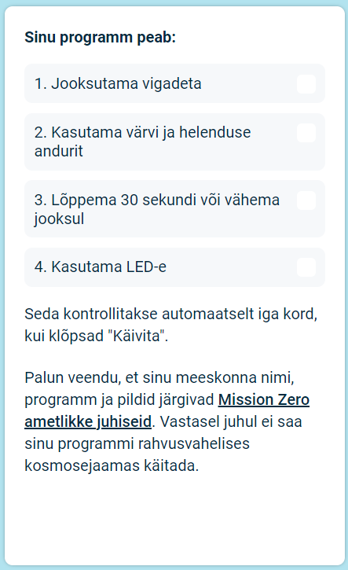

## Esita oma võistlustöö

Nüüd saate sisestatud koodi abil sisestada [Astro Pi Mission Zero](https://astro-pi.org/mission-zero){:target="_blank"} väljakutse.

Sinu koodi esitamiseks rahvusvahelises kosmosejaamas käivitamiseks peab see vastama mõnedele reeglitele. Kui sinu kood neile vastab, siis muutuvad programmi käitamisel **Sense HAT emulaatori** allosas asuvad reeglid roheliseks.

**Näpunäide:** Testi oma koodi mitme eri värviseadega (kasutades valijat), et olla kindel, et see käitab alati õigesti.

Palun veendu, et sinu võistlustöö järgib Mission Zero [ametlikke juhiseid](https://astro-pi.org/mission-zero/guidelines){:target="_blank"}. Kui see ei järgi juhiseid, ei saa sinu programmi rahvusvahelises kosmosejaamas käitada.

Palun ära lisa oma meeskonna nimesse ega koodi järgmist:

+ Kõik, mida võib tõlgendada ebaseadusliku, poliitilise või delikaatsena
+ Lipud, kuna neid võib võtta poliitiliselt delikaatsetena
+ Kõik, mis viitab teisele inimesele ebameeldivuste valmistamisele või kahju tegemisele
+ Isikuandmed, nagu telefoninumbrid, sotsiaalmeedia kontod ja meiliaadressid
+ Ropud pildid
+ Erimärgid või emotikonid
+ Ebaviisakas keel või vandumine

--- task ---

Sisesta oma klassiruumi kood ja meeskonna nimi allpool asuvasse kastikesse; sinu mentor ütleb sulle, mis sinu kood on.

**Märkused mentoritele** on saadaval [Sissejuhatuses](https://projects.raspberrypi.org/en/projects/astro-pi-mission-zero/0).

--- /task ---

--- task ---

Oma koodi sisestamiseks vajuta **Lisa oma tiim** nuppu. Pea meeles, et peale esitamist ei ole programmi enam võimalik muuta.

Sinu mentorile saadetakse võistlustöö esitamist kinnitav meil.

--- /task ---

--- task ---

Soovi korral võid oma koodi linki jagada sotsiaalmeedias andmaks kõigile teada, et sinu kirjutatud koodi näidatakse kosmoses!

--- /task ---
