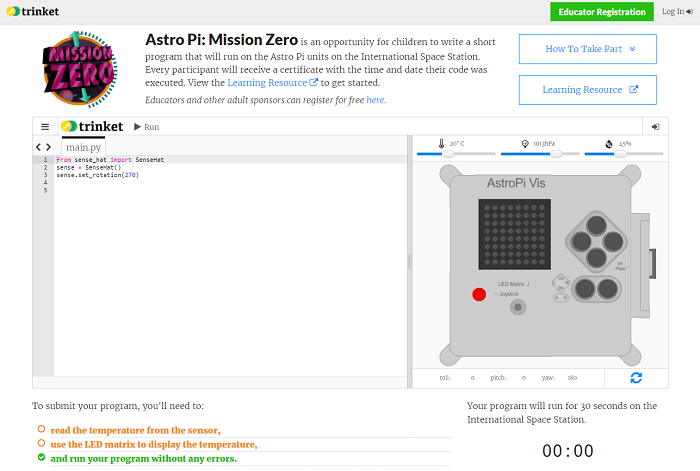

## Esita oma kirje

Sinu koodi esitamiseks rahvusvahelises kosmosejaamas peab see vastama mõnedele reeglitele. Kui sinu kood vastab neile, siis programmi käivitamisel muutuvad emulaatori allosas asuvad reeglid roheliseks.

1. Mõõda õhutemperatuur
2. Süüta LED-id
3. Kontrolli, et sinu kood töötab vigadeta lõpuni välja. You should not include any `while True` loops in your code as this will keep you code running and prevent it from finishing.

Samuti pead veenduma, et järgmised kriteeriumid oleks täidetud:

1. Astronautidele edastatava sõnumi pikkus ei tohi ületada 30 sekundit, kuna see on sinu koodi pikkus, mida saad esitada rahvusvahelises kosmosejaamas
2. Väldi mistahes sisendit vajava meetodi kasutamist
3. Impordi ainult moodulitelt `sense_hat`, `time` ja `random`
4. Ei tohi olla ebaviisakas või sündsusetu

Kui kõik reeglid on rohelised, oled esitamiseks valmis.

\--- task \---

Sisesta oma klassiruumi kood allpool asuvasse kastikesse; sinu õpetaja ütleb sulle, mis sinu kood on.

**Märkused õpetajatele või mentoritele** on saadaval jaotises [Sissejuhatus](https://projects.raspberrypi.org/et-EE/projects/astro-pi-mission-zero/1).

\--- /task \---

\--- task \---

Kuvatakse sinu õpetaja nimi. Kui see on õige, siis klõpsa rohelisel **Continue to form** (ava vorm) nupul.

\--- /task \---

\--- task \---

Sisesta oma meeskonna nimi ja meeskonnaliikmete nimed. Peale sinu koodi näitamist kosmoses trükitakse need nimed tunnistusele, seega kontrolli et nimed oleksid õigesti kirjutatud!

\--- /task \---

\--- task \---

Oma koodi sisestamiseks vajuta **Submit** (Esita) nuppu. Sinu õpetajale või mentorile saadetakse seda kinnitav e-kiri.

\--- /task \---

\--- task \---

Soovi korral võid oma koodi linki jagada sotsiaalmeedias andmaks kõigile teada, et sinu kirjutatud koodi näidatakse kosmoses!

\--- /task \---