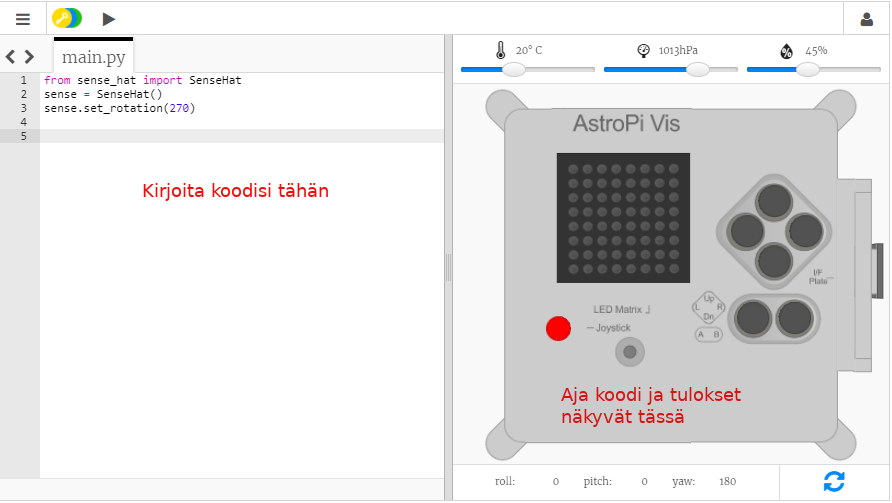

## Mikä Astro Pi on?

Astro Pi on Raspberry Pi -tietokone, jonka kotelo on erityisesti suunniteltu avaruusolosuhteisiin. Siinä on myös lisäosa nimeltä Sense HAT, joka on tehty nimenomaan Astro Pi -missiota varten. Sense HAT -laitteessa on ohjaussauva, LED-näyttö ja anturit lämpötilan, kosteuden, paineen ja suunnan tallentamiseksi.

Tässä on oikea Astro Pi-yksikkö kansainvälisellä avaruusasemalla, jolla suoritetaan opiskelijoiden kirjoittamia koodeja. Täällä koodisi lopulta suoritetaan! <iframe src="https://player.vimeo.com/video/172737314" width="640" height="360" frameborder="0" webkitallowfullscreen mozallowfullscreen allowfullscreen mark="crwd-mark"></iframe> 

Tätä tehtävää varten tulet käyttämään Sense HAT -emulaattoria. Emulaattori on ohjelmisto, joka simuloi kaikkia Astro Pi -toimintoja selaimessasi.

Oikean ja emuloidun Sense HAT:n välillä on muutamia eroavaisuuksia:

- Emulaattorissa voit asettaa lämpötilan, paineen ja kosteuden käyttämällä liukusäätimiä, kun taas Astro Pi:ssä oleva oikea Sense HAT käyttää antureita näiden parametrien mittaamiseen sen ympäristössä.

- Voit hiirellä napsauttaa ja vetää emuloitua Sense HAT -sovellusta siirtääksesi ja pyörittääksesi sitä ja näin ollen simuloida sen suunnan muutoksia; oikea Astro Pi (ja sen Sense HAT) voi liikkua oikeassa maailmassa, ja Sense HAT: n suunta-anturit tunnistavat milloin ja miten se on liikkunut.