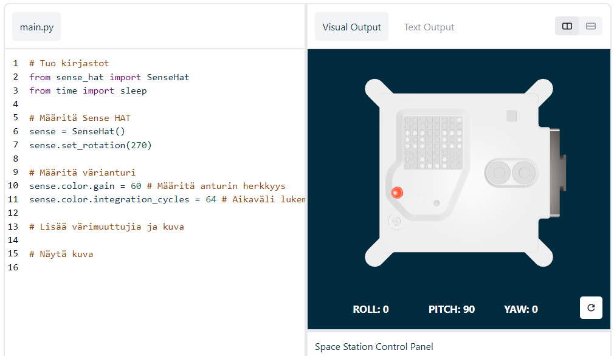

## Näytä viesti

--- task ---

Avaa [Sense HAT -emulaattori](https://trinket.io/mission-zero){:target="_blank"} Mission Zero -projektia varten.

Näet, että kolme riviä koodia on lisätty sinulle automaattisesti:

```python
from sense_hat import SenseHat
sense = SenseHat()
sense.set_rotation(270)
```



Tämä koodi ottaa yhteyden Astro Pihin ja varmistaa, että Astro Pin LED-näyttö näytetään oikein päin. Jätä koodi sinne, koska tulet tarvitsemaan sitä.

--- /task ---

--- task ---

Ehkä voisit jättää mukavan tervehdyksen ISS:n astronauteille, jotka työskentelevät Astro Pin lähellä? Vieritetään viesti näytön poikki.

Lisää tämä rivi muun koodin alapuolelle:

```python
sense.show_message("Astro Pi")
```

--- /task ---

--- task ---

Paina **Run** (Suorita) -painiketta ja katsele, kun viesti `Astro Pi` vierii LED-näytön poikki.


--- /task ---

Erilaisen viestin näyttämiseksi voit kirjoittaa mitä tahansa lainausmerkkien (`""`) väliin.

--- collapse ---
---
title: Mitä merkkejä voidaan käyttää?
---

Sense HAT pystyy näyttämään vain Latin 1 -merkkijoukon, mikä tarkoittaa, että vain seuraavat merkit ovat käytettävissä. Muut merkit näytetään muodossa `?`.

```
+-*/!"#$><0123456789.=)(

ABCDEFGHIJKLMNOPQRSTUVWXYZ

abcdefghijklmnopqrstuvwxyz

?,;:|@%[&_']\~
```

--- /collapse ---

--- task ---

Voit myös muuttaa näytön poikki vierivän viestin nopeutta. Lisää `scroll_speed` jo olemassa olevaan koodiriviin tällä tavalla:

```python
sense.show_message("Astro Pi", scroll_speed=0.05)
```

Viestin oletusnopeus on `0.1`. Numeron muuttaminen pienemmäksi saa viestin vierimään nopeammin, ja sen muuttaminen suuremmaksi saa viestin vierimään hitaammin.

--- /task ---

### Valitse nimi uusille Astro Pi -tietokoneille

--- task --- Nimeämme Astro Pi -tietokoneet kahden inspiroivan eurooppalaisen tieteentekijän mukaan. On satoja miehiä ja naisia, jotka ovat antaneet panostuksensa tieteeseen ja tekniikkaan, ja osallistujat voivat esittää omaa ehdokastaan tai valita listaltamme:


[Ada Lovelace](https://en.wikipedia.org/wiki/Ada_Lovelace){:target="_blank"} 
[Alan Turing](https://en.wikipedia.org/wiki/Alan_Turing){:target="_blank"} 
[Caroline Herschel](https://en.wikipedia.org/wiki/Caroline_Herschel){:target="_blank"} 
[Edsger Dijkstra](https://en.wikipedia.org/wiki/Edsger_W._Dijkstra){:target="_blank"} 
[Hedy Lamarr](https://en.wikipedia.org/wiki/Hedy_Lamarr){:target="_blank"} 
[Hypatia](https://en.wikipedia.org/wiki/Hypatia){:target="_blank"} 
[John Edmonstone](https://en.wikipedia.org/wiki/John_Edmonstone){:target="_blank"} 
[Marie Curie](https://en.wikipedia.org/wiki/Marie_Curie){:target="_blank"} 
[Nikola Tesla](https://en.wikipedia.org/wiki/Nikola_Tesla){:target="_blank"} 
[Tycho Brahe](https://en.wikipedia.org/wiki/Tycho_Brahe){:target="_blank"}

Äänestääksesi aloita viestisi sanoilla "My name should be". Jos haluat äänestää esimerkiksi Ada Lovelacea, koodisi näyttäisi tältä:

```python
sense.show_message("My name should be Ada Lovelace")
```

Jos haluat äänestää, viestisi *pitää* alkaa näillä sanoilla, muuten emme pysty automaattisesti laskemaan ääntäsi.

--- /task ---


