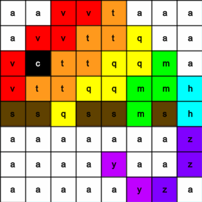

## Näytä kuva

Astro Pin LED-matriisi voi näyttää värejä. Tässä vaiheessa näytät luontokuvia Astro Pin LED-matriisilla.

<p style="border-left: solid; border-width:10px; border-color: #0faeb0; background-color: aliceblue; padding: 10px;">
<span style="color: #0faeb0">**LED-matriisi**</span> on ruudukko LEDejä, joita voidaan ohjata yhdessä tai erikseen erilaisten valotehosteiden luomiseksi. Sense HATin LED-matriisissa on 64 LEDiä 8 x 8 -ruudukossa. LEDit voidaan ohjelmoida tuottamaan laaja valikoima värejä.
</p>


--- task ---

Avaa [Mission Zero -aloitusprojekti](https://missions.astro-pi.org/mz/code_submissions/){:target="_blank"}.

Näet, että sinua varten on lisätty muutama koodirivi automaattisesti.

Tämä koodi ottaa yhteyden Astro Pihin, varmistaa Astro Pin LED-näytön olevan oikein päin ja määrittää värianturin. Jätä koodi sinne, koska tulet tarvitsemaan sitä.

--- code ---
---
language: python filename: main.py line_numbers: false line_number_start: 1
line_highlights:
---
# Tuo kirjastot
from sense_hat import SenseHat from time import sleep

# Määritä Sense HAT
sense = SenseHat() sense.set_rotation(270)

# Määritä värianturi
sense.color.gain = 60 # Set the sensitivity of the sensor sense.color.integration_cycles = 64 # The interval at which the reading will be taken

--- /code ---


--- /task ---

### RGB-värit

Värejä voidaan luoda käyttämällä punaista, vihreää ja sinistä eri suhteissa. Voit tutustua RGB-väreihin täältä:

[[[generic-theory-simple-colours]]]

LED-matriisi on 8 x 8 -ruudukko. Jokainen ruudukon LED-valo voidaan asettaa eri väriin. Tässä on luettelo muuttujista 24 eri värille. Jokaisella värillä on arvo punaiselle, vihreälle ja siniselle:

[[[ambient-colours]]]

### Valitse kuva

--- task ---

**Valitse:** Valitse näytettävä kuva alla olevista vaihtoehdoista. Python tallentaa kuvan tiedot luetteloon. Jokaisen kuvan koodi sisältää käytetyt värimuuttujat ja luettelon.

Sinun on **kopioitava** kaikki valitsemasi kuvan koodi ja sitten **liitettävä** se projektiisi alapuolelle riviä, jolla lukee `# Lisää värimuuttujia ja kuva`.

--- collapse ---

---
title: Kala
---


Tehnyt joukkue chalka, Puola

```python
z = (153, 50, 204) # DarkOrchid
q = (255, 255, 0) # Keltainen
d = (51, 153, 255) # sininen
c = (0, 0, 0) # Musta

kuva = [
d, d, z, d, d, d, d, d, d, d, d,
d, d, z, z, d, d,
z, d, q, q, q, q, d, d,
z, z, q, q, q, c, q, d,
z, z, z, q, q, q, q, q, d,
z, z, q, q, q, q, q, d,
z, d, q, z, z, q, d, d,
d, d, z, d, d, d, d]

```

--- /collapse ---


--- collapse ---

---
title: Mursu
---


Tehnyt joukkue Mursu, Suomi

```python
h = (0, 255, 255) # Syaani
c = (0, 0, 0) # Musta
s = (139, 69, 19) # Satulanruskea
a = (255, 255, 255) # Valkoinen
r = (184, 134, 11) # TummaKultapiisku

kuva = [
h, h, h, h, h, h, h, h,
h, h, s, s, s, h, h, h,
h, s, s, s, s, s, h, h,
h, s, c, s, c, s, s, s,
h, r, r, r, r, r, s, s,
h, h, a, s, a, s, s, s,
h, h, a, s, a, s, s, s,
r, r, s, s, s, s, s, s]

```

--- /collapse ---

--- collapse ---
---
title: Paxi
---


Tehnyt joukkue tony_pi, Italia

```python
v = (255, 0, 0) # Punainen
m = (34, 139, 34) # Metsänvihreä
c = (0, 0, 0) # Musta 
e = (100, 149, 237) # Ruiskukansininen
l = (0, 255, 0) # Vihreä

kuva = [
    c, v, m, c, c, m, v, c,
    c, c, v, v, v, v, c, c,
    c, v, c, e, l, e, v, c,
    c, v, c, l, l, l, v, c,
    c, v, c, l, c, l, v, c,
    c, c, v, v, v, v, c, c,
    c, c, l, c, c, l, c, c,
    c, m, m, c, c, m, m, c]

```

--- /collapse ---


--- collapse ---
---
title: Koira
---


Tehnyt joukkue ptpr_07, Espanja

```python

c = (0, 0, 0) # Musta
r = (184, 134, 11) # Tummankultapiisku
s = (139, 69, 19) # Satulanruskea
y = (255, 20, 147) # Syvänvaaleanpunainen

kuva = [
    c, r, r, c, c, r, r, c,
    c, r, s, s, s, r, c,
    c, r, c, s, s, c, r, c,
    c, s, s, s, s, s, s, c,
    c, s, s, s, s, s, s, c,
    c, s, s, c, c, s, s, c,
    c, c, s, y, y, s, c, c,
    c, c, c, y, y, c, c]


```

--- /collapse ---

--- collapse ---
---
title: Kameleontti
---



Tehnyt joukkue The_ETs, Englanti

```python

c = (0, 0, 0) # Musta
s = (139, 69, 19) # Satulanruskea
a = (255, 255, 255) # Valkoinen
v = (255, 0, 0) # Punainen
t = (255, 140, 0) # Tummanoranssi
q = (255, 255, 0) # Keltainen
m = (34, 139, 34) # Metsänvihreä
h = (0, 255, 255) # Syaani
z = (153, 50, 204) # Tummanorkidea
y = (255, 20, 147) # Syvänvaaleanpunainen

kuva = [
    a, a, v, v, t, a, a,
    a, v, v, t, t, q, a, a,
    v, c, t, t, q, q, m, a,
    v, t, t, q, q, m, m, h,
    s, s, q, s, s, m, s, h,
    a, a, a, a, a, a, a, z,
    a, a, a, a, y, a, a, z,
    a, a, a, a, a, y, z, a]

```

--- /collapse ---

--- collapse ---
---
title: Leija
---


Tehnyt joukkue Val, Kreikka

```python

c = (0, 0, 0) # Musta
m = (34, 139, 34) # Metsänvihreä
v = (255, 0, 0) # Punainen
q = (255, 255, 0) # Keltainen
e = (0, 0, 205) # Keskisininen
h = (0, 255, 255) # Syaani

kuva = [
    h, h, h, h, h, h, h, h, 
    h, h, h, e, e, v, v, h, 
    h, h, h, e, e, v, v, h, 
    h, h, h, q, q, m, m, h, 
    h, h, h, q, q, m, m, h,
    h, h, c, h, h, h, h, h, h, 
    h, c, h, h, h, h, h, h, h, 
    c, h, h, h, h, h, h, h, h]

```

--- /collapse ---

--- collapse ---
---
title: Kana
---


Tehnyt joukkue Slepicky, Tšekki

```python

v = (255, 0, 0) # Punainen
c = (0, 0, 0) # Musta
b = (105, 105, 105) # Himmeänharmaa
q = (255, 255, 0) # Keltainen
r = (184, 134, 11) # Tummanpiisku

kuva = [
    c, c, v, v, v, c, c, c,
    c, v, b, b, r, c, c, r,
    c, b, c, b, b, c, r, b,
    q, r, b, b, b, b, b, b, r,
    c, v, b, b, b, b, r, b,
    c, v, b, r, r, r, b, r,
    c, c, c, r, b, q, r, c,
    c, c, c, c, q, q, c, c]

```

--- /collapse ---

--- /task ---

--- task ---

**Etsi:** rivi, jossa lukee `# Näytä kuva` ja lisää koodirivi näyttääksesi kuvasi LED-matriisissa:

--- code ---
---
language: python filename: main.py line_numbers: false line_number_start: 1
line_highlights: 18, 19
---
z = (153, 50, 204) # DarkOrchid q = (255, 255, 0) # Keltainen d = (51, 153, 255) # Sininen c = (0, 0, 0) # Musta

image = [ d, d, z, d, d, d, d, d, d, d, d, z, z, d, d, d, z, d, q, q, q, q, d, d, z, z, q, q, q, c, q, d, z, z, z, q, q, q, q, d, z, z, q, q, q, q, q, d, z, d, q, z, z, q, d, d, d, d, d, z, d, d, d, d]

# Näytä kuva
sense.set_pixels(image)

--- /code ---

--- /task ---

--- task ---

Paina **Aja** editorin alaosassa nähdäksesi kuvasi LED-matriisissa.

--- /task ---

--- task ---

**Vianselvitys**

Koodissani on syntaksivirhe:

- Tarkista, että koodisi vastaa yllä olevien esimerkkien koodia
- Tarkista, että olet sisentänyt koodin luettelossasi
- Tarkista, että luettelosi ympärillä on `[` ja `]`
- Tarkista, että jokainen värimuuttuja luettelossa on erotettu pilkulla

Kuvani ei näy:

- Tarkista, että `sense.set_pixels(kuva)` ei ole sisennetty

--- /task ---


--- task ---

**Tallenna kehityksesi**

Nyt kun olet näyttänyt kuvan, voit tallentaa ohjelmasi tehtävän aloitusprojektissa syöttämällä joukkueesi nimen, joukkueen jäsenten nimet ja saamasi luokkahuonekoodin. Voit ladata ohjelman uudelleen millä tahansa laitteella, jossa on Internet-yhteys, syöttämällä joukkuenimen ja luokkahuonekoodin.


--- /task --- 
