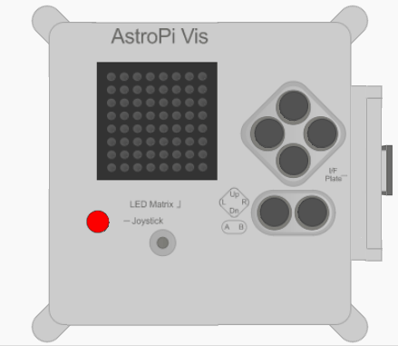

## Näytä viesti

\--- task \---

Avaa [Sense HAT -emulaattori](https://trinket.io/mission-zero){:target="_blank"} Mission Zero -projektia varten.

Näet, että kolme riviä koodia on lisätty sinulle automaattisesti:

```python
from sense_hat import SenseHat
sense = SenseHat()
sense.set_rotation(270)
```


Tämä koodi muodostaa yhteyden Astro Pihin ja varmistaa, että Astro Pin LED-näyttö näytetään oikein päin. Jätä koodi sinne, koska tulet tarvitsemaan sitä.

\--- /task \---

\--- task \---

Ehkä voisit jättää mukavan tervehdyksen ISS:n astronauteille, jotka työskentelevät Astro Pin lähellä? Vieritetään viesti näytön poikki.

Lisää tämä rivi muun koodin alapuolelle:

```python
sense.show_message("Astro Pi")
```

\--- /task \---

\--- task \---

Paina **Run** (Suorita) -painiketta ja katsele, kun viesti `Astro Pi` vierii LED-näytön poikki.


\--- /task \---



Erilaisen viestin näyttämiseksi voit kirjoittaa sen lainausmerkkien (`""`) väliin.

\--- collapse \---

* * *

## title: Mitä merkkejä voidaan käyttää?

Sense HAT pystyy näyttämään vain Latin 1 -merkkijoukon, mikä tarkoittaa, että vain seuraavat merkit ovat käytettävissä. Muut merkit näytetään muodossa `?`.

    +-*/!"#$><0123456789.=)(
    
    ABCDEFGHIJKLMNOPQRSTUVWXYZ
    
    abcdefghijklmnopqrstuvwxyz
    
    ?,;:|@%[&_']\~
    

\--- /collapse \---

\--- task \---

Voit myös muuttaa näytön poikki vierivän viestin nopeutta. Lisää `scroll_speed` jo olemassa olevan koodisi riviin tällä tavalla:

```python
sense.show_message("Astro Pi", scroll_speed=0.05)
```

Viestin oletusnopeus on `0.1`. Numeron muuttaminen pienemmäksi saa viestin vierimään nopeammin, ja sen muuttaminen suuremmaksi saa viestin vierimään hitaammin.

\--- /task \---