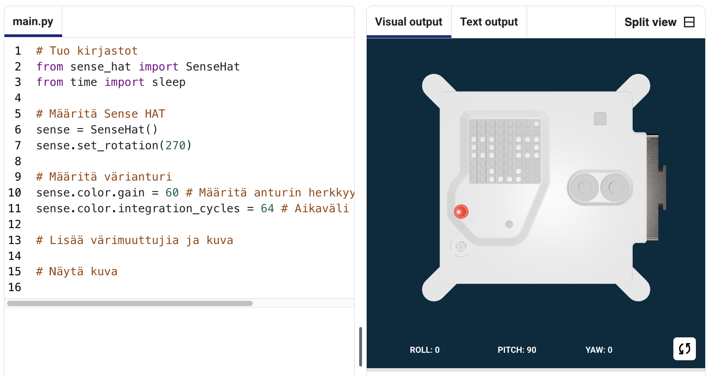
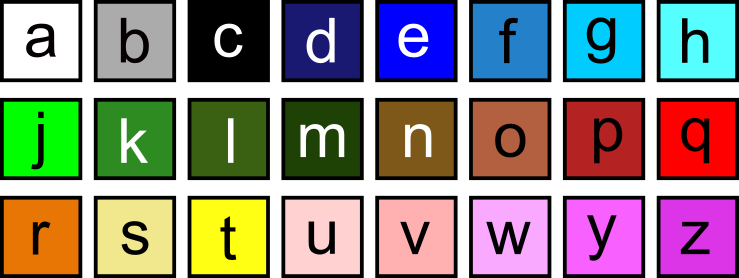

## Näytä kuva

Esittämäsi kuva koostuu 64 värillisestä neliöstä, joita kutsutaan **pikseleiksi**. Pikselit on järjestetty 8 x 8 -ruudukkoon. Jokainen pikseli voi olla erivärinen. Voit luoda kuvan valitsemalla värit huolellisesti. Tässä on esimerkki valaasta, joka on tehty käyttämällä erilaisia sinisen sävyjä mustalla taustalla.

<p style="border-left: solid; border-width:10px; border-color: #0faeb0; background-color: aliceblue; padding: 10px;">
<span style="color: #0faeb0">**LED-matriisi**</span> on ruudukko LEDejä, joita voidaan ohjata yhdessä tai erikseen erilaisten valotehosteiden luomiseksi. Sense HATin LED-matriisissa on 64 LEDiä 8 x 8 -ruudukossa. LEDit voidaan ohjelmoida tuottamaan laaja valikoima värejä.
</p>


Huomaa, että jokainen neliö on merkitty koodilla, joka tarkoittaa tiettyä väriä. Tässä kuvassa käytetään 3 väriä:
+ c = musta
+ f = merensininen
+ g = taivaansininen


--- task ---

Avaa [Mission Zero -aloitusprojekti](https://missions.astro-pi.org/fi/mz/code_submissions/){:target="_blank"}.

Näet, että sinua varten on lisätty muutama koodirivi automaattisesti.

Tämä koodi ottaa yhteyden Astro Pihin, varmistaa Astro Pin LED-näytön olevan oikein päin ja määrittää värianturin. Jätä koodi sinne, koska tulet tarvitsemaan sitä.

--- code ---
---
language: python filename: main.py line_numbers: false line_number_start: 1
line_highlights:
---
# Tuo kirjastot
from sense_hat import SenseHat from time import sleep

# Määritä Sense HAT
sense = SenseHat() sense.set_rotation(270)

# Määritä värianturi
sense.color.gain = 60 # Set the sensitivity of the sensor sense.color.integration_cycles = 64 # The interval at which the reading will be taken

--- /code ---



--- /task ---

### RGB-värit

Värejä voidaan luoda käyttämällä punaista, vihreää ja sinistä eri suhteissa. Voit tutustua RGB-väreihin täältä:


LED-matriisi on 8 x 8 -ruudukko. Jokainen ruudukon LED-valo voidaan asettaa eri väriin. Voimme käyttää kirjaimia a-z muuttujien niminä tarkoittamaan 24 eri väriä. Jokaisella värillä on arvo punaiselle, vihreälle ja siniselle.

--- collapse ---

---
title: Värimuuttujien luettelo
---



```python
a = (255, 255, 255) # Valkoinen
b = (171, 171, 171) # Harmaa
c = (0, 0, 0) # Musta
d = (25, 25, 113) # Tummansininen
e = (0, 0, 255) # Puhtaansininen
f = (36, 128, 200) # Merensininen
g = (0, 204, 255) # Taivaansininen
h = (86, 255, 255) # Sähköinen syaani
j = (0, 255, 0) # Puhtaan vihreä
k = (46, 139, 33) # Lehdenvihreä
l = (57, 97, 17) # Oliivinvihreä
m = (30, 65, 6) # Metsänvihreä
n = (126, 88, 25) # Maanruskea
o = (179, 96, 65) # Terrakotanruskea
p = (180, 34, 34) # Tiilenpunainen
q = (255, 0, 0) # Puhtaan punainen
r = (232, 118, 5) # Oranssi
s = (241, 231, 100) # Vaaleankeltainen
t = (255, 255, 0) # Puhtaankeltainen
u = (255, 209, 209) # Vaaleanpunainen
v = (255, 177, 177) # Punainenpinkki
w = (249, 169, 255) # Vaaleanpunainen
y = (248, 97, 255) # Purppura
z = (220, 53, 232) # Violetti

```

--- /collapse ---

### Valitse kuva

--- task ---

**Valitse:** Valitse näytettävä kuva alla olevista vaihtoehdoista. Python tallentaa kuvan tiedot luetteloon. Jokaisen kuvan koodi sisältää käytetyt värimuuttujat ja luettelon.

Sinun on **kopioitava** kaikki valitsemasi kuvan koodi ja sitten **liitettävä** se projektiisi alapuolelle riviä, jolla lukee `# Lisää värimuuttujia ja kuva`.

--- collapse ---

---
title: Valas
---


Tehnyt joukkue Naicom, Italia

```python
c = (0, 0, 0)       # Black
f = (36, 128, 200)  # Ocean Blue
g = (0, 204, 255)   # Sky Blue

image = [
c, g, c, g, c, c, c, c,
c, c, g, c, c, f, f, f,
c, f, f, f, c, c, f, a,
f, f, c, f, f, c, f, c,
f, f, f, f, f, c, f, c,
g, f, f, f, f, f, f, c,
g, g, g, g, g, g, c, c,
c, g, g, g, g, c, c, c]

```

--- /collapse ---


--- collapse ---

---
title: Sitruuna
---


Tehnyt joukkue g4lemoni, Kreikka

```python
c = (0, 0, 0)       # Black
k = (46, 139, 33)   # Leaf Green
t = (255, 255, 0)   # Pure Yellow

image = [
c, c, c, k, k, c, c, c,
c, c, k, c, k, c, c, c,
c, k, c, t, t, c, c, c,
c, c, t, t, t, t, c, c,
c, c, t, t, t, t, c, c,
c, c, t, t, t, t, c, c,
c, c, t, t, t, t, c, c,
c, c, c, t, t, c, c, c]

```

--- /collapse ---

--- collapse ---
---
title: Possu
---


Tehnyt joukkue Gary, Yhdistynyt kuningaskunta

```python
a = (255, 255, 255) # White
v = (255, 177, 177) # Blush Pink
y = (248, 97, 255)  # Magenta
o = (179, 96, 65)   # Terracotta Brown
c = (0, 0, 0)       # Black

image = [
a, a, y, a, a, y, a, a,
a, y, y, y, y, y, y, a,
a, y, c, y, c, y, y, y,
v, v, v, v, v, y, y, y,
v, o, v, o, v, y, y, y,
v, v, v, v, v, y, y, y,
a, y, y, y, y, y, y, y,
a, a, y, a, a, a, y, a]

```

--- /collapse ---


--- collapse ---
---
title: Myrsky
---


Tehnyt joukkue hop2p023, Espanja

```python

c = (0, 0, 0)       # Black
f = (36, 128, 200)  # Ocean Blue
g = (0, 204, 255)   # Sky Blue
t = (255, 255, 0)   # Pure Yellow

image = [
c, c, c, c, c, c, c, c,
c, c, f, f, f, f, c, c,
c, f, f, f, f, f, f, c,
c, g, c, g, t, g, c, c,
c, c, c, t, t, c, c, c,
c, c, t, t, c, c, c, c,
c, c, g, c, c, c, c, g,
c, g, c, c, c, c, c, c]


```

--- /collapse ---

--- collapse ---
---
title: Ankka
---


Tekijä Peter, Irlanti

```python

c = (0, 0, 0) # Black
l = (57, 97, 17)    # Olive Green
m = (30, 65, 6)     # Forest Green
r = (232, 118, 5)   # Orange
a = (255, 255, 255) # White
b = (171, 171, 171) # Grey

image = [
c, l, l, c, c, c, c, c,
r, r, m, c, c, c, c, c,
c, l, l, c, c, c, c, c,
c, a, a, l, a, a, c, c,
c, l, l, a, a, a, b, a,
c, a, a, b, b, b, a, a,
c, c, a, a, a, a, c, c,
c, c, c, r, c, r, c, c]

```

--- /collapse ---

--- collapse ---
---
title: Sammakko
---


Tehnyt joukkue Jmeno, Tšekki

```python

a = (255, 255, 255) # White
b = (171, 171, 171) # Grey
c = (0, 0, 0)       # Black
q = (255, 0, 0)     # Pure Red
j = (0, 255, 0)     # Pure Green
k = (46, 139, 33)   # Leaf Green
n = (126, 88, 25)   # Earth Brown

image = [
a, a, a, a, a, a, a, a,
a, a, a, a, a, b, a, b,
a, a, a, a, a, a, c, a,
a, a, c, a, c, a, q, a,
a, a, j, j, j, q, a, a,
a, j, j, k, q, a, a, a,
j, k, j, k, k, a, a, a,
k, k, k, j, k, n, n, n]

```

--- /collapse ---

--- collapse ---
---
title: Kukkiva puu
---


Tehnyt joukkue Zssh14, Slovakia

```python

t = (255, 255, 0)   # Pure Yellow
g = (0, 204, 255)   # Sky Blue
w = (249, 169, 255) # Light Pink
y = (248, 97, 255)  # Magenta
z = (220, 53, 232)  # Purple
n = (126, 88, 25)   # Earth Brown
o = (179, 96, 65)   # Terracotta Brown
k = (46, 139, 33)   # Leaf Green

image =  [
t, g, g, w, w, y, g, g,
g, g, w, w, y, y, z, g,
g, w, y, z, y, z, z, z,
w, y, z, z, g, n, w, g,
g, g, o, o, n, w, y, z,
g, g, g, g, n, g, g, g,
g, g, g, o, n, n, g, g,
k, k, o, n, n, n, k, k]

```

--- /collapse ---

--- /task ---

--- task ---

**Etsi:** rivi, jossa lukee `# Näytä kuva` ja lisää koodirivi näyttääksesi kuvasi LED-matriisissa:

--- code ---
---
language: python filename: main.py line_numbers: false line_number_start: 1
line_highlights: 17, 18
---
c = (0, 0, 0)       # Black f = (36, 128, 200)  # Ocean Blue g = (0, 204, 255)   # Sky Blue

image = [ c, g, c, g, c, c, c, c, c, c, g, c, c, f, f, f, c, f, f, f, c, c, f, a, f, f, c, f, f, c, f, c, f, f, f, f, f, c, f, c, g, f, f, f, f, f, f, c, g, g, g, g, g, g, c, c, c, g, g, g, g, c, c, c]

# Näytä kuva
sense.set_pixels(image)

--- /code ---

--- /task ---

--- task ---

Paina **Aja** editorin alaosassa nähdäksesi kuvasi LED-matriisissa.

--- /task ---

--- task ---

**Vianselvitys**

Koodissani on syntaksivirhe:

- Tarkista, että koodisi vastaa yllä olevien esimerkkien koodia
- Tarkista, että olet sisentänyt koodin luettelossasi
- Tarkista, että luettelosi ympärillä on `[` ja `]`
- Tarkista, että jokainen värimuuttuja luettelossa on erotettu pilkulla

Kuvani ei näy:

- Tarkista, että `sense.set_pixels(kuva)` ei ole sisennetty

--- /task ---


--- task ---

**Tallenna kehityksesi**

Nyt kun olet näyttänyt kuvan, voit tallentaa ohjelmasi tehtävän aloitusprojektissa syöttämällä joukkueesi nimen, joukkueen jäsenten nimet ja saamasi luokkahuonekoodin. Voit ladata ohjelman uudelleen millä tahansa laitteella, jossa on Internet-yhteys, syöttämällä joukkuenimen ja luokkahuonekoodin.


--- /task --- 
