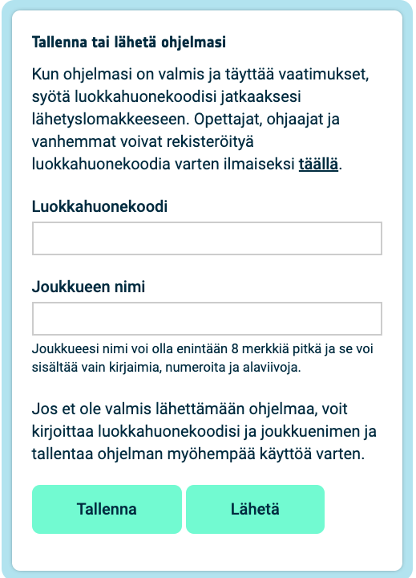

## Tunnista väri

Tässä vaiheessa määrität värin kirkkausanturin ja käytät sitä tunnistaaksesi punaisen, vihreän ja sinisen määrät anturissa. Tätä väriä käytetään sitten valitsemasi kuvan värittämiseen. Astronautti, joka kävelee anturin luo sinisessä paidassa, näkisi erilaisen kuvan kuin punaisessa paidassa oleva astronautti.

Riippumatta valitsemastasi kuvasta, tausta käyttää `c` muuttujaa, joka on asetettu mustaksi.

--- task ---

Käytä värianturia värittääksesi taustasi.

Lisää koodi kuvalistasi eteen saadaksesi värin anturilta ja muuta taustavärisi muuttujaa `c` käyttääksesi Sense HATin värianturin tunnistamaa väriä mustan sijasta.

**Vinkki:** Sinun ei tarvitse kirjoittaa #-alkuisia kommentteja (ne ovat siellä koodin selittämiseksi).

--- code ---
---
language: python
filename: main.py
line_numbers: false
line_number_start: 1
line_highlights: 9, 10
---

# Lisää värimuuttujia ja kuva

z = (153, 50, 204) # Tummanorkidea
q = (255, 255, 0) # Keltainen
d = (51, 153, 255) # Sininen
c = (0, 0, 0) # Musta

rgb = sense.color # hae väri anturilta
c = (rgb.red, rgb.green, rgb.blue) # käytä tunnistettua väriä

kuva = [
  d, d, z, d, d, d, d, d,
  d, d, d, z, z, d, d, d,
  z, d, q, q, q, q, d, d,
  z, z, q, q, q, c, q, d,
  z, z, z, q, q, q, q, d,
  z, z, q, q, q, q, q, d,
  z, d, q, z, z, q, d, d,
  d, d, d, z, d, d, d, d]

--- /code ---

--- /task ---

--- task ---

**Kokeile:** Siirrä värin liukusäädin valitsemaasi väriin ja sitten **aja** koodisi. Taustavärisi muuttuu. Toista tämä kokeilu uudella värillä.

**Vinkki:** Sinun on napsautettava 'Aja' aina, kun muutat väriä.

--- /task ---

## Aja ohjelmaasi silmukassa

Astro Pi Mission Zero -ohjelman ajo saa kestää enintään 30 sekuntia. Käytät tämän ajan toistuvasti värianturin tarkastamiseen ja kuvan päivittämiseen.

Koodisi käyttää `for`-silmukkaa 28 ajokertaan. **Joka** kerta se:
+ tunnistaa uusimman värin
+ päivittää kuvan taustavärin
+ odottaa yhden sekunnin

--- task ---

**Etsi** sinun `rgb = sense.color` koodirivi.

**Lisää** koodi sen yläpuolelle määrittääksesi `for` -silmukan `28` toistolle.

--- code ---
---
language: python
filename: main.py
line_numbers: false
line_number_start: 1
line_highlights: 2
---

for i in range(28):
rgb = sense.color # hae väri anturilta
c = (rgb.red, rgb.green, rgb.blue)

kuva = [
  d, d, z, d, d, d, d, d,
  d, d, d, z, z, d, d, d,
  z, d, q, q, q, q, d, d,
  z, z, q, q, q, c, q, d,
  z, z, z, q, q, q, q, d,
  z, z, q, q, q, q, q, d,
  z, d, q, z, z, q, d, d,
  d, d, d, z, d, d, d, d]

  
--- /code ---

--- /task ---

--- task ---

Sinun on nyt sisennettävä kaikki `for`-silmukan alapuolella oleva koodi niin, että se sijoittuu `for`-silmukan **sisälle**.

**Vinkki:** Sisentääksesi useita rivejä, ensin valitse sisennettävät rivit, sitten paina näppäimistösi <kbd>Tab</kbd>-näppäintä (yleensä <kbd>Caps Lock</kbd>-näppäimen yläpuolella).

--- code ---
---
language: python
filename: main.py
line_numbers: false
line_number_start: 1
line_highlights: 3, 4, 5, 6, 7, 8, 9, 10, 11, 12, 13, 14, 15, 16, 17, 18, 19
---

for i in range(28):
  rgb = sense.color # hae väri anturilta
  c = (rgb.red, rgb.green, rgb.blue)

  kuva = [
    d, d, z, d, d, d, d, d,
    d, d, d, z, z, d, d, d,
    z, d, q, q, q, q, d, d,
    z, z, q, q, q, c, q, d,
    z, z, z, q, q, q, q, d,
    z, z, q, q, q, q, q, d,
    z, d, q, z, z, q, d, d,
    d, d, d, z, d, d, d, d]

    
  # Näytä kuva

  sense.set_pixels(kuva)
 
--- /code ---

--- /task ---

--- task ---

Koodisi loppuun lisää yhden sekunnin mittainen `sleep` silmukkasi sisälle:

--- code ---
---
language: python
filename: main.py
line_numbers: false
line_number_start: 1 
line_highlights: 5
---
  
  # Näytä kuva

  sense.set_pixels(kuva)
  sleep(1)  
  
--- /code ---

**Vinkki:** Varmista, että tämä koodirivi on sisennettynä `for`-silmukassasi.

--- /task ---

--- task ---

**Kokeile:** Aja koodisi ja vaihda värivalitsinta useita kertoja projektisi suorituksen aikana. Tarkista, että kuvasi päivittyy havaitun värin mukaisesti seuraavalla suorituskerralla.

Kuvan päivitys lopetetaan silmukan päätyttyä, jotta ohjelman ajo ei kestä yli 30 sekuntia.

--- /task ---

--- task ---

**Vianselvitys**

Koodissani on syntaksivirhe tai ei toimi odotetulla tavalla:

- Tarkista, että koodisi vastaa yllä olevien esimerkkien koodia
- Tarkista, että olet sisentänyt koodin `for`-silmukassasi
- Tarkista, että luettelosi ympärillä on `[` ja `]`
- Tarkista, että jokainen värimuuttuja luettelossa on erotettu pilkulla

Koodini toimii yli 30 sekuntia:

- Vähennä for-silmukan suorituskertojen lukumäärää 28:sta 25:een tai jopa 20:een.
- Lyhennä sleepin kestoa 1 sekunnista 0.5 sekuntiin.

--- /task ---

--- task ---

Lisää `sense.clear()` koodisi loppuun kuvan tyhjentämiseksi silmukkasi päätteeksi. Tämä auttaa sinua näkemään, milloin animaatiosi suoritus on päättynyt.

**Vinkki:** Varmista, että **et** sisennä `sense.clear()`-koodiriviä, koska haluat sen suoritettavan vain yhden kerran animaatiosi lopuksi.

--- code ---
---
language: python
filename: main.py
line_numbers: false
line_number_start: 1 
line_highlights: 7
---
  
  # Näytä kuva

  sense.set_pixels(kuva)
  sleep(1) 
  
sense.clear()
  
--- /code ---

--- /task ---

--- task ---

**Kokeile:** Aja koodisi uudelleen. Kun projektisi on suoritettu, LED-matriisi tyhjenee kaikkien valojen vaihtuessa mustaksi (pois päältä).

--- /task ---

--- task ---

**Vianselvitys**

LED-matriisi muuttuu mustaksi joka sekunti:

- Tarkista, että et ole sisentänyt `sense.clear()`-koodia `for`-silmukkasi sisälle

--- /task ---

--- task ---

Lisää koodia LED-matriisin tyhjentämiseksi valitsemallasi värillä. Luo muuttuja nimeltä `x` tallentaaksesi uuden värisi.

Voit sekoittaa oman värisi tai käyttää väriluettelon arvoja luodaksesi uuden `x`-värisi.

[[[generic-theory-simple-colours]]] 
[[[ambient-colours]]]

--- code ---
---
language: python
filename: main.py
line_numbers: false
line_number_start: 1 
line_highlights: 7, 8
---
  
  # Näytä kuva

  sense.set_pixels(kuva)
  sleep(1) 

x = (178, 34, 34)  # cvalitse omat punaisen, vihreän ja sinisen arvot väliltä 0 - 255
sense.clear(x)
  
--- /code ---

--- /task ---

--- task ---

**Kokeile:** Aja koodisi uudelleen. Kun projektisi on suoritettu, LED-matriisi tyhjenee valittuun väriisi. Voit vaihtaa ja kokeilla väriä niin monta kertaa kuin haluat.

--- /task ---

--- task ---

**Tallenna kehityksesi**

Voit tallentaa ohjelmasi tehtävän aloitusprojektissa syöttämällä joukkueesi nimen, joukkueen jäsenten nimet ja saamasi luokkahuonekoodin. Voit ladata ohjelman uudelleen millä tahansa laitteella, jossa on Internet-yhteys, syöttämällä joukkuenimen ja luokkahuonekoodin.

--- /task ---

--- task ---

--- collapse ---

---
title: Valmis koodiesimerkki
---

--- code ---
---
language: python
filename: main.py
line_numbers: false
---
# Tuo kirjastot
from sense_hat import SenseHat
from time import sleep

# Määritä Sense HAT
sense = SenseHat()
sense.set_rotation(270)

# Määritä värianturi
sense.color.gain = 60 # Määritä anturin herkkyys
sense.color.integration_cycles = 64 # Aikaväli lukeman ottamiseksi

# Lisää värimuuttujia ja kuva

z = (153, 50, 204) # Tummanorkidea
q = (255, 255, 0) # Keltainen
d = (51, 153, 255) # Sininen
c = (0, 0, 0) # Musta

for i in range(28):
  rgb = sense.color # hae väri anturilta
  c = (rgb.red, rgb.green, rgb.blue)

  kuva = [
    d, d, z, d, d, d, d, d,
    d, d, d, z, z, d, d, d,
    z, d, q, q, q, q, d, d,
    z, z, q, q, q, c, q, d,
    z, z, z, q, q, q, q, d,
    z, z, q, q, q, q, q, d,
    z, d, q, z, z, q, d, d,
    d, d, d, z, d, d, d, d]

  # Näytä kuva

  sense.set_pixels(kuva)
  sleep(1)

x = (178, 34, 34)  # cvalitse omat punaisen, vihreän ja sinisen arvot väliltä 0 - 255
sense.clear(x)

--- /code ---

--- /collapse ---

--- /task ---
