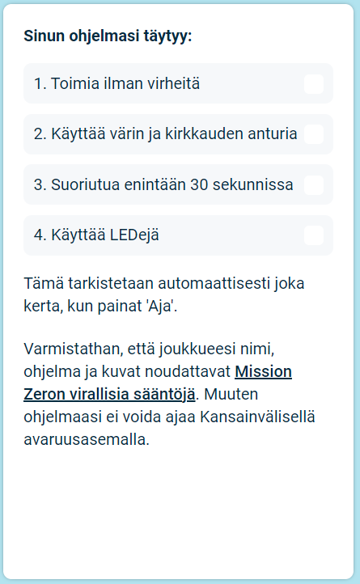

## Lähetä ohjelmasi

Voit nyt osallistua [Astro Pi Mission Zero](https://astro-pi.org/mission-zero){:target="_blank"} -haasteeseen kirjoittamallasi koodilla.

On olemassa muutamia sääntöjä, joita koodisi on noudatettava, jotta voit lähettää sen suoritettavaksi Kansainvälisellä avaruusasemalla. Jos koodisi noudattaa niitä, säännöt **Sense HAT -emulaattorin** alareunassa syttyvät vihreinä ohjelmaa ajaessasi.

**Vinkki:** Kokeile koodiasi muutamalla eri väriasetuksella (valitsimen avulla) varmistaaksesi, että se toimii aina oikein.

Varmista, että työsi noudattaa Mission Zeron [virallisia sääntöjä](https://astro-pi.org/mission-zero/guidelines){:target="_blank"}. Jos se ei noudata sääntöjä, ohjelmaasi ei voida ajaa Kansainvälisellä avaruusasemalla.

Älä sisällytä joukkueesi nimeen tai koodiin mitään seuraavista:

+ Kaikki mikä voidaan tulkita laittomaksi, poliittiseksi tai arkaluonteiseksi
+ Lippuja, koska niitä voidaan pitää poliittisesti arkaluonteisina
+ Kaikki mikä viittaa toisen henkilön haittaamiseen tai vahingoittamiseen
+ Henkilötietoja kuten puhelinnumeroita, sosiaalisen median tunnuksia tai sähköpostiosoitteita
+ Siveettömiä kuvia
+ Erikoismerkkejä tai hymiöitä
+ Huonoa kieltä tai kiroilua

--- task ---

Kirjoita luokkahuonekoodisi ja joukkueesi nimi alhaalla olevaan ruutuun — ohjaajasi kertoo sinulle, mikä koodisi on.

**Huomautuksia ohjaajille** löytyy [Johdanto](https://projects.raspberrypi.org/fi-FI/projects/astro-pi-mission-zero/0)-vaiheesta.

--- /task ---

--- task ---

Paina **Lisää joukkueesi** -painiketta syöttääksesi koodisi. Huomioithan, että ohjelmaa ei voi muuttaa enää lähettämisen jälkeen.

Ohjaajasi saa sähköpostin vahvistukseksi ilmoittautumisestasi.

--- /task ---

--- task ---

Jos haluat, voit jakaa linkin koodiisi sosiaalisessa mediassa kertoaksesi, että koodia, jonka kirjoitit, käytetään avaruudessa!

--- /task ---
