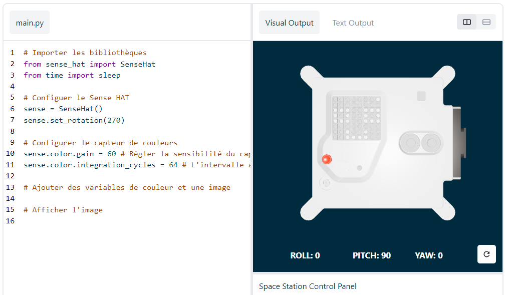

## Afficher un message et choisir un nom pour les nouveaux ordinateurs Astro Pi

--- task ---

Ouvre [l'émulateur Sense HAT](https://trinket.io/mission-zero){:target="_blank"} pour le projet Mission Zero.

Tu vas constater que trois lignes de code ont été ajoutées automatiquement :

```python
from sense_hat import SenseHat
sense = SenseHat()
sense.set_rotation(270)
```



Ce code se connecte à l'Astro Pi et s'assure que l'écran LED de l'Astro Pi est affiché dans le bon sens. Laisse ce code ici car tu en auras besoin.

--- /task ---

--- task ---

Peut-être pourrais-tu laisser un message de bienvenue aux astronautes de l'ISS qui travaillent près de l'Astro Pi ? Faisons défiler un message sur l'écran.

Ajoute cette ligne en-dessous de l'autre ligne de code :

```python
sense.show_message("Astro Pi")
```

--- /task ---

--- task ---

Appuie sur le bouton **Run** (Exécuter) et regarde le message `Astro Pi` défiler sur l'écran LED.


--- /task ---


Pour afficher un message différent, tu peux écrire ce que tu veux entre les guillemets (`""`).

--- collapse ---

---
title: Quels caractères peuvent être utilisés ?
---

Le Sense HAT ne peut afficher que le jeu de caractères Latin 1, ce qui signifie que seuls les caractères suivants sont disponibles. Les autres caractères s'afficheront sous la forme d'un `?` .

```
+-*/!"#$><0123456789.=)(

ABCDEFGHIJKLMNOPQRSTUVWXYZ

abcdefghijklmnopqrstuvwxyz

?,;:|@%[&_']\~
```

--- /collapse ---

--- task ---

Tu peux aussi modifier la vitesse de défilement du message sur l'écran. Ajoute un `scroll_speed` (vitesse de défilement) à ta ligne de code, comme ceci :

```python
sense.show_message("Astro Pi", scroll_speed=0.05)
```

La vitesse par défaut du message est `0.1`. En réduisant le nombre, tu fais défiler le message plus rapidement et en augmentant le nombre tu fais défiler le message plus lentement.

--- /task ---

### Choisis un nom pour les nouveaux ordinateurs Astro Pi

--- task --- Nous donnerons aux ordinateurs Astro Pi le nom de deux scientifiques européens inspirants. Des centaines d'hommes et de femmes ont contribué à la science et à la technologie ; les participants peuvent suggérer leur propre nom ou choisir dans notre liste de suggestions :


[Ada Lovelace](https://en.wikipedia.org/wiki/Ada_Lovelace){:target="_blank"} 
[Alan Turing](https://en.wikipedia.org/wiki/Alan_Turing){:target="_blank"} 
[Caroline Herschel](https://en.wikipedia.org/wiki/Caroline_Herschel){:target="_blank"} 
[Edsgar Dijkstra](https://en.wikipedia.org/wiki/Edsger_W._Dijkstra){:target="_blank"} 
[Hedy Lamarr](https://en.wikipedia.org/wiki/Hedy_Lamarr){:target="_blank"} 
[Hypatia](https://en.wikipedia.org/wiki/Hypatia){:target="_blank"} 
[John Edmonstone](https://en.wikipedia.org/wiki/John_Edmonstone){:target="_blank"} 
[Marie Curie](https://en.wikipedia.org/wiki/Marie_Curie){:target="_blank"} 
[Nikola Tesla](https://en.wikipedia.org/wiki/Nikola_Tesla){:target="_blank"} 
[Tycho Brahe](https://en.wikipedia.org/wiki/Tycho_Brahe){:target="_blank"}

Tu dois débuter ton message par « My name should be » (en anglais). Par exemple, si tu souhaites voter pour Ada Lovelace, ton code ressemblerait à ceci :

```python
sense.show_message("My name should be Ada Lovelace")
```

Si tu souhaites voter, ton message doit commencer par ces mots, sinon nous ne pourrons pas compter ton vote.

--- /task ---


