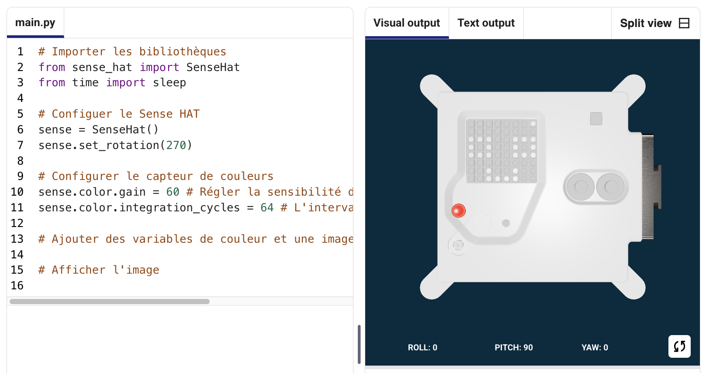
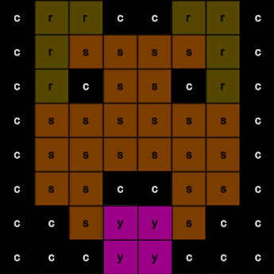

## Afficher une image

La matrice LED de l'Astro Pi peut afficher des couleurs. Dans cette étape, tu vas afficher des images de la nature sur la matrice LED de l'Astro Pi.

<p style="border-left: solid; border-width:10px; border-color: #0faeb0; background-color: aliceblue; padding: 10px;">
Une <span style="color: #0faeb0">**matrice LED**</span> est une grille de LED qui peuvent être contrôlées individuellement ou en groupe pour créer différents effets de lumière. La matrice LED du Sense HAT comporte 64 LED affichées dans une grille de 8 x 8. Les LED peuvent être programmées pour produire une large gamme de couleurs.
</p>


--- task ---

Ouvre le [projet de démarrage de Mission Zero](https://missions.astro-pi.org/mz/code_submissions/){:target="_blank"}.

Tu verras que quelques lignes de code ont été ajoutées pour toi automatiquement.

Ce code se connecte à l'Astro Pi et fait en sorte que l'écran LED de l'Astro Pi s'affiche correctement et effectue la configuration du capteur de couleurs. Laisse ce code ici car tu en auras besoin.

--- code ---
---
language: python filename: main.py line_numbers: false line_number_start: 1
line_highlights:
---
# Importer les bibliothèques
from sense_hat import SenseHat from time import sleep

# Configuer le Sense HAT
sense = SenseHat() sense.set_rotation(270)

# Configurer le capteur de couleurs
sense.color.gain = 60 # Set the sensitivity of the sensor sense.color.integration_cycles = 64 # The interval at which the reading will be taken

--- /code ---



--- /task ---

### Les couleurs RVB

Tu peux créer des couleurs en utilisant différentes valeurs de rouge, vert et bleu. Tu peux découvrir les couleurs RVB ici :

[[[generic-theory-simple-colours]]]

La matrice LED est une grille 8 x 8. Chaque LED de la grille peut être réglée sur une couleur différente. Voici une liste de variables pour 24 couleurs différentes. Chaque couleur comporte une valeur de rouge, vert et bleu :

[[[ambient-colours]]]

### Choisis une image

--- task ---

**Choisir :** choisis une image à afficher parmi les options ci-dessous. Python stocke les informations d'une image dans une liste. Le code de chaque image comprend les variables de couleur utilisées et la liste.

Tu devras **copier** tout le code de l'image que tu as choisie puis le **coller** dans ton projet sous la ligne indiquant `# Ajouter des variables de couleur et une image`.

--- collapse ---

---
title: Poisson
---


Créé par l'équipe chalka, Pologne

```python
c = (0, 0, 0) # Noir
a = (255, 255, 255) # Blanc
t = (255, 140, 0) # Orange foncé

image = [
t, a, t, c, c, t, a, t,
t, a, t, c, c, t, a, t,
t, t, t, t, t, t, t, t,
t, a, c, t, t, c, a, t,
t, t, t, t, t, t, t, t,
a, a, a, c, c, a, a, a,
c, a, a, a, a, a, a, c,
c, c, a, a, a, a, c, c]

```

--- /collapse ---


--- collapse ---

---
titre : Morse
---


Créé par l'équipe Walrus, Finlande

```python
c = (0, 0, 0) # Noir
b = (105, 105, 105) # Gris foncé
a = (255, 255, 255) # Blanc

image = [
    c, c, c, c, c, c, c, c,
    c, b, b, b, c, c, c, c,
    c, b, c, b, c, c, b, b,
    c, b, c, c, c, b, b, b,
    c, b, b, c, c, b, c, b,
    c, b, b, b, b, b, b, b,
    c, c, b, b, a, b, b, b,
    c, c, c, c, a, b, b, b]

```

--- /collapse ---

--- collapse ---
---
title: Paxi
---


Créé par l'équipe tony_pi, Italie

```python
a = (255, 255, 255) # Blanc
c = (0, 0, 0) # Noir
n = (154, 205, 50) # Jaune-vert
q = (255, 255, 0) # Jaune
t = (255, 140, 0) # Orange foncé

image = [   
  q, q, c, n, c, c, a, c,
  q, c, c, n, c, a, a, a,
  c, n, c, n, c, c, c, c,
  c, n, n, n, c, n, c, c,
  c, a, n, n, n, n, c, c,
  a, a, a, n, c, a, a, a,
  c, c, c, n, a, a, a, c,
  t, t, t, t, t, t, t, t]

```

--- /collapse ---


--- collapse ---
---
title: Chien
---



Créé par l'équipe ptpr_07, Espagne

```python

c = (0, 0, 0) # Black
r = (184, 134, 11) # DarkGoldenrod
s = (139, 69, 19) # SaddleBrown
y = (255, 20, 147) # DeepPink

image = [
    c, r, r, c, c, r, r, c,
    c, r, s, s, s, s, r, c,
    c, r, c, s, s, c, r, c,
    c, s, s, s, s, s, s, c,
    c, s, s, s, s, s, s, c,
    c, s, s, c, c, s, s, c,
    c, c, s, y, y, s, c, c,
    c, c, c, y, y, c, c, c]


```

--- /collapse ---

--- collapse ---
---
title: Caméléon
---


Créé par l'équipe The_ETs, Royaume-Uni

```python

c = (100, 149, 237) # Bleuet
a = (255, 255, 255) # Blanc
v = (255, 0, 0) # Rouge
t = (255, 140, 0) # Orange foncé
q = (255, 255, 0) # Jaune
l = (0, 255, 127) # Vert printanier
e = (0, 0, 205) # Bleu moyen

arc-en-ciel = [
  c, c, c, c, c, c, c, c, 
  v, v, v, v, c, c, c, c,
  t, t, t, t, v, v, c, c,
  q, q, q, q, t, v, c, c,
  l, l, l, l, q, t, v, c,
  e, e, e, l, q, t, v, c,
  c, c, e, a, a, a, a, c,
  c, a, a, a, a, a, a, a
]

```

--- /collapse ---

--- collapse ---
---
title: Cerf-volant
---


Créé par l'équipe Val, Grèce

```python

b = (105, 105, 105) # FaibleGris
c = (0, 0, 0) # Noir
d = (100, 149, 237) # Bleuet
v = (255, 0, 0) # Rouge
z = (153, 50, 204) # Orchidée Foncée

image = [
    c, c, v, c, v, c, c, c,
    c, z, z, z, z, v, c, c,
    z, b, z, b, z, c, c, c,
    z, z, z, z, z, v, c, c,
    c, c, d, d, d, c, c, z,
    c, z, d, z, z, z, z, c,
    c, c, d, d, z, c, c, c,
    c, c, z, c, z, c, c, c]

```

--- /collapse ---

--- collapse ---
---
title: Poulet
---


Created by team Slepicky, Czechia

```python

a = (255, 255, 255) # Blanc
c = (0, 0, 0) # Noir
f = (25, 25, 112) # Bleu nuit
m = (34, 139, 34) # Vert forêt

image = [
  m, m, m, m, m, c, c, c,
  m, f, m, f, m, m, m, m,
  m, m, m, m, m, m, m, m,
  m, m, c, a, c, c, c, a,
  m, m, c, c, c ,c ,c ,c,
  m, m, c, c, c, a, c, c,
  m, m, m, m, m, m, m, m,
  m, m, m, m, m, m, m, m]

# Afficher l'image
sense.set_pixels(image)

```

--- /collapse ---

--- /task ---

--- task ---

**Recherche :** la ligne indiquant `# Afficher l'image` et ajoute une ligne de code pour afficher ton image sur la matrice LED :

--- code ---
---
language: python filename: main.py line_numbers: false line_number_start: 1
line_highlights: 18, 19
---
z = (153, 50, 204) # DarkOrchid q = (255, 255, 0) # Yellow d = (51, 153, 255) # blue c = (0, 0, 0) # Black

image = [ d, d, z, d, d, d, d, d, d, d, d, z, z, d, d, d, z, d, q, q, q, q, d, d, z, z, q, q, q, c, q, d, z, z, z, q, q, q, q, d, z, z, q, q, q, q, q, d, z, d, q, z, z, q, d, d, d, d, d, z, d, d, d, d]

# Afficher l'image
sense.set_pixels(image)

--- /code ---

--- /task ---

--- task ---

Appuie sur **Run** en bas de l'éditeur, pour voir ton image s'afficher sur la matrice LED.

--- /task ---

--- task ---

**Déboguer**

Mon code a une erreur de syntaxe :

- Vérifie que ton code correspond au code des exemples ci-dessus
- Vérifie que tu as bien indenté le code dans ta liste
- Vérifie que ta liste est entourée de `[` et `]`
- Vérifie que chaque variable de couleur de la liste est séparée par une virgule

Mon image n'apparaît pas :

- Vérifie que ton `sense.set_pixels(image)` n'est pas indenté

--- /task ---


--- task ---

**Enregistre ta progression**

Maintenant que tu as affiché une image, tu peux enregistrer ton programme sur le projet Mission Starter en entrant le nom de ton équipe, les noms des membres de l'équipe et le code de classe qui t'a été donné. Tu peux recharger ton programme sur n'importe quel appareil avec une connexion Internet en entrant le nom de ton équipe et le code de classe.


--- /task --- 
