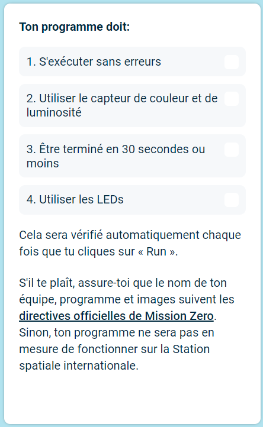

## Soumettre ton programme

Tu pouvez maintenant entrer le défi [Astro Pi Mission Zero](https://astro-pi.org/mission-zero){:target="_blank"} en utilisant le code que tu avez écrit.

Ton code doit respecter quelques règles pour que tu puisses le soumettre et l'exécuter dans la Station Spatiale Internationale. Si ton code les respecte, les règles situées en bas de l'**émulateur Sense HAT** s'allumeront en vert lorsque tu exécuteras le programme.

**Astuce :** teste ton code avec quelques paramètres de couleur différents (en utilisant le sélecteur) pour t'assurer qu'il fonctionne toujours correctement.

Assure-toi que ton programme respecte les [directives officielles](https://astro-pi.org/mission-zero/guidelines){:target="_blank"} de Mission Zero. Sinon, ton programme ne sera pas en mesure de fonctionner sur la Station spatiale internationale.

N'inclus aucun des éléments suivants dans le nom ou le code de ton équipe :

+ Tout ce qui pourrait être interprété comme étant de nature illégale, politique ou sensible
+ Des drapeaux, car ils peuvent être considérés comme politiquement sensibles
+ Des choses qui sont désagréables ou qui pourraient heurter une autre personne
+ Des données personnelles telles que des numéros de téléphone, des liens vers les réseaux sociaux, et des adresses e-mail
+ Des images obscènes
+ Des caractères spéciaux ou des émojis
+ Des gros mots ou des injures

--- task ---

Saisis ton code de classe et le nom de ton équipe dans la case en bas : ton mentor te dira quel est ton code.

**Les notes destinées aux mentors** se trouvent dans l'étape [Introduction](https://projects.raspberrypi.org/fr-FR/projects/astro-pi-mission-zero/0).

--- /task ---

--- task ---

Appuie sur le bouton **Ajouter ton équipe** pour saisir ton code. Sache qu'un programme ne peut pas être modifié après avoir été soumis.

Ton mentor recevra un e-mail pour confirmer ton inscription.

--- /task ---

--- task ---

Si tu veux, tu peux partager le lien vers ton code sur les réseaux sociaux pour informer les gens que le code que tu as écrit sera exécuté dans l'espace !

--- /task ---
