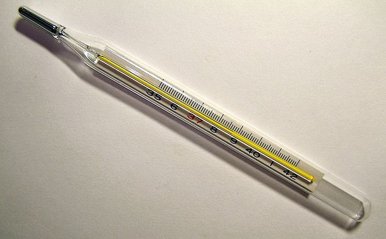

## Mesurer la température

Le capteur de température de l'Astro Pi peut mesurer la température de l'air qui l'entoure, c'est une fonction utile pour t'aider à rassembler des données sur les conditions dans l'espace.


L'Astro Pi mesure la température dans la SSI en degrés Celsius (&deg;C). Parce que les températures dans l'espace varient beaucoup plus que sur la Terre, l'Astro Pi peut mesurer des températures allant de -40 degrés Celsius à +120 degrés Celsius.

Une partie de ta mission consiste à contribuer à la vie quotidienne de l’équipage à bord de la SSI, c'est pourquoi faire savoir aux astronautes que la température à bord de la station spatiale se situe dans les limites normales est utile et va les rassurer.

## \--- collapse \---

## title: Qu'est-ce que la température ?

La température est la mesure qui indique la chaleur de quelque chose. Peut-être que ta température a été prise avec un thermomètre quand tu es allé voir le médecin.

 *By Menchi [CC-BY-SA-3.0](http://creativecommons.org/licenses/by-sa/3.0/){:target="_blank"} via Wikimedia Commons*

Pour être plus précis, la température est la mesure de la quantité d'énergie thermique d'une substance. Tu sais qu'un cube de glace est solide, mais à mesure qu'il se réchauffe, c'est-à-dire qu'il absorbe l'énergie thermique de son environnement, il fond et devient liquide. Ceci est dû au fait que lorsqu'une substance absorbe ou perd suffisamment d'énergie calorifique, la substance change d'état, elle passe de l'état solide à l'état liquide.

\--- /collapse \---

\--- task \---

Ajoute ce code pour mesurer la température :

```python
temp = sense.temperature
```

Cette ligne mesure la température actuelle et stocke la valeur mesurée dans la variable `temp`.

\--- /task \---

\--- task \---

La température est enregistrée très précisément, c’est-à-dire que la valeur stockée a un grand nombre de décimales. Tu peux arrondir la valeur à n'importe quel nombre de décimales. Dans l'exemple, nous avons arrondi à une décimale, mais pour avoir un autre niveau de précision remplace le nombre `1` par le nombre de décimales que tu souhaites.

```python
temp = round( sense.temperature, 1 )
```

\--- /task \---

\--- task \---

Pour afficher la température actuelle sous la forme d'un message défilant à l'écran, ajoute cette ligne de code :

```python
sense.show_message( str(temp) )
```

La partie `str()` convertit la température d'un nombre en texte pour que l'Astro Pi puisse l'afficher.

\--- /task \---

\--- task \---

Tu peux également afficher la température à l'intérieur d’un autre message en joignant les différentes parties de ton message avec un `+` .

```python
sense.show_message( "It is " + str(temp) + " degrees" )
```

\--- /task \---

Le vrai Astro Pi mesure la température autour de lui, mais toi tu peux déplacer le curseur de température sur l'émulateur Sense HAT pour simuler des changements de température et tester ton code.


**Remarque :** Tu te demandes peut-être pourquoi le curseur de température affiche la température sous forme d'un nombre entier, mais le résultat de la mesure de la température est donnée avec des décimales. L'émulateur simule la légère imprécision du capteur réel, de sorte que le résultat de la mesure de la température que tu vois peut être très légèrement supérieure ou inférieure à la valeur que tu as définie avec le curseur.