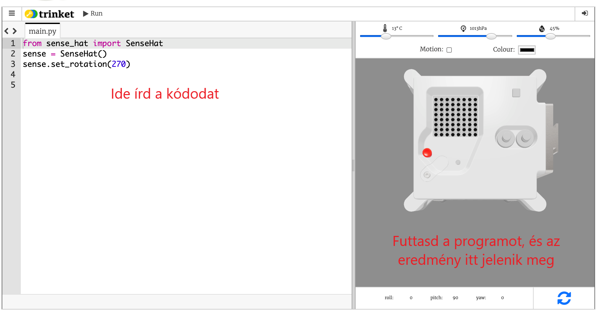

## Mi az az Astro Pi?

Az Astro Pi egy Raspberry Pi számítógép egy olyan burkolatban, amelyet kifejezetten az űrbeli körülményekre terveztek. Egy Sense HAT nevű kiegészítő alkatrész is van hozzá, amely kifejezetten az Astro Pi küldetéshez készült. A Sense HAT-nek van egy joystickje, egy LED-kijelzője és a hőmérséklet, páratartalom, nyomás és irány rögzítésére alkalmas érzékelője.

Itt van egy igazi Astso Pi egység a Nemzetközi Űrállomáson, éppen a diákok által írt kód fut rajta. Egyszer majd a te kódod is itt fog futni! <iframe src="https://player.vimeo.com/video/172737314" width="640" height="360" frameborder="0" webkitallowfullscreen mozallowfullscreen allowfullscreen mark="crwd-mark"></iframe> 

Ehhez a küldetéshez a Sense HAT emulátort használod majd. Az emulátor egy olyan szoftver, amely az Astro Pi összes funkcióját szimulálja a webböngésződben.

Azonban van néhány különbség az igazi és az emulált Sense HAT között:

- Az emulátoron saját magad állíthatod be a hőmérsékletet, nyomást és a páratartalmat csúszkák használatával, azonban az igazi Sense HAT az Astro Pi-ban érzékelőket használ ezeknek a paramétereknek a mérésére környezetében.

- Kattints rá és húzd el az egérrel az emulált Sense HAT-et, hogy elmozgasd és elforgasd, ezáltal szimulálva az irányában beálló változásokat; az igazi Astro Pi (és a Sense HAT) a való világban elmozdulhat, és a Sense HAT irányérzékelői észlelik, hogyan és mikor mozdult el.