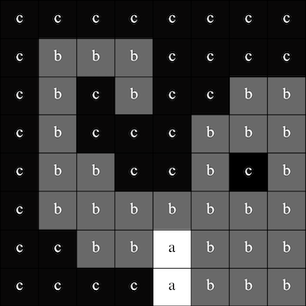

## Jeleníts meg egy képet

Az Astro Pi LED-mátrixa színeket is meg tud jeleníteni. Ebben a lépésben a természetről szóló képeket fogsz megjeleníteni az Astro Pi LED-mátrixán.

<p style="border-left: solid; border-width:10px; border-color: #0faeb0; background-color: aliceblue; padding: 10px;">
A <span style="color: #0faeb0">**LED mátrix**</span> egy LED-ekből álló rács, amely egyenként vagy csoportosan vezérelhető, hogy létrehozz különféle fényhatásokat. A Sense HAT LED-mátrixa 64 LED-ből áll egy 8*8-as rácson elhelyezve. A LED-eket be lehet programozni, hogy a színek széles skáláját mustassák.
</p>


--- task ---

Nyisd meg a [Mission Zero kezdőprojektet](http://rpf.io/mzcode){:target="_blank"}.

Látni fogod, hogy néhány kódsort már automatikusan hozzáadtunk neked.

Ez a kód az Astro Pi-hoz kapcsolódik, és biztosítja, hogy az Astro Pi LED kijelzője a helyes irányba mutat, majd beállítja a színérzékelőt. Hagyd meg a kódot, mert szükséged lesz rá!

--- code ---
---
language: python filename: main.py line_numbers: false line_number_start: 1
line_highlights:
---
# Importáld a könyvtárakat
from sense_hat import SenseHat from time import sleep

# Állítsd be a SenseHAT-et
sense = SenseHat() sense.set_rotation(270)

# Állítsd be a színérzékelőt
sense.color.gain = 60 # Set the sensitivity of the sensor sense.color.integration_cycles = 64 # The interval at which the reading will be taken

--- /code ---


--- /task ---

### RGB-színek

Bármilyen színt létrehozhatsz a vörös, a zöld és a kék különböző arányainak használatával. Itt többet tudhatsz meg az RGB-színekről:

[[[generic-theory-simple-colours]]]

A LED-mátrix egy 8*8-as rács. A rácson mindegyik LED más színre állítható be. Itt egy lista színváltozókból 24 különböző színhez. Mindegyik szín egy vörös, zöld és kék értékkel rendelkezik:

[[[ambient-colours]]]

### Válassz egy képet

--- task ---

**Válassz:** Az alábbi képek között keress egyet, amely tetszik. A Python a kép információit egy listában tárolja. Mindegyik kép kódja tartalmazza a felhasznált színváltozókat és a listát.

Ki kell **másolnod** a választott képed kódját, aztán **beillesztened** a projektedbe a `Színváltozók és kép hozzáadása` sor alá.

--- collapse ---

---
title: Róka
---


Készítette: team i_pupi csapat, Olaszország

```python
c = (0, 0, 0) # Black
a = (255, 255, 255) # white
t = (255, 140, 0) # dark orange

image = [
t, a, t, c, c, t, a, t,
t, a, t, c, c, t, a, t,
t, t, t, t, t, t, t, t,
t, a, c, t, t, c, a, t,
t, t, t, t, t, t, t, t,
a, a, a, c, c, a, a, a,
c, a, a, a, a, a, a, c,
c, c, a, a, a, a, c, c]
```

--- /collapse ---


--- collapse ---

---
title: Elefánt
---



Készítette: ILiFanT csapat, Finnország

```python
c = (0, 0, 0) # Black
b = (105, 105, 105) # dark grey
a = (255, 255, 255) # white

image = [
    c, c, c, c, c, c, c, c,
    c, b, b, b, c, c, c, c,
    c, b, c, b, c, c, b, b,
    c, b, c, c, c, b, b, b,
    c, b, b, c, c, b, c, b,
    c, b, b, b, b, b, b, b,
    c, c, b, b, a, b, b, b,
    c, c, c, c, a, b, b, b]
```

--- /collapse ---

--- collapse ---
---
title: Kaktusz
---


Készítette: 6TETHASI csapat, Hollandia

```python
a = (255, 255, 255) # White
c = (0, 0, 0) # Black
n = (154, 205, 50) # YellowGreen
q = (255, 255, 0) # Yellow
t = (255, 140, 0) # DarkOrange

image = [   
  q, q, c, n, c, c, a, c,
  q, c, c, n, c, a, a, a,
  c, n, c, n, c, c, c, c,
  c, n, n, n, c, n, c, c,
  c, a, n, n, n, n, c, c,
  a, a, a, n, c, a, a, a,
  c, c, c, n, a, a, a, c,
  t, t, t, t, t, t, t, t]

```

--- /collapse ---


--- collapse ---
---
title: Krokodil
---


```python

a = (255, 255, 255) # White
c = (0, 0, 0) # Black
f = (25, 25, 112) # MidnightBlue
m = (34, 139, 34) # ForestGreen

image = [
  m, m, m, m, m, c, c, c,
  m, f, m, f, m, m, m, m,
  m, m, m, m, m, m, m, m,
  m, m, c, a, c, c, c, a,
  m, m, c, c, c ,c ,c ,c,
  m, m, c, c, c, a, c, c,
  m, m, m, m, m, m, m, m,
  m, m, m, m, m, m, m, m]

```

--- /collapse ---

--- collapse ---
---
title: Szivárvány
---


Készítette: camrus_6 csapat, Egyesült Királyság

```python

c = (100, 149, 237) # CornflowerBlue
a = (255, 255, 255) # White
v = (255, 0, 0) # Red
t = (255, 140, 0) # DarkOrange
q = (255, 255, 0) # Yellow
l = (0, 255, 127) # SpringGreen
e = (0, 0, 205) # MediumBlue

rainbow = [
  c, c, c, c, c, c, c, c, 
  v, v, v, v, c, c, c, c,
  t, t, t, t, v, v, c, c,
  q, q, q, q, t, v, c, c,
  l, l, l, l, q, t, v, c,
  e, e, e, l, q, t, v, c,
  c, c, e, a, a, a, a, c,
  c, a, a, a, a, a, a, a
]

```

--- /collapse ---

--- collapse ---
---
title: Sárkány
---


Készítette: hwplucyr csapat, Egyesült Királyság

```python

b = (105, 105, 105) # DimGray
c = (0, 0, 0) # Black
d = (100, 149, 237) # CornflowerBlue
v = (255, 0, 0) # Red
z = (153, 50, 204) # DarkOrchid

image = [
    c, c, v, c, v, c, c, c,
    c, z, z, z, z, v, c, c,
    z, b, z, b, z, c, c, c,
    z, z, z, z, z, v, c, c,
    c, c, d, d, d, c, c, z,
    c, z, d, z, z, z, z, c,
    c, c, d, d, z, c, c, c,
    c, c, z, c, z, c, c, c]

```

--- /collapse ---

--- /task ---

--- task ---

**Keresd meg** a `# Kép megjelenítése` sort, majd adj hozzá egy új sor kódot, hogy megjelenítsd a képet a LED-mátrixon:

```python
a = (255, 255, 255) # White
c = (0, 0, 0) # Black
f = (25, 25, 112) # MidnightBlue
m = (34, 139, 34) # ForestGreen

image = [
  m, m, m, m, m, c, c, c,
  m, f, m, f, m, m, m, m,
  m, m, m, m, m, m, m, m,
  m, m, c, a, c, c, c, a,
  m, m, c, c, c ,c ,c ,c,
  m, m, c, c, c, a, c, c,
  m, m, m, m, m, m, m, m,
  m, m, m, m, m, m, m, m]

# Display the image 
sense.set_pixels(image)

```

--- /task ---

--- task ---

Nyomd meg a **Run** (futtatás) gombot a szerkesztő alján, hogy láthasd, ahogy a képed megjelenik a LED-mátrixon.

--- /task ---

--- task ---

**Hibakeresés**

A kódom szintaxishibás ("Syntax error"):

- Ellenőrizd, hogy a kódod megegyezik-e a fenti példákban látható kóddal
- Ellenőrizd, hogy beljebb kezdted-e a kódot a listádban
- Ellenőrizd, hogy a listád `[` és `]` között van-e
- Ellenőrizd, hogy a listában minden színváltozó vesszővel van-e elválasztva

Nem jelenik meg a képem:

- Ellenőrizd, hogy a `sense.set_pixels(image)` ne legyen beljebb kezdve

--- /task ---


--- task ---

**Mentsd el a munkádat!**

Now that you have displayed an image, you can save your program on the Mission Starter project by entering your team name, team members' names, and the classroom code given to you. You can reload your program on any device with an internet connection by entering your team name and classroom code.


--- /task --- 
