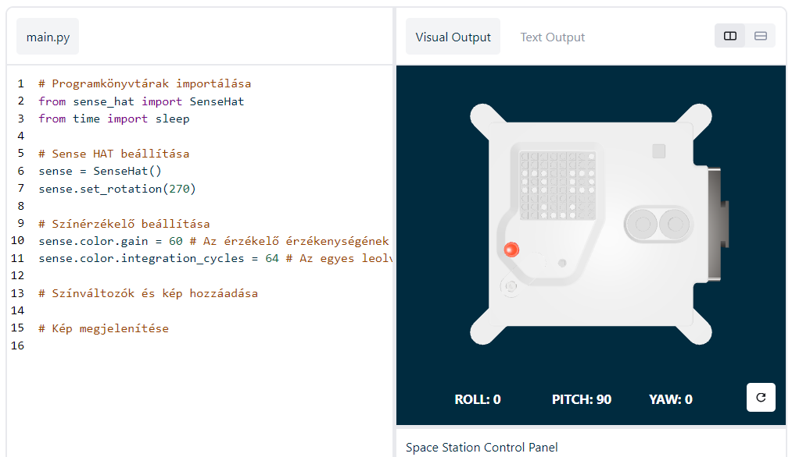

## Jeleníts meg egy képet

Az Astro Pi LED-mátrixa színeket is meg tud jeleníteni. Ebben a lépésben a természetről szóló képeket fogsz megjeleníteni az Astro Pi LED-mátrixán.

A **LED mátrix** egy LED-ekből álló rács, amely egyenként vagy csoportosan vezérelhető, hogy létrehozz különféle fényhatásokat. A Sense HAT LED-mátrixa 64 LED-ből áll egy 8*8-as rácson elhelyezve. A LED-eket be lehet programozni, hogy a színek széles skáláját mustassák.

--- task ---

Nyisd meg a [Mission Zero kezdőprojektet](http://rpf.io/mzcode){:target="_blank"}.

Látni fogod, hogy néhány kódsort már automatikusan hozzáadtunk neked.

Ez a kód az Astro Pi-hoz kapcsolódik, és biztosítja, hogy az Astro Pi LED kijelzője a helyes irányba mutat, majd beállítja a színérzékelőt. Hagyd meg a kódot, mert szükséged lesz rá!

--- code ---
---
Írd be ezt a sort a többi kód alá:
title: Milyen karaktereket lehet használni?
---
# Importáld a könyvtárakat
from sense_hat import SenseHat from time import sleep

# Állítsd be a SenseHAT-et
sense = SenseHat() sense.set_rotation(270)

# Állítsd be a színérzékelőt
Kattints a **Run** (Futtatás) gombra, és figyeld, hogy fut az `Astro Pi` üzenet keresztül a LED kijelzőn!

--- /code ---

--- /task ---

### RGB-színek

Bármilyen színt létrehozhatsz a vörös, a zöld és a kék különböző arányainak használatával. Itt többet tudhatsz meg az RGB-színekről:

[[[generic-theory-simple-colours]]]

A LED-mátrix egy 8*8-as rács. A rácson mindegyik LED más színre állítható be. Itt egy lista színváltozókból 24 különböző színhez. Mindegyik szín egy vörös, zöld és kék értékkel rendelkezik:

[[[ambient-colours]]]

### Válassz egy képet

--- task ---

**Válassz:** Az alábbi képek között keress egyet, amely tetszik. A Python a kép információit egy listában tárolja. Mindegyik kép kódja tartalmazza a felhasznált színváltozókat és a listát.

Ki kell **másolnod** a választott képed kódját, aztán **beillesztened** a projektedbe a `Színváltozók és kép hozzáadása` sor alá.

--- collapse ---

---
title: Csirke
---

--- code ---
---
Ha szeretnél szavazni, az üzenetednek *kötelezően* ezekkel a szavakkal kell kezdődnie, különben nem fogjuk tudni automatikusan beszámítani a szavazatodat.
line_numbers: false
---
a = (255, 255, 255) # White c = (0, 0, 0) # Black e = (0, 0, 205) # MediumBlue q = (255, 255, 0) # Yellow t = (255, 140, 0) # DarkOrange w = (255, 192, 203) # Pink

image = [ c, c, c, q, q, q, c, c, c, c, t, q, e, q, c, c, c, c, c, q, q, q, c, c, c, w, w, w, w, w, w, c, c, w, a, a, a, a, w, c, c, w, a, a, a, a, w, c, c, c, w, a, a, w, c, c, c, c, c, w, w, c, c, c]

--- /code ---

--- /collapse ---

--- collapse ---

---
title: Virág
---

--- code ---
---
language: python filename: main.py
line_numbers: false
---
c = (0, 0, 0) # Black m = (34, 139, 34) # ForestGreen q = (255, 255, 0) # Yellow t = (255, 140, 0) # DarkOrange y = (255, 20, 147) # DeepPink

image = [ c, c, y, y, y, y, c, c, c, y, y, t, t, y, y, c, y, y, t, q, q, t, y, y, c, y, y, t, t, y, y, c, c, c, y, y, y, y, c, c, m, c, c, m, m, c, c, m, c, m, m, m, m, m, m, c, c, c, c, m, m, c, c, c]

--- /code ---

--- /collapse ---

--- collapse ---
---
title: Rák
---

--- code ---
---
language: python filename: main.py
line_numbers: false
---
a = (255, 255, 255) # White c = (0, 0, 0) # Black v = (255, 0, 0) # Red

image = [ c, a, a, c, a, a, c, c, c, a, c, c, a, c, c, c, c, v, c, c, v, c, c, c, c, v, c, c, v, c, c, c, v, v, v, v, v, c, v, v, v, v, c, c, v, v, v, c, v, v, v, v, v, c, v, v, v, c, v, c, v, c, c, c]

--- /code ---

--- /collapse ---

--- collapse ---
---
title: Krokodil
---

--- code ---
---
language: python filename: main.py
line_numbers: false
---
a = (255, 255, 255) # White c = (0, 0, 0) # Black f = (25, 25, 112) # MidnightBlue m = (34, 139, 34) # ForestGreen

image = [ m, m, m, m, m, c, c, c, m, f, m, f, m, m, m, m, m, m, m, m, m, m, m, m, m, m, c, a, c, c, c, a, m, m, c, c, c ,c ,c ,c, m, m, c, c, c, a, c, c, m, m, m, m, m, m, m, m, m, m, m, m, m, m, m, m]

--- /code ---

--- /collapse ---

--- collapse ---
---
title: Kígyó
---

--- code ---
---
language: python filename: main.py
line_numbers: false
---
  c = (0, 0, 0) # Black (fekete) m = (34, 139, 34) # ForestGreen (sötétzöld) q = (255, 255, 0) # Yellow (sárga) v = (255, 0, 0) # Red (piros)

  kep = [ c, c, c, c, c, c, c, m, c, m, m, m, m, m, m, m, c, m, c, c, c, c, c, c, c, m, m, m, m, m, c, c, c, c, c, c, c, m, c, c, q, m, q, m, m, m, c, c, m, m, m, c, c, c, c, c, v, c, c, c, c, c, c, c]

--- /code ---

--- /collapse ---

--- collapse ---
---
title: Béka
---

--- code ---
---
language: python filename: main.py line_numbers: false line_number_start:
line_highlights:
---
c = (0, 0, 0) # Black m = (34, 139, 34) # ForestGreen q = (255, 255, 0) # Yellow v = (255, 0, 0) # Red

image = [ c, m, m, m, c, m, m, m, c, m, q, m, c, m, q, m, m, m, m, m, m, m, m, m, m, v, v, v, v, v, v, v, m, m, m, m, m, m, m, m, m, m, m, m, m, m, m, m, m, m, m, m, m, m, m, m, m, m, c, m, m, m, c, m]

--- /code ---

--- /collapse ---

--- /task ---

--- task ---

**Keresd meg** a `# Kép megjelenítése` sort, majd adj hozzá egy új sor kódot, hogy megjelenítsd a képet a LED-mátrixon:

--- code ---
---
language: python filename: main.py line_numbers: false line_number_start: 1
line_highlights: 12
---
image = [ c, c, c, q, q, q, c, c, c, c, t, q, e, q, c, c, c, c, c, q, q, q, c, c, c, w, w, w, w, w, w, c, c, w, a, a, a, a, w, c, c, w, a, a, a, a, w, c, c, c, w, a, a, w, c, c, c, c, c, w, w, c, c, c]

# Jelenítsd meg a képet
sense.set_pixels(image)

--- /code ---

--- /task ---

--- task ---

Nyomd meg a **Run** (futtatás) gombot a szerkesztő alján, hogy láthasd, ahogy a képed megjelenik a LED-mátrixon.

--- /task ---

--- task ---

**Hibakeresés**

A kódom szintaxishibás ("Syntax error"):

- Ellenőrizd, hogy a kódod megegyezik-e a fenti példákban látható kóddal
- Ellenőrizd, hogy beljebb kezdted-e a kódot a listádban
- Ellenőrizd, hogy a listád `[` és `]` között van-e
- Ellenőrizd, hogy a listában minden színváltozó vesszővel van-e elválasztva

Nem jelenik meg a képem:

- Ellenőrizd, hogy a `sense.set_pixels(image)` ne legyen beljebb kezdve

--- /task ---

