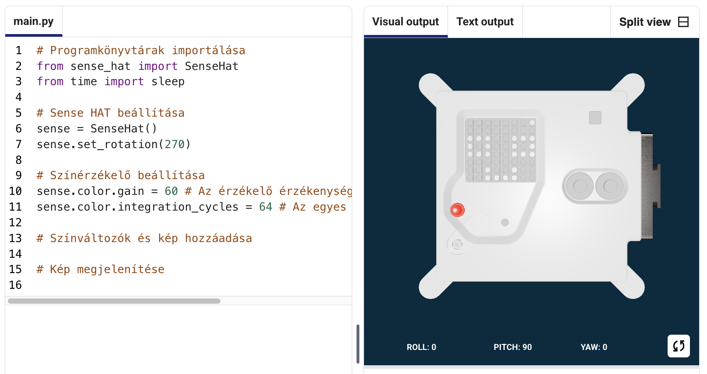
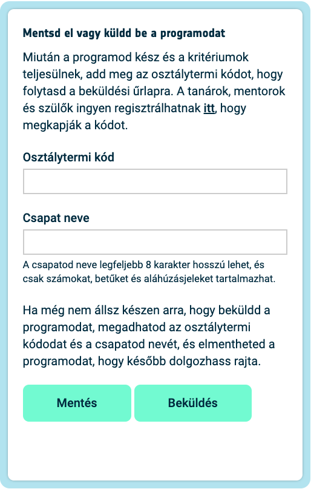

## Jeleníts meg egy képet

Az Astro Pi LED-mátrixa színeket is meg tud jeleníteni. Ebben a lépésben a természetről szóló képeket fogsz megjeleníteni az Astro Pi LED-mátrixán.

<p style="border-left: solid; border-width:10px; border-color: #0faeb0; background-color: aliceblue; padding: 10px;">
A <span style="color: #0faeb0">**LED mátrix**</span> egy LED-ekből álló rács, amely egyenként vagy csoportosan vezérelhető, hogy létrehozz különféle fényhatásokat. A Sense HAT LED-mátrixa 64 LED-ből áll egy 8*8-as rácson elhelyezve. A LED-eket be lehet programozni, hogy a színek széles skáláját mustassák.
</p>


--- task ---

Nyisd meg a [Mission Zero kezdőprojektet](https://missions.astro-pi.org/hu/mz/code_submissions/){:target="_blank"}.

Látni fogod, hogy néhány kódsort már automatikusan hozzáadtunk neked.

Ez a kód az Astro Pi-hoz kapcsolódik, és biztosítja, hogy az Astro Pi LED kijelzője a helyes irányba mutat, majd beállítja a színérzékelőt. Hagyd meg a kódot, mert szükséged lesz rá!

--- code ---
---
language: python
filename: main.py
line_numbers: false
line_number_start: 1
line_highlights: 
---
# Programkönyvtárak importálása
from sense_hat import SenseHat
from time import sleep

# Sense HAT beállítása
sense = SenseHat()
sense.set_rotation(270)

# Színérzékelő beállítása
sense.color.gain = 60 # Az érzékelő érzékenységének beállítása
sense.color.integration_cycles = 64 # Az egyes leolvasások között eltelt idő

--- /code ---



--- /task ---

### RGB-színek

Bármilyen színt létrehozhatsz a vörös, a zöld és a kék különböző arányainak használatával. Itt többet tudhatsz meg az RGB-színekről:

[[[generic-theory-simple-colours]]]

A LED-mátrix egy 8*8-as rács. A rácson mindegyik LED más színre állítható be. Itt egy lista színváltozókból 24 különböző színhez. Mindegyik szín egy vörös, zöld és kék értékkel rendelkezik:

[[[ambient-colours]]]

### Válassz egy képet

--- task ---

**Válassz:** Az alábbi képek között keress egyet, amely tetszik. A Python a kép információit egy listában tárolja. Mindegyik kép kódja tartalmazza a felhasznált színváltozókat és a listát.

Ki kell **másolnod** a választott képed kódját, aztán **beillesztened** a projektedbe a `Színváltozók és kép hozzáadása` sor alá.

--- collapse ---

---
title: Hal
---


Készítette: chalka csapat, Lengyelország

```python
z = (153, 50, 204) # DarkOrchid - lila
q = (255, 255, 0) # sárga
d = (51, 153, 255) # kék
c = (0, 0, 0) # fekete

kep = [
d, d, z, d, d, d, d, d,
d, d, d, z, z, d, d, d,
z, d, q, q, q, q, d, d,
z, z, q, q, q, c, q, d,
z, z, z, q, q, q, q, d,
z, z, q, q, q, q, q, d,
z, d, q, z, z, q, d, d,
d, d, d, z, d, d, d, d]

```

--- /collapse ---


--- collapse ---

---
title: Rozmár
---


Készítette: Walrus csapat, Finnország

```python
h = (0, 255, 255) # cián
c = (0, 0, 0) # fekete
s = (139, 69, 19) # SaddleBrown - barna
a = (255, 255, 255) # fehér
r = (184, 134, 11) # DarkGoldenrod - arany

kep = [
h, h, h, h, h, h, h, h,
h, h, s, s, s, h, h, h,
h, s, s, s, s, s, h, h,
h, s, c, s, c, s, s, s,
h, r, r, r, r, r, s, s,
h, h, a, s, a, s, s, s,
h, h, a, s, a, s, s, s,
r, r, s, s, s, s, s, s]

```

--- /collapse ---

--- collapse ---
---
title: Paxi
---


Készítette: tony_pi csapat, Olaszország

```python
v = (255, 0, 0) # vörös
m = (34, 139, 34) # ForestGreen - sötétzöld
c = (0, 0, 0) # fekete
e = (100, 149, 237) # CornflowerBlue - világoskék
l = (0, 255, 0) # zöld

kep = [
    c, v, m, c, c, m, v, c,
    c, c, v, v, v, v, c, c,
    c, v, c, e, l, e, v, c,
    c, v, c, l, l, l, v, c,
    c, v, c, l, c, l, v, c,
    c, c, v, v, v, v, c, c,
    c, c, l, c, c, l, c, c,
    c, m, m, c, c, m, m, c]

```

--- /collapse ---


--- collapse ---
---
title: Kutya
---


Készítette: ptpr_07 csapat, Spanyolország

```python

c = (0, 0, 0) # fekete
r = (184, 134, 11) # DarkGoldenrod - arany
s = (139, 69, 19) # SaddleBrown - barna
y = (255, 20, 147) # DeepPink - rózsaszín

kep = [
    c, r, r, c, c, r, r, c,
    c, r, s, s, s, s, r, c,
    c, r, c, s, s, c, r, c,
    c, s, s, s, s, s, s, c,
    c, s, s, s, s, s, s, c,
    c, s, s, c, c, s, s, c,
    c, c, s, y, y, s, c, c,
    c, c, c, y, y, c, c, c]


```

--- /collapse ---

--- collapse ---
---
title: Kaméleon
---


Készítette: The_ETs csapat, Egyesült Királyság

```python

c = (0, 0, 0) # fekete
s = (139, 69, 19) # SaddleBrown - barna
a = (255, 255, 255) # fehér
v = (255, 0, 0) # vörös
t = (255, 140, 0) # DarkOrange - sötét narancssárga
q = (255, 255, 0) # sárga
m = (34, 139, 34) # ForestGreen - sötétzölds
h = (0, 255, 255) # cián
z = (153, 50, 204) # DarkOrchid - lila
y = (255, 20, 147) # DeepPink - rózsaszín

kep = [
    a, a, v, v, t, a, a, a,
    a, v, v, t, t, q, a, a,
    v, c, t, t, q, q, m, a,
    v, t, t, q, q, m, m, h,
    s, s, q, s, s, m, s, h,
    a, a, a, a, a, a, a, z,
    a, a, a, a, y, a, a, z,
    a, a, a, a, a, y, z, a]

```

--- /collapse ---

--- collapse ---
---
title: Papírsárkány
---


Készítette: Val csapat, Görögország

```python

c = (0, 0, 0) # fekete
m = (34, 139, 34) # ForestGreen - sötétzöld
v = (255, 0, 0) # vörös
q = (255, 255, 0) # sárga
e = (0, 0, 205) # MediumBlue - sötétkék
h = (0, 255, 255) # cián

kep = [
    h, h, h, h, h, h, h, h, 
    h, h, h, e, e, v, v, h, 
    h, h, h, e, e, v, v, h, 
    h, h, h, q, q, m, m, h, 
    h, h, h, q, q, m, m, h,
    h, h, c, h, h, h, h, h, 
    h, c, h, h, h, h, h, h, 
    c, h, h, h, h, h, h, h]

```

--- /collapse ---

--- collapse ---
---
title: Csirke
---


Készítette: Slepicky csapat, Csehország

```python

v = (255, 0, 0) # vörös
c = (0, 0, 0) # fekete
b = (105, 105, 105) # DimGray - szürke
q = (255, 255, 0) # sárga
r = (184, 134, 11) # DarkGoldenrod - arany

kep =  [
    c, c, v, v, v, c, c, c,
    c, v, b, b, r, c, c, r,
    c, b, c, b, b, c, r, b,
    q, r, b, b, b, b, b, r,
    c, v, b, b, b, b, r, b,
    c, v, b, r, r, r, b, r,
    c, c, c, r, b, q, r, c,
    c, c, c, c, q, q, c, c]

```

--- /collapse ---

--- /task ---

--- task ---

**Keresd meg** a `# Kép megjelenítése` sort, majd adj hozzá egy új sor kódot, hogy megjelenítsd a képet a LED-mátrixon:

--- code ---
---
language: python
filename: main.py
line_numbers: false
line_number_start: 1
line_highlights: 18, 19
---
z = (153, 50, 204) # DarkOrchid (lila)
q = (255, 255, 0) # Yellow (Sárga)
d = (51, 153, 255) # kék
c = (0, 0, 0) # Black (fekete)

kep = [
d, d, z, d, d, d, d, d,
d, d, d, z, z, d, d, d,
z, d, q, q, q, q, d, d,
z, z, q, q, q, c, q, d,
z, z, z, q, q, q, q, d,
z, z, q, q, q, q, q, d,
z, d, q, z, z, q, d, d,
d, d, d, z, d, d, d, d]

# Kép megjelenítése 
sense.set_pixels(kep)

--- /code ---

--- /task ---

--- task ---

Nyomd meg a **Run** (futtatás) gombot a szerkesztő alján, hogy láthasd, ahogy a képed megjelenik a LED-mátrixon.

--- /task ---

--- task ---

**Hibakeresés**

A kódom szintaxishibás ("Syntax error"):

- Ellenőrizd, hogy a kódod megegyezik-e a fenti példákban látható kóddal
- Ellenőrizd, hogy beljebb kezdted-e a kódot a listádban
- Ellenőrizd, hogy a listád `[` és `]` között van-e
- Ellenőrizd, hogy a listában minden színváltozó vesszővel van-e elválasztva

Nem jelenik meg a képem:

- Ellenőrizd, hogy a `sense.set_pixels(kep)` ne legyen beljebb kezdve

--- /task ---


--- task ---

**Mentsd el a munkádat!**

Most, hogy megjeenítettél egy képet, elmentheted a programodat a küldetés kezdőprojektjébe, ha megadod a csapatod nevét, a csapattagok nevét és a mentorodtól kapott osztálytermi kódot. Újra betöltheted a programodat bármely internetkapcsolattal rendelkező eszközön, ha megadod a csapatod nevét és az osztálytermi kódot.



--- /task --- 
