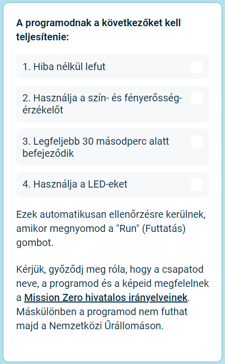

## Küldd be a munkádat

Van egy pár olyan szabály, amelynek a kódodnak meg kell felelnie ahhoz, hogy beküldhesd a Nemzetközi Űrállomáson való futtatásra. Ha a kódod betartja őket, akkor a **Sense HAT emulátor** alján a szabályok zölddel villannak fel, amikor futtatod a programodat.

**Tipp:** Teszteld a kódodat különféle színbeállításokkal (használd a színválasztót), hogy megyőződj róla, hogy a programod mindig helyesn fut.

Kérjük, győződj meg róla, hogy a munkád betartja a Mission Zero [hivatalos irányelveit](https://astro-pi.org/mission-zero/guidelines){:target="_blank"}. Ha nem tartja be az irányelveket, a programod nem futhat majd a Nemzetközi Űrállomáson.

Kérjük, ne használd az alábbiakat a csapatod nevében vagy a kódodban:

+ Bármi, ami törvényellenesnek, politikainak vagy érzékenynek értelmezhető
+ Zászlók, mert azok politikailag érzékenynek tekinthetők
+ Bármi, ami más személy kellemetlenségére vagy kárára utal
+ Személyes adatok, pl. telefonszám, közösségi profilnév és e-mail cím
+ Obszcén képek
+ Speciális karakterek és emojik
+ Rossz nyelvezet vagy káromkodás

--- task ---

Írd be az osztálytermi kódodat és a csapatod nevét a lenti mezőbe. A tanárod mondja meg majd a kódod.

**A mentorok részére szóló jegyzetek** a [Bevezető](https://projects.raspberrypi.org/en/projects/astro-pi-mission-zero/0) lépésben találhatók meg.

--- /task ---

--- task ---

Nyomd meg az **Add your team** (Csapatod hozzáadása) gombot a kódod beküldéséhez. Kérjük, figyelj rá, hogy a program beküldés után nem változtatható meg.

A mentorod egy e-mailt kap majd a jelentkezésedről.

--- /task ---

--- task ---

Ha szeretnéd, akár meg is oszthatod a kódodhoz tartozó linket a közösségi médián, hogy elújságold az embereknek, hogy a kód, amit írtál, az űrben fog futni!

--- /task ---
