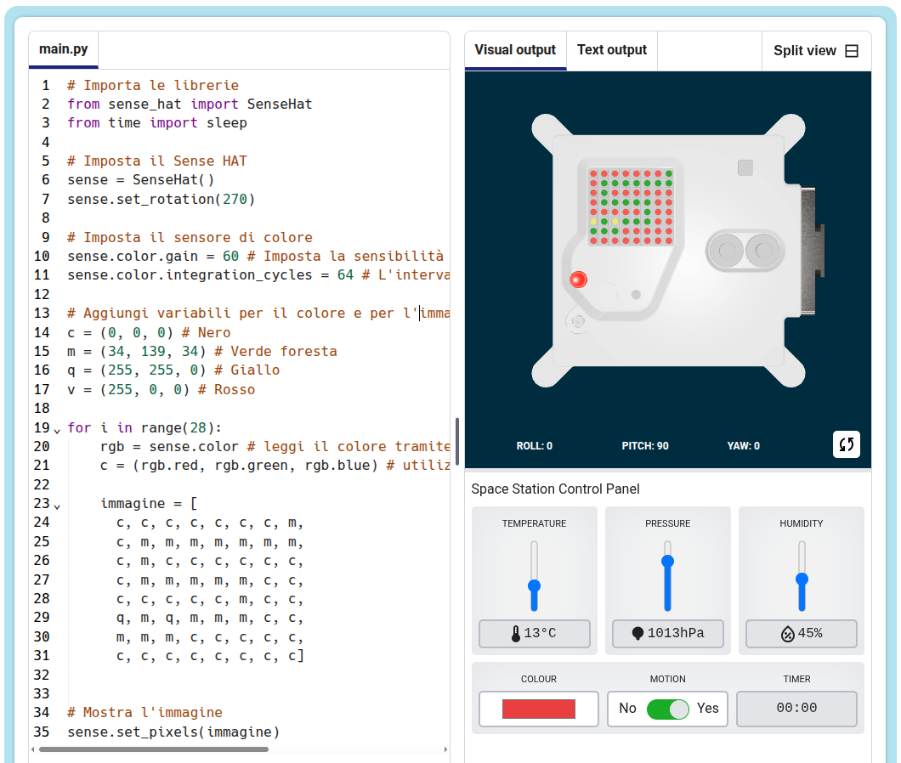

## Che cos'è un Astro Pi?

Un Astro Pi è un computer Raspberry Pi racchiuso in un contenitore appositamente progettato per le condizioni dello spazio. È dotato anche di una scheda aggiuntiva chiamata Sense HAT, realizzata specificamente per la missione Astro Pi. Sense HAT ha un joystick, un display LED e dei sensori per registrare temperatura, umidità, pressione e orientamento.

Ecco un'autentica unità Mark I Astro Pi sulla Stazione Spaziale Internazionale mentre sta eseguendo del codice scritto dagli studenti. Il vostro codice verrà eseguito su una nuova versione di computer Astro Pi!

<iframe width="560" height="315" src="https://www.youtube.com/embed/4ykbAJeGPMM" frameborder="0" allow="accelerometer; autoplay; encrypted-media; gyroscope; picture-in-picture" allowfullscreen mark="crwd-mark"></iframe>>

Per questa missione, utilizzerete l’emulatore Sense HAT. L’emulatore è un software che simula tutte le funzioni dell’Astro Pi nel vostro browser web.

Vi sono alcune differenze fra il Sense HAT vero e la sua emulazione:

- Sull’emulatore, potete impostare voi stessi la temperatura, la pressione e l’umidità usando dei cursori, mentre sul vero Sense HAT dell’Astro Pi questi parametri ambientali sono misurati mediante appositi sensori.

- Potete trascinare il Sense HAT con il mouse per spostarlo e ruotarlo, simulando dei cambiamenti nel suo orientamento. Il vero Astro Pi (e il suo Sense HAT) si muove nel mondo reale e, con i sensori di cui è dotato, può rilevare gli spostamenti e il momento in cui avvengono.
