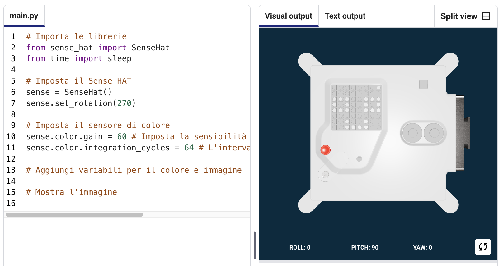

## Mostra un’immagine

La matrice LED di Astro Pi può visualizzare i colori. In questa fase, visualizzerai immagini prese dalla natura sulla matrice LED di Astro Pi.

<p style="border-left: solid; border-width:10px; border-color: #0faeb0; background-color: aliceblue; padding: 10px;">
Una <span style="color: #0faeb0">**matrice LED**</span> è una griglia di LED che può essere controllata individualmente o in gruppo per creare diversi effetti di luce. La matrice LED del Sense HAT ha 64 LED disposti in una griglia 8 x 8. I LED possono essere programmati per produrre un'ampia gamma di colori.
</p>


--- task ---

Apri [il progetto iniziale Mission Zero](https://missions.astro-pi.org/mz/code_submissions/){:target="_blank"}.

Vedrai che alcune righe di codice sono state aggiunte automaticamente per facilitarti.

Questo codice esegue il collegamento all'Astro Pi, assicurando che il display a LED dell'Astro Pi sia mostrato nel modo corretto e inoltre imposta il sensore di colore. Non modificate questo codice, perché ne avrete bisogno.

--- code ---
---
language: python filename: main.py line_numbers: false line_number_start: 1
line_highlights:
---
# Importa le librerie
from sense_hat import SenseHat from time import sleep

# Imposta il Sense HAT
sense = SenseHat() sense.set_rotation(270)

# Configura il sensore di colore
sense.color.gain = 60 # Set the sensitivity of the sensor sense.color.integration_cycles = 64 # The interval at which the reading will be taken

--- /code ---



--- /task ---

### Colori RGB

I colori possono essere creati utilizzando diverse quantità di rosso, verde e blu. Puoi scoprire i colori RGB qui:

[[[generic-theory-simple-colours]]]

La matrice LED è una griglia 8 x 8. Ciascun LED sulla griglia può essere impostato a un colore diverso. Ecco un elenco di variabili per 24 diversi colori. Ogni colore ha un valore per rosso, verde e blu:

[[[ambient-colours]]]

### Scegli un'immagine

--- task ---

**Scegli:** decidi quale immagine visualizzare tra le seguenti opzioni. Python memorizza le informazioni per un'immagine in una lista. Il codice di ogni immagine include le variabili di colore utilizzate e la lista.

Dovrai **copiare** tutto il codice per l'immagine scelta, quindi **incollarlo** nel tuo progetto sotto la riga che dice `# Aggiungi variabili di colore e immagine`.

--- collapse ---

---
title: Pesce
---


Creato dal team chalka, Polonia

```python
z = (153, 50, 204) # Orchidea sura
q = (255, 255, 0) # Giallo
d = (51, 153, 255) # Blu
c = (0, 0, 0) # Nero

immagine = [
d, d, z, d, d, d, d, d,
d, d, d, z, z, d, d, d, d,
z, d, q, q, q, q, d, d,
z, z, q, q, q, c, q, d,
z, z, z, q, q, q, q, d,
z, z, q, q, q, q, q, d,
z, d, q, z, z, q, d, d,
d, d, d, z, d, d, d, d]

```

--- /collapse ---


--- collapse ---

---
title: Tricheco
---


Creato dal team Walrus, Finlandia

```python
h = (0, 255, 255) # Ciano
c = (0, 0, 0) # Nero
s = (139, 69, 19) # Marrone sella
a = (255, 255, 255) # Bianco
r = (184, 134, 11) # Asta oro scuro

immagine = [
h, h, h, h, h, h, h, h, h,
h, h, s, s, s, h, h, h,
h, s, s, s, s, s, h, h,
h, s, c, s, c, s, s, s,
h, r, r, r, r, s, s,
h, h, a, s, a, s, s, s,
h, h, a, s, a, s, s, s,
r, r, s, s, s, s, s, s]

```

--- /collapse ---

--- collapse ---
---
title: Paxi
---


Creato dal team tony_pi, Italia

```python
v = (255, 0, 0) # Rosso
m = (34, 139, 34) # Verde Foresta
c = (0, 0, 0) # Nero 
e = (100, 149, 237) # Blu Fiordaliso
l = (0, 255, 0) # Verde

immagine = [
    c, v, m, c, c, m, v, c,
    c, c, v, v, v, v, c, c,
    c, v, c, e, l, e, v, c,
    c, v, c, l, l, l, v, c,
    c, v, c, l, c, l, v, c,
    c, c, v, v, v, v, c, c,
    c, c, l, c, c, l, c, c,
    c, m, m, c, c, m, m, c]

```

--- /collapse ---


--- collapse ---
---
title: Cane
---


Creato dal team ptpr_07, Spagna

```python

c = (0, 0, 0) # Nero
r = (184, 134, 11) # Asta oro scuro
s = (139, 69, 19) # Marrone sella
y = (255, 20, 147) # Rosa scurp

immagine = [
    c, r, r, c, c, r, r, c,
    c, r, s, s, s, s, r, c,
    c, r, c, s, s, c, r, c,
    c, s, s, s, s, s, s, c,
    c, s, s, s, s, s, s, c,
    c, s, s, c, c, s, s, c,
    c, c, s, y, y, s, c, c,
    c, c, c, y, y, c, c, c]


```

--- /collapse ---

--- collapse ---
---
title: Camaleonte
---


Creato dal team The_ETs, Regno Unito

```python

c = (0, 0, 0) # Nero
s = (139, 69, 19) # Marrone sella
a = (255, 255, 255) # Bianco
v = (255, 0, 0) # Rosso
t = (255, 140, 0) # Arancione scuro
q = (255, 255, 0) # Giallo
m = (34, 139, 34) # Verde foresta
h = (0, 255, 255) # Ciano
z = (153, 50, 204) # Orchidea scura
y = (255, 20, 147) # Rosa scuro

immagine = [
    a, a, v, v, t, a, a, a,
    a, v, v, t, t, q, a, a,
    v, c, t, t, q, q, m, a,
    v, t, t, q, q, m, m, h,
    s, s, q, s, s, m, s, h,
    a, a, a, a, a, a, a, z,
    a, a, a, a, y, a, a, z,
    a, a, a, a, a, y, z, a]

```

--- /collapse ---

--- collapse ---
---
title: Aquilone
---


Creato dal team Val, Grecia

```python

c = (0, 0, 0) # Nero
m = (34, 139, 34) # Verde Foresta
v = (255, 0, 0) # Rosso
q = (255, 255, 0) # Giallo
e = (0, 0, 205) # Blu Medio
h = (0, 255, 255) # Ciano

immagine = [
    h, h, h, h, h, h, h, h, 
    h, h, h, e, e, v, v, h, 
    h, h, h, e, e, v, v, h, 
    h, h, h, q, q, m, m, h, 
    h, h, h, q, q, m, m, h,
    h, h, c, h, h, h, h, h, h, 
    h, c, h, h, h, h, h, h, h, 
    c, h, h, h, h, h, h, h, h]

```

--- /collapse ---

--- collapse ---
---
title: Gallina
---


Creato dal team Slepicky, Repubblica Ceca

```python

v = (255, 0, 0) # Rosso
c = (0, 0, 0) # Nero
b = (105, 105, 105) # Grigio medio
q = (255, 255, 0) # Giallo
r = (184, 134, 11) # Asta oro scuro

immagine = [
    c, c, v, v, c, c, c,
    c, v, b, b, r, c, c, r,
    c, b, c, b, b, c, r, b,
    q, r, b, b, b, b, b, r,
    c, v, b, b, b, r, b,
    c, v, b, r, r, r, b, r,
    c, c, c, r, b, q, r, c,
    c, c, c, c, q, q, c, c]

```

--- /collapse ---

--- /task ---

--- task ---

**Trova:** la riga che dice `# Mostra l'immagine` e aggiungi una riga di codice per visualizzare la tua immagine sulla matrice LED:

--- code ---
---
language: python filename: main.py line_numbers: false line_number_start: 1
line_highlights: 18, 19
---
z = (153, 50, 204) # Orchidea scura q = (255, 255, 0) # Giallo d = (51, 153, 255) # Blu c = (0, 0, 0) # Nero

image = [ d, d, z, d, d, d, d, d, d, d, d, z, z, d, d, d, z, d, q, q, q, q, d, d, z, z, q, q, q, c, q, d, z, z, z, q, q, q, q, d, z, z, q, q, q, q, q, d, z, d, q, z, z, q, d, d, d, d, d, z, d, d, d, d]

# Mostra l'immagine
sense.set_pixels(image)

--- /code ---

--- /task ---

--- task ---

Premi **Run (esegui)** nella parte inferiore dell'editor per vedere la tua immagine visualizzata sulla matrice LED.

--- /task ---

--- task ---

**Debug**

Il mio codice ha un errore di sintassi:

- Verifica che il tuo codice corrisponda al codice degli esempi sopra
- Verifica di aver indentato il codice nella tua lista
- Verifica che la tua lista sia racchiusa tra `[` e `]`
- Verifica che ogni variabile di colore nell'elenco sia separata da una virgola

La mia immagine non viene visualizzata:

- Verifica che il tuo `sense.set_pixels(immagine)` non sia indentato

--- /task ---


--- task ---

**Salva i tuoi progressi**

Ora che hai visualizzato un'immagine, puoi salvare il tuo programma sul progetto Mission Starter inserendo il nome della tua squadra, i nomi dei membri del team e il codice dell'aula che ti è stato comunicato. È possibile ricaricare il programma su qualsiasi dispositivo con una connessione internet inserendo il nome del team e il codice aula.


--- /task --- 
