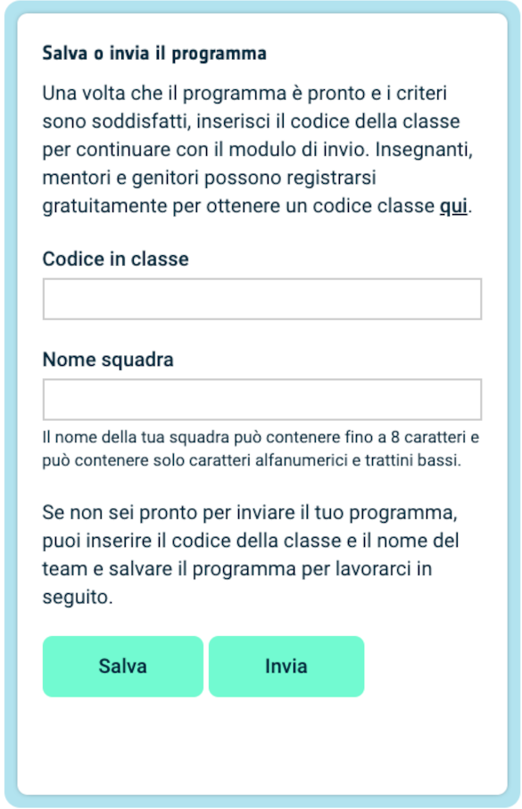

## Mostra un’immagine

La matrice LED di Astro Pi può visualizzare i colori. In questa fase, visualizzerai immagini prese dalla natura sulla matrice LED di Astro Pi.

<p style="border-left: solid; border-width:10px; border-color: #0faeb0; background-color: aliceblue; padding: 10px;">
Una <span style="color: #0faeb0">**matrice LED**</span> è una griglia di LED che può essere controllata individualmente o in gruppo per creare diversi effetti di luce. La matrice LED del Sense HAT ha 64 LED disposti in una griglia 8 x 8. I LED possono essere programmati per produrre un'ampia gamma di colori.
</p>


--- task ---

Apri [il progetto iniziale Mission Zero](https://missions.astro-pi.org/mz/code_submissions/){:target="_blank"}.

Vedrai che alcune righe di codice sono state aggiunte automaticamente per facilitarti.

Questo codice esegue il collegamento all'Astro Pi, assicurando che il display a LED dell'Astro Pi sia mostrato nel modo corretto e inoltre imposta il sensore di colore. Lasciate stare questo codice, perché ne avrete bisogno.

--- code ---
---
language: python 
filename: main.py 
line_numbers: false 
line_number_start: 1
line_highlights:
---
# Importa le librerie
from sense_hat import SenseHat 
from time import sleep

# Imposta il Sense HAT
sense = SenseHat() 
sense.set_rotation(270)

# Configura il sensore di colore
sense.color.gain = 60 # Imposta la sensibilità del sensore 
sense.color.integration_cycles = 64 # L'intervallo con cui verrà eseguita la lettura

--- /code ---


--- /task ---

### Colori RGB

I colori possono essere creati utilizzando diverse quantità di rosso, verde e blu. Puoi scoprire i colori RGB qui:

[[[generic-theory-simple-colours]]]

La matrice LED è una griglia 8 x 8. Ciascun LED sulla griglia può essere impostato ad un colore diverso. Ecco un elenco di variabili per 24 diversi colori. Ogni colore ha un valore per rosso, verde e blu:

[[[ambient-colours]]]

### Scegli un'immagine

--- task ---

**Scegli:** decidi quale immagine visualizzare tra le seguenti opzioni. Python memorizza le informazioni per un'immagine in una lista. Il codice di ogni immagine include le variabili di colore utilizzate e la lista.

Dovrai **copiare** tutto il codice per l'immagine scelta, quindi **incollarlo** nel tuo progetto sotto la riga che dice `# Aggiungi variabili di colore e immagine`.

--- collapse ---

---
title: Volpe
---


Creato dal team i_pupi, Italia

```python
c = (0, 0, 0) # Nero
a = (255, 255, 255) # Bianco
t = (255, 140, 0) # Arancione scuro

immagine = [
t, a, t, c, c, t, a, t,
t, a, t, c, c, t, a, t,
t, t, t, t, t, t, t, t,
t, a, c, t, t, c, a, t,
t, t, t, t, t, t, t, t,
a, a, a, c, c, a, a, a,
c, a, a, a, a, a, a, c,
c, c, a, a, a, a, c, c]
```

--- /collapse ---

--- collapse ---

---
title: Elefante
---


Creato dal team ILiFanT, Finlandia

```python
c = (0, 0, 0) # Nero
b = (105, 105, 105) # Grigio scuro
a = (255, 255, 255) # Bianco

immagine = [
    c, c, c, c, c, c, c, c,
    c, b, b, b, c, c, c, c,
    c, b, c, b, c, c, b, b,
    c, b, c, c, c, b, b, b,
    c, b, b, c, c, b, c, b,
    c, b, b, b, b, b, b, b,
    c, c, b, b, a, b, b, b,
    c, c, c, c, a, b, b, b]
```

--- /collapse ---

--- collapse ---
---
title: Cactus
---


Creato dal team 6TETHASI, Paesi Bassi

```python
a = (255, 255, 255) # Bianco
c = (0, 0, 0) # Nero
n = (154, 205, 50) # Giallo verde
q = (255, 255, 0) # Giallo
t = (255, 140, 0) # Arancione scuro

immagine = [   
  q, q, c, n, c, c, a, c,
  q, c, c, n, c, a, a, a,
  c, n, c, n, c, c, c, c,
  c, n, n, n, c, n, c, c,
  c, a, n, n, n, n, c, c,
  a, a, a, n, c, a, a, a,
  c, c, c, n, a, a, a, c,
  t, t, t, t, t, t, t, t]

```

--- /collapse ---


--- collapse ---
---
title: Coccodrillo
---


```python

a = (255, 255, 255) # Bianco 
c = (0, 0, 0) # Nero 
f = (25, 25, 112) # Blu notte 
m = (34, 139, 34) # Verde bosco

immagine = [
  m, m, m, m, m, c, c, c,
  m, f, m, f, m, m, m, m,
  m, m, m, m, m, m, m, m,
  m, m, c, a, c, c, c, a,
  m, m, c, c, c ,c ,c ,c,
  m, m, c, c, c, a, c, c,
  m, m, m, m, m, m, m, m,
  m, m, m, m, m, m, m, m]

```

--- /collapse ---

--- collapse ---
---
title: Arcobaleno
---


Creato da team camrus_6, Regno Unito

```python

c = (100, 149, 237) # Blu Fiordaliso
a = (255, 255, 255) # Bianco
v = (255, 0, 0) # Rosso
t = (255, 140, 0) # Arancione scuro
q = (255, 255, 0) # Giallo
l = (0, 255, 127) # Verde primavera
e = (0, 0, 205) # Blu medio

arcobaleno = [
  c, c, c, c, c, c, c, c, 
  v, v, v, v, c, c, c, c,
  t, t, t, t, v, v, c, c,
  q, q, q, q, t, v, c, c,
  l, l, l, l, q, t, v, c,
  e, e, e, l, q, t, v, c,
  c, c, e, a, a, a, a, c,
  c, a, a, a, a, a, a, a
]

```

--- /collapse ---

--- collapse ---
---
title: Drago
---


Creato dal team hwplucyr, Regno Unito

```python

b = (105, 105, 105) # Grigio medio
c = (0, 0, 0) # Nero
d = (100, 149, 237) # Blu Fiordaliso
v = (255, 0, 0) # Rosso
z = (153, 50, 204) # Orchidea scura

immagine = [
    c, c, v, c, v, c, c, c,
    c, z, z, z, z, v, c, c,
    z, b, z, b, z, c, c, c,
    z, z, z, z, z, v, c, c,
    c, c, d, d, d, c, c, z,
    c, z, d, z, z, z, z, c,
    c, c, d, d, z, c, c, c,
    c, c, z, c, z, c, c, c]

```

--- /collapse ---

--- /task ---

--- task ---

**Trova:** la riga che dice `# Mostra l'immagine` e aggiungi una riga di codice per visualizzare la tua immagine sulla matrice LED:

```python
a = (255, 255, 255) # Bianco
c = (0, 0, 0) # Nero
f = (25, 25, 112) # Blu notte
m = (34, 139, 34) # Verde foresta

immagine = [
  m, m, m, m, m, c, c, c,
  m, f, m, f, m, m, m, m,
  m, m, m, m, m, m, m, m,
  m, m, c, a, c, c, c, a,
  m, m, c, c, c ,c ,c ,c,
  m, m, c, c, c, a, c, c,
  m, m, m, m, m, m, m, m,
  m, m, m, m, m, m, m, m]

# Mostra l'immagine
sense.set_pixels(immagine)

```

--- /task ---

--- task ---

Premi **Esegui** nella parte inferiore dell'editor per vedere la tua immagine visualizzata sulla matrice LED.

--- /task ---

--- task ---

**Debug**

Il mio codice ha un errore di sintassi:

- Verifica che il tuo codice corrisponda al codice degli esempi sopra
- Verifica di aver indentato il codice nella tua lista
- Verifica che la tua lista sia racchiusa tra `[` e `]`
- Verifica che ogni variabile di colore nell'elenco sia separata da una virgola

La mia immagine non viene visualizzata:

- Verifica che il tuo `sense.set_pixels(immagine)` non sia indentato

--- /task ---


--- task ---

**Salva i tuoi progressi**

Ora che hai visualizzato un'immagine, puoi salvare il tuo programma sul progetto Mission Starter inserendo il nome della tua squadra, i nomi dei membri del team e il codice dell'aula che ti è stato comunicato. È possibile ricaricare il programma su qualsiasi dispositivo con una connessione internet inserendo il nome del team e il codice aula.



--- /task --- 
