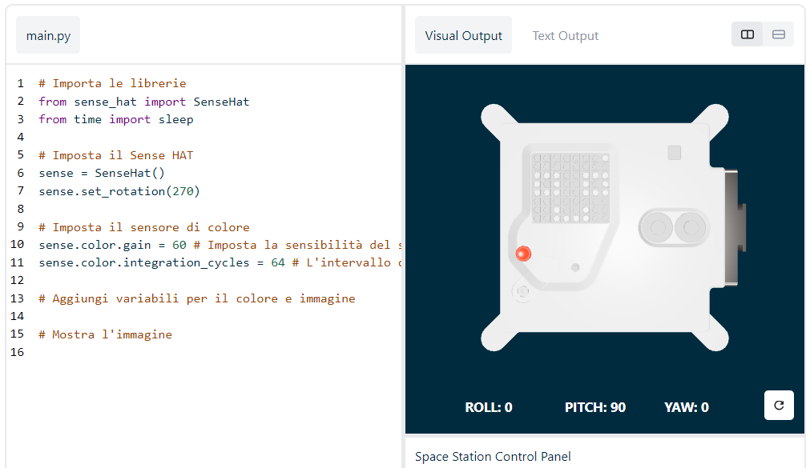

## Mostrate un messaggio

--- task ---

Aprite l’[emulatore Sense HAT](https://trinket.io/mission-zero){:target="_blank"} del progetto Mission Zero.

Vedrete che tre righe di codice sono già state aggiunte per voi automaticamente:

```python
from sense_hat import SenseHat
sense = SenseHat()
sense.set_rotation(270)
```



Questo codice si collega all’Astro Pi e garantisce che il messaggio sul display LED di Astro Pi sia mostrato nel senso corretto. Lasciate qui questo codice perché è necessario.

--- /task ---

--- task ---

Cosa ne dite di lasciare un bel saluto agli astronauti della ISS che stanno lavorando vicino all’Astro Pi? Facciamo scorrere il messaggio sul display.

Aggiungete questa riga sotto l’altro codice:

```python
sense.show_message("Astro Pi")
```

--- /task ---

--- task ---

Premete il pulsante **Run** (esegui) e guardate il messaggio `Astro Pi` che scorre sul display LED.


--- /task ---


Se volete visualizzare un messaggio diverso, scrivete quello che desiderate fra le virgolette (`""`).

--- collapse ---
---
title: Quali caratteri si possono usare?
---
Sense HAT può visualizzare solo il set di caratteri "Latin 1". Questo significa che saranno disponibili solo i seguenti caratteri: Eventuali altri caratteri verranno visualizzati come `?`.

    +-*/!"#$><0123456789.=)(
    
    ABCDEFGHIJKLMNOPQRSTUVWXYZ
    
    abcdefghijklmnopqrstuvwxyz
    
    ?,;:|@%[&_']\~
    

--- /collapse ---

--- task ---

Potete anche cambiare la velocità di scorrimento del messaggio sullo schermo. Aggiungete il parametro `scroll_speed` (velocità di scorrimento) alla vostra linea di codice, in questo modo:

```python
sense.show_message("Astro Pi", scroll_speed=0.05)
```

La velocità predefinita del messaggio è ` 0.1`. Usando un numero più piccolo, il messaggio scorre più velocemente, mentre usando un numero più grande il messaggio scorre più lentamente.

--- /task ---