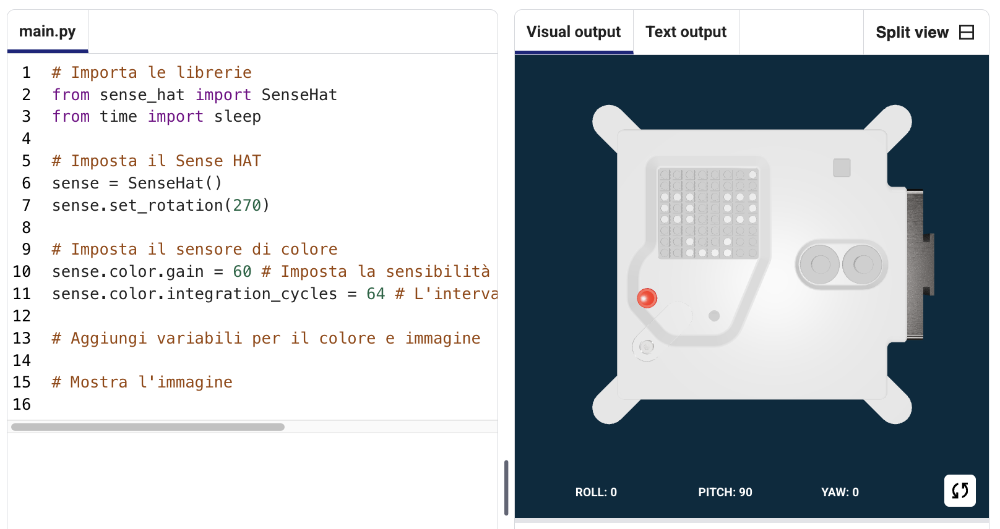

## Mostra un’immagine

The image you display will be made from 64 coloured squares called **pixels**. The pixels are arranged in an 8 x 8 grid. Each pixel can be a different colour. By choosing the colours carefully, you can create a picture. Here is an example of a whale made using different shades of blue on a black background.

<p style="border-left: solid; border-width:10px; border-color: #0faeb0; background-color: aliceblue; padding: 10px;">
Una <span style="color: #0faeb0">**matrice LED**</span> è una griglia di LED che può essere controllata individualmente o in gruppo per creare diversi effetti di luce. La matrice LED del Sense HAT ha 64 LED disposti in una griglia 8 x 8. I LED possono essere programmati per produrre un'ampia gamma di colori.
</p>


Notice that each square is labelled with a code to represent a particular colour. In this image 3 colours are used:
+ c = black
+ f = Ocean blue
+ g = Sky blue


--- task ---

Apri [il progetto iniziale Mission Zero](https://missions.astro-pi.org/mz/code_submissions/){:target="_blank"}.

Vedrai che alcune righe di codice sono state aggiunte automaticamente per facilitarti.

Questo codice esegue il collegamento all'Astro Pi, assicurando che il display a LED dell'Astro Pi sia mostrato nel modo corretto e inoltre imposta il sensore di colore. Non modificate questo codice, perché ne avrete bisogno.

--- code ---
---
language: python filename: main.py line_numbers: false line_number_start: 1
line_highlights:
---
# Importa le librerie
from sense_hat import SenseHat from time import sleep

# Imposta il Sense HAT
sense = SenseHat() sense.set_rotation(270)

# Configura il sensore di colore
sense.color.gain = 60 # Set the sensitivity of the sensor sense.color.integration_cycles = 64 # The interval at which the reading will be taken

--- /code ---



--- /task ---

### Colori RGB

I colori possono essere creati utilizzando diverse quantità di rosso, verde e blu. Puoi scoprire i colori RGB qui:


La matrice LED è una griglia 8 x 8. Ciascun LED sulla griglia può essere impostato a un colore diverso. We can use the letters a to z as the names of variables to represent 24 different colours. Each colour has a value for red, green, and blue.

--- collapse ---

---
title: List of Colour Variables
---


```python
a = (255, 255, 255) # White
b = (171, 171, 171) # Grey
c = (0, 0, 0)       # Black
d = (25, 25, 113)   # Navy Blue
e = (0, 0, 255)     # Pure Blue
f = (36, 128, 200)  # Ocean Blue
g = (0, 204, 255)   # Sky Blue
h = (86, 255, 255)  # Electric Cyan
j = (0, 255, 0)     # Pure Green
k = (46, 139, 33)   # Leaf Green
l = (57, 97, 17)    # Olive Green
m = (30, 65, 6)     # Forest Green
n = (126, 88, 25)   # Earth Brown
o = (179, 96, 65)   # Terracotta Brown
p = (180, 34, 34)   # Brick Red
q = (255, 0, 0)     # Pure Red
r = (232, 118, 5)   # Orange
s = (241, 231, 100) # Pale Yellow
t = (255, 255, 0)   # Pure Yellow
u = (255, 209, 209) # Pale Pink
v = (255, 177, 177) # Blush Pink
w = (249, 169, 255) # Light Pink
y = (248, 97, 255)  # Magenta
z = (220, 53, 232)  # Purple

```

--- /collapse ---

### Scegli un'immagine

--- task ---

**Scegli:** decidi quale immagine visualizzare tra le seguenti opzioni. Python memorizza le informazioni per un'immagine in una lista. Il codice di ogni immagine include le variabili di colore utilizzate e la lista.

Dovrai **copiare** tutto il codice per l'immagine scelta, quindi **incollarlo** nel tuo progetto sotto la riga che dice `# Aggiungi variabili di colore e immagine`.

--- collapse ---

---
title: Whale
---


Created by Team Naicom, Italy

```python
c = (0, 0, 0)       # Black
f = (36, 128, 200)  # Ocean Blue
g = (0, 204, 255)   # Sky Blue

image = [
c, g, c, g, c, c, c, c,
c, c, g, c, c, f, f, f,
c, f, f, f, c, c, f, a,
f, f, c, f, f, c, f, c,
f, f, f, f, f, c, f, c,
g, f, f, f, f, f, f, c,
g, g, g, g, g, g, c, c,
c, g, g, g, g, c, c, c]

```

--- /collapse ---


--- collapse ---

---
title: Lemon
---


Created by team g4lemoni, Greece

```python
a = (255, 255, 255) # White
k = (46, 139, 33)   # Leaf Green
t = (255, 255, 0)   # Pure Yellow

image = [
c, c, c, k, k, c, c, c,
c, c, k, c, k, c, c, c,
c, k, c, t, t, c, c, c,
c, c, t, t, t, t, c, c,
c, c, t, t, t, t, c, c,
c, c, t, t, t, t, c, c,
c, c, t, t, t, t, c, c,
c, c, c, t, t, c, c, c]

```

--- /collapse ---

--- collapse ---
---
title: Pig
---


Created by Gary, United Kingdom

```python
a = (255, 255, 255) # White
u = (255, 209, 209) # Pale Pink
v = (255, 177, 177) # Blush Pink
o = (179, 96, 65)   # Terracotta Brown
c = (0, 0, 0)       # Black

image = [
a, a, y, a, a, y, a, a,
a, y, y, y, y, y, y, a,
a, y, c, y, c, y, y, y,
v, v, v, v, v, y, y, y,
v, o, v, o, v, y, y, y,
v, v, v, v, v, y, y, y,
a, y, y, y, y, y, y, y,
a, a, y, a, a, a, y, a]

```

--- /collapse ---


--- collapse ---
---
title: Storm
---


Created by team hop2p023, Spain

```python

c = (0, 0, 0)       # Black
f = (36, 128, 200)  # Ocean Blue
g = (0, 204, 255)   # Sky Blue
t = (255, 255, 0)   # Pure Yellow

image = [
c, c, c, c, c, c, c, c,
c, c, f, f, f, f, c, c,
c, f, f, f, f, f, f, c,
c, g, c, g, t, g, c, c,
c, c, c, t, t, c, c, c,
c, c, t, t, c, c, c, c,
c, c, g, c, c, c, c, g,
c, g, c, c, c, c, c, c]


```

--- /collapse ---

--- collapse ---
---
title: Duck
---


Created by Peter, Ireland

```python

c = (0, 0, 0) # Black
l = (57, 97, 17)    # Olive Green
m = (30, 65, 6)     # Forest Green
r = (232, 118, 5)   # Orange
a = (255, 255, 255) # White
b = (171, 171, 171) # Grey

image = [
c, l, l, c, c, c, c, c,
r, r, m, c, c, c, c, c,
c, l, l, c, c, c, c, c,
c, a, a, l, a, a, c, c,
c, l, l, a, a, a, b, a,
c, a, a, b, b, b, a, a,
c, c, a, a, a, a, c, c,
c, c, c, r, c, r, c, c]

```

--- /collapse ---

--- collapse ---
---
title: Frog
---


Created by team Jmeno, Czech Republic

```python

a = (255, 255, 255) # White
b = (171, 171, 171) # Grey
c = (0, 0, 0)       # Black
q = (255, 0, 0)     # Pure Red
j = (0, 255, 0)     # Pure Green
k = (46, 139, 33)   # Leaf Green
n = (126, 88, 25)   # Earth Brown

image = [
a, a, a, a, a, a, a, a,
a, a, a, a, a, b, a, b,
a, a, a, a, a, a, c, a,
a, a, c, a, c, a, q, a,
a, a, j, j, j, q, a, a,
a, j, j, k, q, a, a, a,
j, k, j, k, k, a, a, a,
k, k, k, j, k, n, n, n]

```

--- /collapse ---

--- collapse ---
---
title: Blossom Tree
---


Created by team Zssh14, Slovakia

```python

t = (255, 255, 0)   # Pure Yellow
g = (0, 204, 255)   # Sky Blue
w = (249, 169, 255) # Light Pink
y = (248, 97, 255)  # Magenta
z = (220, 53, 232)  # Purple
n = (126, 88, 25)   # Earth Brown
o = (179, 96, 65)   # Terracotta Brown
k = (46, 139, 33)   # Leaf Green

image =  [
t, g, g, w, w, y, g, g,
g, g, w, w, y, y, z, g,
g, w, y, z, y, z, z, z,
w, y, z, z, g, n, w, g,
g, g, o, o, n, w, y, z,
g, g, g, g, n, g, g, g,
g, g, g, o, n, n, g, g,
k, k, o, n, n, n, k, k]

```

--- /collapse ---

--- /task ---

--- task ---

**Trova:** la riga che dice `# Mostra l'immagine` e aggiungi una riga di codice per visualizzare la tua immagine sulla matrice LED:

--- code ---
---
language: python filename: main.py line_numbers: false line_number_start: 1
line_highlights: 17, 18
---
c = (0, 0, 0)       # Black f = (36, 128, 200)  # Ocean Blue g = (0, 204, 255)   # Sky Blue

image = [ c, g, c, g, c, c, c, c, c, c, g, c, c, f, f, f, c, f, f, f, c, c, f, a, f, f, c, f, f, c, f, c, f, f, f, f, f, c, f, c, g, f, f, f, f, f, f, c, g, g, g, g, g, g, c, c, c, g, g, g, g, c, c, c]

# Mostra l'immagine
sense.set_pixels(image)

--- /code ---

--- /task ---

--- task ---

Premi **Run (esegui)** nella parte inferiore dell'editor per vedere la tua immagine visualizzata sulla matrice LED.

--- /task ---

--- task ---

**Debug**

Il mio codice ha un errore di sintassi:

- Verifica che il tuo codice corrisponda al codice degli esempi sopra
- Verifica di aver indentato il codice nella tua lista
- Verifica che la tua lista sia racchiusa tra `[` e `]`
- Verifica che ogni variabile di colore nell'elenco sia separata da una virgola

La mia immagine non viene visualizzata:

- Verifica che il tuo `sense.set_pixels(immagine)` non sia indentato

--- /task ---


--- task ---

**Salva i tuoi progressi**

Ora che hai visualizzato un'immagine, puoi salvare il tuo programma sul progetto Mission Starter inserendo il nome della tua squadra, i nomi dei membri del team e il codice dell'aula che ti è stato comunicato. È possibile ricaricare il programma su qualsiasi dispositivo con una connessione internet inserendo il nome del team e il codice aula.


--- /task --- 
