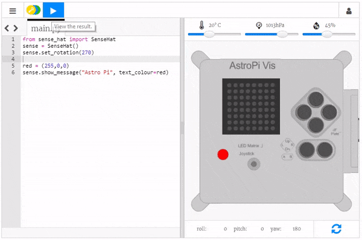

## Aggiungete un po’ di colore

I LED dell’Astro Pi possono anche visualizzare colori. Potete specificare un colore creando una variabile e assegnando ad essa un valore di colore RGB.

Potete imparare come si possono creare tutti i colori usando diverse proporzioni di rosso, verde e blu qui:

[[[generic-theory-colours]]]

--- task ---

Scegliete un colore e scoprite quale è il suo valore RGB. Se volete, potete usare un [calcolatore dei colori](https://www.w3schools.com/colors/colors_rgb.asp){:target="_blank"} per sceglierlo.

--- /task ---

--- task ---

Create una variabile in cui memorizzare il colore che avete scelto. Ad esempio, se avete scelto il rosso dovreste scrivere questa riga di codice:

```python
red = (255,0,0)
```

--- /task ---

--- task ---

Potete ora visualizzare il vostro messaggio nel colore che preferite! Per dire al programma di usare il colore che avete creato, aggiungete il parametro `text_colour` al codice che visualizza il vostro testo:

```python
red = (255,0,0)
sense.show_message("Astro Pi", text_colour=red)
```

--- /task ---



--- task ---

Potete anche cambiare il colore di sfondo del display. Scegliete un altro colore e create un’altra variabile per memorizzare tale colore. Per dire al programma di usare il colore di sfondo che avete scelto, aggiungete al codice il parametro ` back_colour`:

```python
red = (255,0,0)
green = (0,255,0)
sense.show_message("Astro Pi", text_colour=red, back_colour=green)
```

--- /task ---

--- task ---

Modificate il testo e il colore del messaggio di saluto: quale messaggio volete inviare agli astronauti a bordo della ISS?

--- /task ---