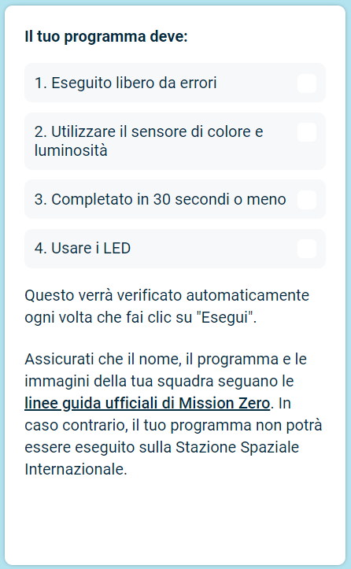

## Invia il tuo progetto

Ci sono alcune regole che il tuo codice deve rispettare per poter essere eseguito sulla Stazione Spaziale Internazionale. Se il tuo codice le segue, le regole nella parte inferiore dell'emulatore **Sense HAT** si illumineranno in verde quando esegui il programma.

**Suggerimento:** prova il tuo codice con alcune impostazioni di colore diverse (usando il selettore) per assicurarti che funzioni sempre correttamente.

Assicurati che la tua voce segua le [linee guida ufficiali](https://astro-pi.org/mission-zero/guidelines){:target="_blank"} per Mission Zero. Se non segue le linee guida, il tuo programma non potrà essere eseguito sulla Stazione Spaziale Internazionale.

Si prega di non includere nessuno dei seguenti elementi nel nome o nel codice della squadra:

+ Tutto ciò che potrebbe essere interpretato come di natura illegale, politica o sensibile
+ Bandiere, in quanto possono essere considerate politicamente sensibili
+ Tutto ciò che fa riferimento a spiacevolezza o danno a un'altra persona
+ Dati personali come numeri di telefono, account social e indirizzi e-mail
+ Immagini oscene
+ Caratteri speciali o emoji
+ Linguaggio scurrile o parolacce

--- task ---

Inserisci il codice della tua classe e il nome del team nella casella in basso: il tuo mentore ti dirà qual è il tuo codice.

**Note per i mentori** si possono trovare nel paragrafo [Introduzione](https://projects.raspberrypi.org/en/projects/astro-pi-mission-zero/0).

--- /task ---

--- task ---

Premi il pulsante **Aggiungi la tua squadra** per inserire il tuo codice. Tieni presente che un programma non può essere modificato una volta inviato.

Il tuo mentore riceverà un'e-mail che conferma la tua iscrizione.

--- /task ---

--- task ---

Se lo desideri, puoi condividere il link al tuo codice sui social media per dire alle persone che il codice che hai scritto verrà eseguito nello spazio!

--- /task ---
