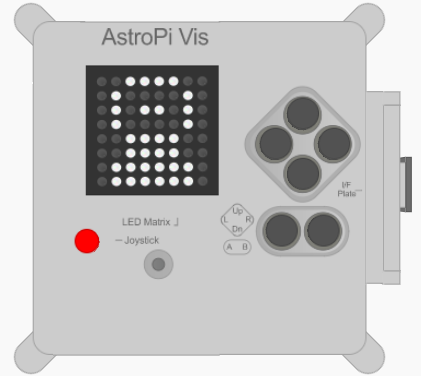

## Mostrate un’immagine

La matrice di LED dell’Astro Pi consente anche di visualizzare immagini. Se volete, il vostro saluto per gli astronauti potrebbe includere un’immagine o un motivo, invece di un messaggio di testo.



\--- task \---

Alla fine del programma, create delle variabili di colore per definire i colori con i quali potete disegnare la vostra immagine. Potete utilizzare tutti i colori che volete ma, in questo esempio, ci limiteremo a due soli colori: il bianco (`w`) e il nero (`b`).

```python
w = (255, 255, 255)
b = (0, 0, 0)
```

**Nota:** In questo caso è una buona idea assegnare alle variabili di colore nomi abbreviati di una sola lettera per risparmiare tempo nel passo seguente, in cui dovrete scriverli ripetutamente molte volte. Inoltre, usando nomi di una sola lettera, diventa molto più facile vedere l’immagine disegnata.

\--- /task \---

\--- task \---

Sotto alle vostre nuove variabili, create una lista con 64 voci. Ciascuna voce rappresenta un pixel nella matrice di LED e corrisponde ad una delle variabili di colore che avete definito. Per disegnare l’immagine è sufficiente inserire una variabile nel punto in cui volete che appaia il colore ad essa assegnato. Qui sotto abbiamo disegnato un astronauta, usando pixel neri (`b`) per lo sfondo e pixel bianchi per la sua tuta spaziale (`w`):

```python
picture = [
    b, b, w, w, w, w, b, b,
    b, w, b, b, b, b, w, b,
    b, w, b, w, w, b, w, b,
    b, w, b, b, b, b, w, b,
    b, b, w, w, w, w, b, b,
    b, b, w, w, w, w, b, b,
    b, w, w, w, w, w, w, b,
    b, w, w, w, w, w, w, b
]
```

\--- /task \---

\--- task \---

Aggiungete una linea di codice per visualizzare il disegno sul display LED.

```python
sense.set_pixels(picture)
```

\--- /task \---

\--- task \---

Premete **Run** (Esegui) per vedere come viene visualizzato il disegno.

\--- /task \---

\--- task \---

Se volete, potreste aggiungere del codice per introdurre una breve pausa (`sleep`) dopo la visualizzazione del disegno. Ciò consentirà agli astronauti di vedere il disegno prima che venga visualizzata la parte successiva del messaggio. All’inizio del programma, aggiungete:

```python
from time import sleep
```

Quindi, sulla riga successiva a quella che visualizza il disegno, aggiungete la seguente riga di codice per fare un’attesa di due secondi:

```python
sleep(2)
```

\--- /task \---

\--- task \---

Adesso potete creare il vostro disegno o motivo grafico da mostrare agli astronauti!

\--- /task \---