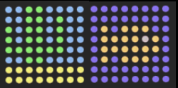

## Display the humidity

You could combine your humidity reading with a picture to also indicate the humidity in a graphical way. For example, you might display an ocean for high humidity, and a desert for low humidity:



\--- task \---

At the bottom of your program, create more colour variables for any colours you want to use in your pictures. You may already have defined some of them in a previous step.

```python
o=(255,130,0)
b=(0,0,255)
c=(0,150,255)
e=(80,80,80)
g=(0,255,0)
y=(255,255,0)
```

\--- /task \---

\--- task \---

Just like earlier, draw your pictures by first creating a list for each of them, and then setting the list items to the colours you want your pixels to be.

```python
wet = [
  b, b, b, b, b, b, b, b,
  b, b, b, b, b, b, b, b,
  b, o, b, o, o, o, b, b,
  b, o, o, o, o, e, o, b,
  b, o, o, o, o, o, o, b,
  b, o, b, o, o, o, b, b,
  b, b, b, b, b, b, b, b,
  b, b, b, b, b, b, b, b
]


dry = [
  c, c, g, g, c, c, c, c,
  c, c, g, g, c, g, c, c,
  g, c, g, g, c, g, c, c,
  g, c, g, g, c, g, c, c,
  g, g, g, g, g, g, c, c,
  c, c, g, g, c, c, c, c,
  y, y, y, y, y, y, y, y,
  y, y, y, y, y, y, y, y
]
```

\--- /task \---

\--- task \---

Add some code to get the humidity:

```python
humid = sense.humidity
```

\--- /task \---

\--- task \---

Now decide which picture to display. For this example, we will display the `wet` image if the humidity reading is 40% or above, and the `dry` image if the humidity is below 40%.

```python
humid = sense.humidity
if humid >= 40:
    sense.set_pixels(wet)
else:
    sense.set_pixels(dry)
```

\--- /task \---

\--- task \---

Use the humidity slider to set a humidity on the emulator. Run your program and check that the image you've selected for that humidity is correctly displayed.

\--- /task \---

\--- task \---

Change your code so that your program displays the humidity to the astronauts in your own chosen way.

\--- /task \---