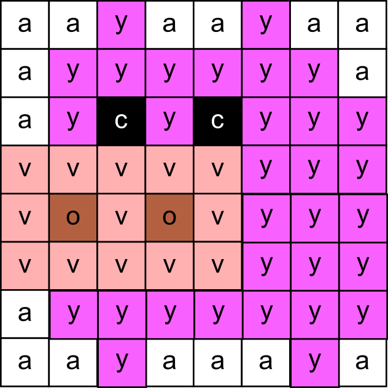

## Attēla attēlošana

Attēls, ko jūs parādīsiet, tiks veidots no 64 krāsainiem kvadrātiem, ko sauc par **pikseļiem**. Pikseļi ir izvietoti 8 x 8 režģī. Katrs pikselis var būt citā krāsā. Rūpīgi izvēloties krāsas, jūs varat izveidot unikālu attēlu. Šeit ir vaļa piemērs, kas izgatavots, izmantojot dažādus zilus toņus uz melna fona.

<p style="border-left: solid; border-width:10px; border-color: #0faeb0; background-color: aliceblue; padding: 10px;">
<span style="color: #0faeb0">**LED matrica**</span> ir LED režģis, ko var vadīt atsevišķi vai grupā, lai radītu dažādus apgaismojuma efektus. Sense HAT gaismas diožu matricā ir 64 gaismas diodes, kas attēlotas 8 x 8 režģī. Gaismas diodes var ieprogrammēt, lai radītu plašu krāsu gammu.
</p>


Ievērojiet, ka katrs kvadrāts ir apzīmēts ar kodu, kas apzīmē noteiktu krāsu. Šajā attēlā izmantotas 3 krāsas:
+ c = melns
+ f = okeāna zils
+ g = debeszils


--- task ---

Atveriet [Mission Zero sākuma projektu](https://missions.astro-pi.org/mz/code_submissions/){:target="_blank"}.

Jūs redzēsiet, ka dažas koda rindiņas ir pievienotas automātiski.

Šis kods izveido savienojumu ar Astro Pi, nodrošina, ka Astro Pi LED displejs tiek parādīts pareizi, un iestata krāsu sensoru. Atstājiet kodu tur, jo tas jums būs nepieciešams.

--- code ---
---
language: python filename: main.py line_numbers: false line_number_start: 1
line_highlights:
---
# Import the libraries
from sense_hat import SenseHat from time import sleep

# Set up the Sense HAT
sense = SenseHat() sense.set_rotation(270, False)

# Set up the colour sensor
sense.color.gain = 60 # Set the sensitivity of the sensor sense.color.integration_cycles = 64 # The interval at which the reading will be taken

--- /code ---


--- /task ---

### RGB krāsas

Krāsas var iegūt, izmantojot dažādas sarkanās, zaļās un zilās krāsas proporcijas. Par RGB krāsām var uzzināt šeit:


Gaismas diožu matrica ir 8 x 8 režģis. Katru režģa gaismas diodi var iestatīt citā krāsā. Mēs varam izmantot burtus no a līdz z kā mainīgo nosaukumus, lai attēlotu 24 dažādas krāsas. Katrai krāsai ir sava vērtība sarkanai, zaļai un zilai krāsai.

--- collapse ---

---
title: Krāsu mainīgo saraksts
---


```python
a = (255, 255, 255) # Balta
b = (171, 171, 171) # Pelēka
c = (0, 0, 0) # Melna
d = (25, 25, 113) # Tumši zila
e = (0, 0, 255) # Tīri zila
f = (36, 128, 200) # Okeāna zila
g = (0, 204, 255) # Debeszila
h = (86, 255, 255) # Elektriski ciāna
j = (0, 255, 0) # Tīri zaļa
k = (46, 139, 33) # Lapu zaļa
l = (57, 97, 17) # Olīvzaļa
m = (30, 65, 6) # Meža zaļa
n = (126, 88, 25) # Zemes brūna
o = (179, 96, 65) # Terakotas brūna
p = (180, 34, 34) # Ķieģeļsarkana
q = (255, 0, 0) # Tīri sarkana
r = (232, 118, 5) # Oranža
s = (241, 231, 100) # Bāli dzeltena
t = (255, 255, 0) # Tīri dzeltena
u = (255, 209, 209) # Bāli rozā
v = (255, 177, 177) # Sārti rozā
w = (249, 169, 255) # Gaiši rozā
y = (248, 97, 255) # Fuksīna
z = (220, 53, 232) # Violeta

```

--- /collapse ---

### Izvēlēties attēlu

--- task ---

You can either choose one of the example images below or create your own original design. Feel free to draw anything you like - such as an animal, plant, or imaginary creature - as long as it follows the Mission Zero guidelines.

**Izvēlieties:** ailasiet attēlu, ko parādīt, no tālāk norādītajām iespējām. Python saglabā attēla informāciju sarakstā. Katra attēla kodā ir iekļauti izmantotie krāsu mainīgie un to saraksts.

Jums vajadzēs **kopēt** visu izvēlētā attēla kodu un pēc tam **ielīmēt** to savā projektā zem rindas, kurā teikts `# Pievienot krāsu mainīgos un attēlu`.

--- collapse ---

---
title: Valis
---


Izveidojusi komanda Team Naicom, Itālija

```python
c = (0, 0, 0)       # Black
f = (36, 128, 200)  # Ocean Blue
g = (0, 204, 255)   # Sky Blue

image = [
c, g, c, g, c, c, c, c,
c, c, g, c, c, f, f, f,
c, f, f, f, c, c, f, a,
f, f, c, f, f, c, f, c,
f, f, f, f, f, c, f, c,
g, f, f, f, f, f, f, c,
g, g, g, g, g, g, c, c,
c, g, g, g, g, c, c, c]

```

--- /collapse ---


--- collapse ---

---
title: Citrons
---


Izveidojusi komanda g4lemoni, Grieķija

```python
c = (0, 0, 0)       # Black
k = (46, 139, 33)   # Leaf Green
t = (255, 255, 0)   # Pure Yellow

image = [
c, c, c, k, k, c, c, c,
c, c, k, c, k, c, c, c,
c, k, c, t, t, c, c, c,
c, c, t, t, t, t, c, c,
c, c, t, t, t, t, c, c,
c, c, t, t, t, t, c, c,
c, c, t, t, t, t, c, c,
c, c, c, t, t, c, c, c]

```

--- /collapse ---

--- collapse ---
---
title: Cūka
---



Izveidojis Gerijs, Apvienotā Karaliste

```python
a = (255, 255, 255) # White
v = (255, 177, 177) # Blush Pink
y = (248, 97, 255)  # Magenta
o = (179, 96, 65)   # Terracotta Brown
c = (0, 0, 0)       # Black

image = [
a, a, y, a, a, y, a, a,
a, y, y, y, y, y, y, a,
a, y, c, y, c, y, y, y,
v, v, v, v, v, y, y, y,
v, o, v, o, v, y, y, y,
v, v, v, v, v, y, y, y,
a, y, y, y, y, y, y, y,
a, a, y, a, a, a, y, a]

```

--- /collapse ---


--- collapse ---
---
title: Vētra
---


Izveidoja komanda hop2p023, Spānija

```python

c = (0, 0, 0)       # Black
f = (36, 128, 200)  # Ocean Blue
g = (0, 204, 255)   # Sky Blue
t = (255, 255, 0)   # Pure Yellow

image = [
c, c, c, c, c, c, c, c,
c, c, f, f, f, f, c, c,
c, f, f, f, f, f, f, c,
c, g, c, g, t, g, c, c,
c, c, c, t, t, c, c, c,
c, c, t, t, c, c, c, c,
c, c, g, c, c, c, c, g,
c, g, c, c, c, c, c, c]


```

--- /collapse ---

--- collapse ---
---
title: Pīle
---


Izveidojis Pīters, Īrija

```python

c = (0, 0, 0) # Black
l = (57, 97, 17)    # Olive Green
m = (30, 65, 6)     # Forest Green
r = (232, 118, 5)   # Orange
a = (255, 255, 255) # White
b = (171, 171, 171) # Grey

image = [
c, l, l, c, c, c, c, c,
r, r, m, c, c, c, c, c,
c, l, l, c, c, c, c, c,
c, a, a, l, a, a, c, c,
c, l, l, a, a, a, b, a,
c, a, a, b, b, b, a, a,
c, c, a, a, a, a, c, c,
c, c, c, r, c, r, c, c]

```

--- /collapse ---

--- collapse ---
---
title: Varde
---


Izveidoja komanda Jmeno, Čehija

```python

a = (255, 255, 255) # White
b = (171, 171, 171) # Grey
c = (0, 0, 0)       # Black
q = (255, 0, 0)     # Pure Red
j = (0, 255, 0)     # Pure Green
k = (46, 139, 33)   # Leaf Green
n = (126, 88, 25)   # Earth Brown

image = [
a, a, a, a, a, a, a, a,
a, a, a, a, a, b, a, b,
a, a, a, a, a, a, c, a,
a, a, c, a, c, a, q, a,
a, a, j, j, j, q, a, a,
a, j, j, k, q, a, a, a,
j, k, j, k, k, a, a, a,
k, k, k, j, k, n, n, n]

```

--- /collapse ---

--- collapse ---
---
title: Ziedošs koks
---


Izveidojusi Zssh14 komanda, Slovākija

```python

t = (255, 255, 0)   # Pure Yellow
g = (0, 204, 255)   # Sky Blue
w = (249, 169, 255) # Light Pink
y = (248, 97, 255)  # Magenta
z = (220, 53, 232)  # Purple
n = (126, 88, 25)   # Earth Brown
o = (179, 96, 65)   # Terracotta Brown
k = (46, 139, 33)   # Leaf Green

image =  [
t, g, g, w, w, y, g, g,
g, g, w, w, y, y, z, g,
g, w, y, z, y, z, z, z,
w, y, z, z, g, n, w, g,
g, g, o, o, n, w, y, z,
g, g, g, g, n, g, g, g,
g, g, g, o, n, n, g, g,
k, k, o, n, n, n, k, k]

```

--- /collapse ---

--- /task ---

--- task ---

**Atrodiet:** rindu, kurā teikts `# Parādiet attēlu` un pievienojiet koda rindu, lai parādītu savu attēlu LED matricā:

--- code ---
---
language: python filename: main.py line_numbers: false line_number_start: 1
line_highlights: 17, 18
---
c = (0, 0, 0)       # Black f = (36, 128, 200)  # Ocean Blue g = (0, 204, 255)   # Sky Blue

image = [ c, g, c, g, c, c, c, c, c, c, g, c, c, f, f, f, c, f, f, f, c, c, f, a, f, f, c, f, f, c, f, c, f, f, f, f, f, c, f, c, g, f, f, f, f, f, f, c, g, g, g, g, g, g, c, c, c, g, g, g, g, c, c, c]

# Attēla attēlošana
sense.set_pixels(image)

--- /code ---

--- /task ---

--- task ---

Nospiediet **Palaist** redaktora apakšdaļā, lai redzētu savu attēlu LED matricā.

--- /task ---

--- task ---

**Atkļūdot**

Manā kodā ir sintakses kļūda:

- Pārliecinieties, vai jūsu kods atbilst iepriekš minētajos piemēros redzamajam kodam
- Pārbaudiet, vai sarakstā ir identisks kods
- Pārliecinieties, vai jūsu sarakstu ieskauj `[` un `]`
- Pārbaudiet, vai katrs krāsu mainīgais sarakstā ir atdalīts ar komatu

Mans attēls neparādās:

- Pārbaudiet, vai jūsu `sense.set_pixels(image)` nav ar atkāpi

--- /task ---


--- task ---

**Saglabājiet savu progresu**

Tagad, kad esat parādījis attēlu, varat saglabāt savu programmu Mission Starter projektā, ievadot savas komandas nosaukumu, komandas dalībnieku vārdus un jums piešķirto klases kodu. Programmu var atkārtoti ielādēt jebkurā ierīcē ar interneta pieslēgumu, ievadot komandas nosaukumu un klases kodu.


--- /task --- 
