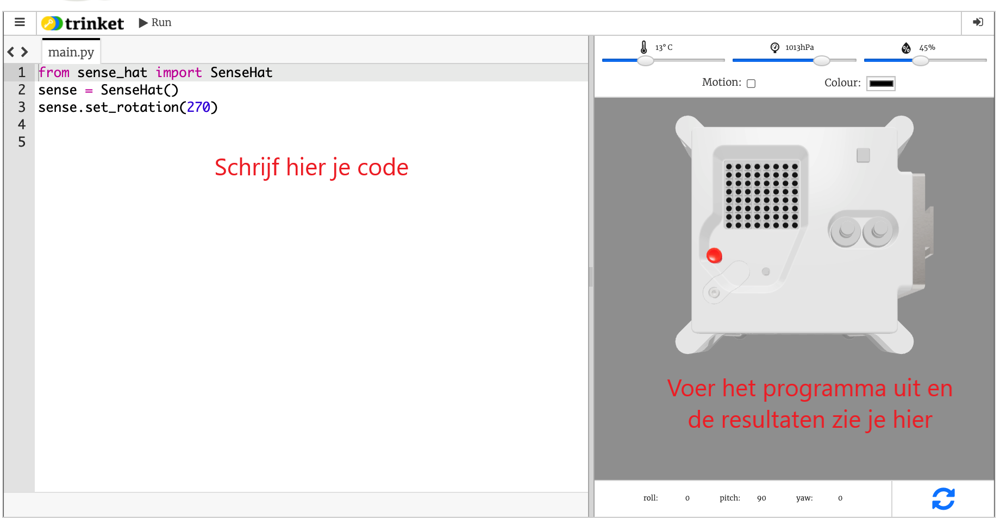

## Wat is een Astro Pi?

Een Astro Pi is een Raspberry Pi-computer in een behuizing die speciaal is ontworpen voor omstandigheden in de ruimte. Het heeft ook een uitbreidingskaart genaamd Sense HAT, speciaal gemaakt voor de Astro Pi-missie. De Sense HAT heeft een joystick, een LED-display en sensoren voor het registreren van temperatuur, vochtigheid, druk en oriëntatie.

Hier is een originele Mark I Astro Pi-eenheid op het internationale ruimtestation ISS, met code die door studenten is geschreven. Je code wordt uiteindelijk uitgevoerd op een nieuwe versie van Astro Pi-computers!

<iframe width="560" height="315" src="https://www.youtube.com/embed/4ykbAJeGPMM" frameborder="0" allow="accelerometer; autoplay; encrypted-media; gyroscope; picture-in-picture" allowfullscreen></iframe>>

Voor deze missie gebruik je de Sense HAT-emulator. De emulator is een stukje software dat alle functies van de Astro Pi simuleert in je webbrowser.
<mark>change screenshot of emulator</mark> 

Er zijn een paar verschillen tussen de echte en de geëmuleerde Sense HAT:
- Op de emulator kun je de temperatuur, druk en vochtigheid zelf instellen met behulp van schuifregelaars, terwijl de echte Sense HAT in de Astro Pi sensoren gebruikt om deze parameters in zijn omgeving te meten.

- Je kunt de muis gebruiken om op de geëmuleerde Sense HAT te klikken en deze te verplaatsen en te draaien, waarbij veranderingen in de richting ervan worden gesimuleerd; de echte Astro Pi (en zijn Sense HAT) kunnen in de echte wereld bewegen, en de Sense HAT-oriëntatiesensoren detecteren wanneer en hoe het is verplaatst.
