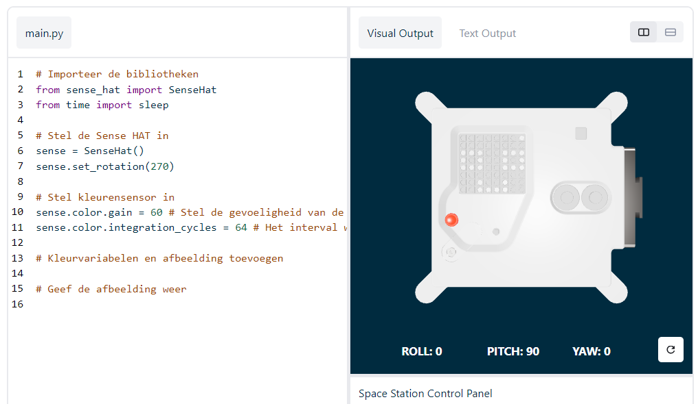

## Toon een afbeelding

De LED-matrix van de Astro Pi kan kleuren weergeven. In deze stap zul je afbeeldingen van de natuur weergeven op de LED-matrix van de Astro Pi.

<p style="border-left: solid; border-width:10px; border-color: #0faeb0; background-color: aliceblue; padding: 10px;">
Een <span style="color: #0faeb0">**LED-matrix**</span> is een raster van LED's die afzonderlijk of als groep kunnen worden aangestuurd om verschillende lichteffecten te creëren. De LED-matrix op de Sense HAT heeft 64 LED's die worden weergegeven in een 8 x 8 raster. De LED's kunnen worden geprogrammeerd om een breed scala aan kleuren te produceren.
</p>


--- task ---

Open het [Mission Zero-startproject](https://missions.astro-pi.org/nl/mz/code_submissions/new){:target="_blank"}.

Je zult zien dat er automatisch enkele regels met code voor je zijn toegevoegd.

Deze code maakt verbinding met de Astro Pi en zorgt ervoor dat het LED-display van de Astro Pi op de juiste manier wordt weergegeven en doet de set up van de kleurensensor. Laat de code staan, want je hebt hem nodig.

--- code ---
---
language: python filename: main.py line_numbers: false line_number_start: 1
line_highlights:
---
# Importeer de bibliotheken
from sense_hat import SenseHat from time import sleep

# Stel de Sense HAT in
sense = SenseHat() sense.set_rotation(270)

# Stel de kleurensensor in
sense.color.gain = 60 # Set the sensitivity of the sensor sense.color.integration_cycles = 64 # The interval at which the reading will be taken

--- /code ---



--- /task ---

### RGB-kleuren

Kleuren kunnen worden gemaakt met verschillende verhoudingen van rood, groen en blauw. Meer informatie over de RGB kleuren vind je hier:

[[[generic-theory-simple-colours]]]

The LED matrix is an 8 x 8 grid. Elke LED op het raster kan op een andere kleur worden ingesteld. Hier is een lijst met variabelen voor 24 verschillende kleuren. Elke kleur heeft een waarde voor rood, groen en blauw:

[[[ambient-colours]]]

### Kies een afbeelding

--- task ---

**Kies:** Kies een afbeelding om weer te geven uit de onderstaande opties. Python slaat de informatie voor een afbeelding op in een lijst. De code voor elke afbeelding bevat de gebruikte kleurvariabelen en de lijst.

Je moet alle code **kopiëren** voor je gekozen afbeelding en **plak** het in je project onder de regel `# Voeg kleurvariablen en afbeelding toe`.

--- collapse ---

---
title: Fish
---


Created by team chalka, Poland

```python
z = (204, 0, 204) # magenta
q = (255, 255, 0) # yellow
d = (51, 153, 255) # blue
c = (0, 0, 0) # black

image = [
d, d, z, d, d, d, d, d,
d, d, d, z, z, d, d, d,
z, d, q, q, q, q, d, d,
z, z, q, q, q, c, q, d,
z, z, z, q, q, q, q, d,
z, z, q, q, q, q, q, d,
z, d, q, z, z, q, d, d,
d, d, d, z, d, d, d, d]

```

--- /collapse ---


--- collapse ---

---
title: Walrus
---


Created by team Walrus, Finland

```python
h = (0, 255, 255)
c = (0, 0, 0)
s = (139, 69, 19)
a = (255, 255, 255)
r = (184, 134, 11)   

image = [
h, h, h, h, h, h, h, h,
h, h, s, s, s, h, h, h,
h, s, s, s, s, s, h, h,
h, s, c, s, c, s, s, s,
h, r, r, r, r, r, s, s,
h, h, a, s, a, s, s, s,
h, h, a, s, a, s, s, s,
r, r, s, s, s, s, s, s]

```

--- /collapse ---

--- collapse ---
---
title: Paxi
---


Created by team tony_pi, Italy

```python
v = (255, 0, 0) # Red
j = (34, 139, 34) # ForestGreen
c = (0, 0, 0) # Black 
e = (100, 149, 237) # CornflowerBlue
l = (0, 255, 0) # Green

image = [
    c, v, j, c, c, j, v, c,
    c, c, v, v, v, v, c, c,
    c, v, c, e, l, e, v, c,
    c, v, c, l, l, l, v, c,
    c, v, c, l, c, l, v, c,
    c, c, v, v, v, v, c, c,
    c, c, l, c, c, l, c, c,
    c, j, j, c, c, j, j, c]

```

--- /collapse ---


--- collapse ---
---
title: Dog
---


Gemaakt door team camrus_6, Verenigd Koninkrijk
```python

c = (0, 0, 0) # Black
r = (86, 71, 0) # Light Brown
s = (123, 61, 0) # Orange Brown
y = (155, 0, 134) # Deep Pink

image = [
    c, r, r, c, c, r, r, c,
    c, r, s, s, s, s, r, c,
    c, r, c, s, s, c, r, c,
    c, s, s, s, s, s, s, c,
    c, s, s, s, s, s, s, c,
    c, s, s, c, c, s, s, c,
    c, c, s, y, y, s, c, c,
    c, c, c, y, y, c, c, c]


```

--- /collapse ---

--- collapse ---
---
title: Chameleon
---


Gemaakt door team hwplucyr, Verenigd Koninkrijk

```python

c = (0, 0, 0) # Black
s = (95, 65, 0) # Brown
a = (255, 255, 255) # white
v = (255, 0, 0) # Red
t = (255, 153, 28) # Orange
q = (255, 255, 0) # Yellow
m = (0, 255, 0) # Green
h = (0, 255, 255) # Cyan
z = (128, 0, 255) # Purple
y = (191, 0, 255) # Magenta

image = [
    a, a, v, v, t, a, a, a,
    a, v, v, t, t, q, a, a,
    v, c, t, t, q, q, m, a,
    v, t, t, q, q, m, m, h,
    s, s, q, s, s, m, s, h,
    a, a, a, a, a, a, a, z,
    a, a, a, a, y, a, a, z,
    a, a, a, a, a, y, z, a]

```

--- /collapse ---

--- collapse ---
---
title: Kite
---


Created by team Val, Greece

```python

c = (0, 0, 0) # Black
m = (0, 255, 0) # Green
v = (255, 0, 0) # Red
q = (255, 255, 0) # Yellow
e = (0, 0, 255) # Blue
h = (0, 255, 255) # Cyan

image = [
    h, h, h, h, h, h, h, h, 
    h, h, h, e, e, v, v, h, 
    h, h, h, e, e, v, v, h, 
    h, h, h, q, q, m, m, h, 
    h, h, h, q, q, m, m, h,
    h, h, c, h, h, h, h, h, 
    h, c, h, h, h, h, h, h, 
    c, h, h, h, h, h, h, h]

```

--- /collapse ---

--- collapse ---
---
title: Chicken
---


Created by team Slepicky, Czech Republic

```python

w = (255, 255, 255) #  White                                                                
v = (255, 0, 0) # Red
c = (0, 0, 0) # Black
b = (105, 105, 105) # Light Grey
q = (255, 255, 0) # Yellow
k = (79, 79, 79) # Dark Grey


image =  [
    a, a, v, v, v, a, a, a,
    a, v, b, b, k, a, a, k,
    a, b, c, b, b, a, k, b,
    q, k, b, b, b, b, b, k,
    a, v, b, b, b, b, k, b,
    a, v, b, k, k, k, b, k,
    a, a, a, k, b, q, k, a,
    a, a, a, a, q, q, a, a]

```

--- /collapse ---

--- /task ---

--- task ---

**Zoek:** de regel `# Toon de afbeelding` en voeg code toe om je afbeelding op de LED matrix weer te geven:

--- code ---
---
language: python filename: main.py line_numbers: false line_number_start: 1
line_highlights: 18, 19
---
z = (204, 0, 204) # magenta q = (255, 255, 0) # yellow d = (51, 153, 255) # blue c = (0, 0, 0) # black

image = [ d, d, z, d, d, d, d, d, d, d, d, z, z, d, d, d, z, d, q, q, q, q, d, d, z, z, q, q, q, c, q, d, z, z, z, q, q, q, q, d, z, z, q, q, q, q, q, d, z, d, q, z, z, q, d, d, d, d, d, z, d, d, d, d]

# Display the image
sense.set_pixels(image)

--- /code ---

--- /task ---

--- task ---

Druk op de **Run** knop onderaan de editor, en zie je bericht weergegeven op de LED matrix.

--- /task ---

--- task ---

**Fouten oplossen (Debuggen)**

Mijn code heeft een syntax fout:

- Controleer of je code overeenkomt met de code in de bovenstaande voorbeelden
- Controleer of je de code in je lijst hebt ingesprongen
- Controleer of je lijst is omgeven door `[` en `]`
- Controleer of elke kleurvariabele in de lijst is gescheiden door een komma

Mijn afbeelding verschijnt niet:

- Controleer of je `sense.set_pixels(afbeelding)` niet ingesprongen is

--- /task ---


--- task ---

**Sla je voortgang op**

Nu je een afbeelding hebt weergegeven, kun je je programma opslaan in het Mission Start-project door je teamnaam, de namen van de teamleden en de klascode die je hebt gekregen in te voeren. Je kunt je programma herladen op elk apparaat met een internetverbinding door je teamnaam en klascode in te voeren.


--- /task --- 
