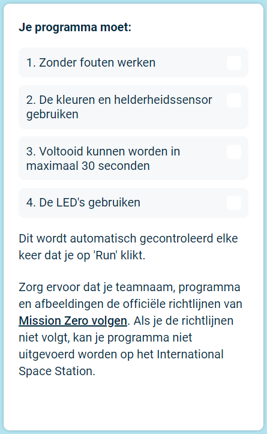

## Verstuur je inzending

Je kunt nu de [Astro Pi Mission Zero](https://astro-pi.org/mission-zero){:target="_blank"} uitdaging binnentreden, met behulp van de code die je hebt geschreven.

Er zijn een paar regels die je code moet volgen, zodat je deze kunt versturen om uitgevoerd te worden op het internationale ruimtestation ISS. Als je code deze regels volgt, lichten de regels onder aan de **Sense HAT emulator** groen op wanneer je het programma uitvoert.

**Tip** Test je code met een aantal verschillende kleurinstellingen (gebruik daarbij de schuifregelaar) om er zeker van te zijn dat deze altijd correct werkt.

Zorg ervoor dat je inzending de [officiële richtlijnen](https://astro-pi.org/mission-zero/guidelines){:target="_blank"} voor Mission Zero volgt. Als je de richtlijnen niet volgt, kan je programma niet uitgevoerd worden op het International Space Station.

Vermeld geen van de volgende zaken in je teamnaam of code:

+ Alles wat kan worden geïnterpreteerd als zijnde van illegale, politieke of gevoelige aard
+ Vlaggen, omdat ze als politiek gevoelig kunnen worden beschouwd
+ Dingen die onaangenaam zijn of een andere persoon kunnen kwetsen
+ Persoonlijke gegevens zoals telefoonnummers, social media-handles en e-mailadressen
+ Obscene afbeeldingen
+ Speciale tekens of emojis
+ Ruw taalgebruik of vloeken

--- task ---

Voer je klascode en teamnaam in het vak onderaan in - je leraar of mentor vertelt je wat je code is.

**Opmerkingen voor mentoren** zijn te vinden in stap [Inleiding](https://projects.raspberrypi.org/nl-NL/projects/astro-pi-mission-zero/0).

--- /task ---

--- task ---

Druk op de knop **Voeg je team toe** om je code in te sturen. Houd er rekening mee dat een programma niet kan worden gewijzigd nadat het is ingediend.

Je leraar of mentor ontvangt een e-mail om je verzending te bevestigen.

--- /task ---

--- task ---

Als je wilt, kun je de link naar je code delen op sociale media om mensen te vertellen dat code die jij hebt geschreven in de ruimte wordt uitgevoerd!

--- /task ---
