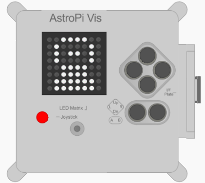

## Toon een afbeelding

Je kunt afbeeldingen op de LED-matrix van de Astro Pi weergeven. Misschien zou je groet voor de astronauten een afbeelding of een patroon kunnen bevatten, evenals of in plaats van een geschreven boodschap?



--- task ---

Onderaan je programma kun je enkele kleurvariabelen maken om de kleuren te definiëren waarmee je je afbeelding wilt tekenen. Je kunt zoveel kleuren gebruiken als je wilt, maar in dit voorbeeld blijven we bij slechts twee - wit (`w`) en zwart (`b`).

```python
w = (255, 255, 255)
b = (0, 0, 0)
```

**Opmerking:** Deze keer is het een goed idee om de kleurvariabelen éénletterige namen te geven, omdat dat tijd zal besparen in de volgende stap, waar je ze veel keer gaat typen. Bovendien maakt het gebruik van losse letters het makkelijker om de afbeelding te zien die je tekent.

--- /task ---

--- task ---

Onder je nieuwe variabelen, maak je een lijst van 64 items. Elk item vertegenwoordigt één pixel op de LED-matrix en komt overeen met een van de kleurvariabelen die je hebt gedefinieerd. Teken je afbeelding door een variabele te plaatsen waar je de toegewezen kleur wilt laten verschijnen. We hebben een astronaut getekend door de zwarte (`b`) pixels te gebruiken als achtergrond en de witte (`w`) pixels om het ruimtepak van de astronaut te tekenen:

```python
picture = [
b, b, w, w, w, w, b, b,
b, w, b, b, b, b, w, b,
b, w, b, w, w, b, w, b,
b, w, b, b, b, b, w, b,
b, b, w, w, w, w, b, b,
b, b, w, w, w, w, b, b,
b, w, w, w, w, w, w, b,
b, w, w, w, w, w, w, b
]
```

--- /task ---

--- task ---

Voeg een coderegel toe om je foto op het LED-display weer te geven.

```python
sense.set_pixels(picture)
```

--- /task ---

--- task ---

Druk op **Run** (Uitvoeren) om je foto te laten zien.

--- /task ---

--- taak ---

Misschien wil je een code toevoegen om een ​​korte wachttijd (of `sleep` (slaapstand)) toe te voegen nadat de foto wordt weergegeven. Dit geeft de astronauten de tijd om je foto te bekijken voordat het volgende deel van je bericht verschijnt. Voeg bovenaan je programma toe:

```python
van tijd slaap importeren
```

Voeg vervolgens aan de lijn na degene die je foto weergeeft deze code toe om twee seconden te wachten:

```python
sleep(2)
```

--- /task ---

--- task ---

Maak je eigen foto of patroon om aan de astronauten te tonen!

--- /task ---