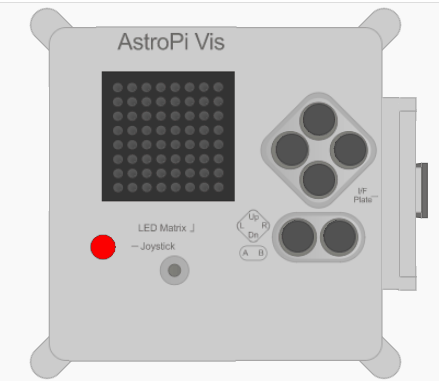
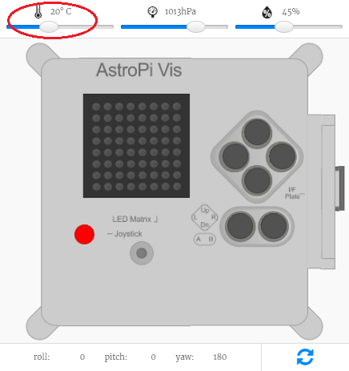

## Meet de temperatuur

De temperatuursensor in de Astro Pi kan de temperatuur van de lucht eromheen meten, een handige functie om je te helpen gegevens te verzamelen over de omstandigheden in de ruimte.



De Astro Pi meet de temperatuur in het ISS in graden Celsius (&deg;C). Omdat de temperatuur in de ruimte veel meer varieert dan die op aarde, kan de Astro Pi temperaturen van -40 graden Celsius tot +120 graden Celsius meten.

Een deel van je missie is om bij te dragen aan het dagelijks leven van de bemanning aan boord van het ISS, dus ze laten weten dat de temperatuur aan boord van het ruimtestation binnen een normaal bereik ligt, zal hen geruststellen.

## \--- collapse \---

## title: Wat is temperatuur?

Temperatuur is de maat voor hoe warm iets is. Misschien heb je je temperatuur met een thermometer laten meten tijdens een bezoek aan de dokter.

 *Door Menchi [CC-BY-SA-3.0](http://creativecommons.org/licenses/by-sa/3.0/){:target="_blank"} via Wikimedia Commons*

Om exacter te zijn, temperatuur is een maat voor de hoeveelheid warmte-energie van een stof. Je weet dat een ijsblokje vast is, maar naarmate het opwarmt, dat wil zeggen omdat het warmte-energie absorbeert uit zijn omgeving, smelt het en wordt het vloeibaar. Dit komt omdat wanneer een stof voldoende warmte-energie absorbeert of verliest, de toestand zal veranderen, bijv. van een vaste stof naar een vloeistof.

\--- /collapse \---

\--- task \---

Voeg deze code toe om een ​​temperatuurmeting te doen:

```python
temp = sense.temperature
```

Deze regel meet de huidige temperatuur en slaat de gemeten waarde op in de variabele `temp`.

-- /task \---

\--- task \---

De temperatuur wordt zeer nauwkeurig geregistreerd, d.w.z. de opgeslagen waarde heeft een groot aantal decimalen. Je kunt de waarde naar elk aantal decimalen afronden. In het voorbeeld hebben we afgerond op één plaats achter de komma, maar voor een ander niveau van precisie, wijzig je het cijfer `1` tot het aantal decimalen dat je wilt zien.

```python
temp = round( sense.temperature, 1 )
```

\--- /task \---

\--- task \---

Om de huidige temperatuur weer te geven als een scrollend bericht op het display, voeg je deze regel code toe:

```python
sense.show_message( str(temp) )
```

Het `str()` gedeelte zet de temperatuur van een getal om naar tekst, zodat de Astro Pi het kan weergeven.

\--- /task \---

\--- task \---

Je kunt de temperatuur ook weergeven als onderdeel van een ander bericht door de delen van je bericht samen te voegen met een `+`.

```python
sense.show_message( "It is " + str(temp) + " degrees" )
```

\--- /task \---

De echte Astro Pi meet de temperatuur om zich heen, maar je kunt de temperatuurschuifregelaar op de Sense HAT-emulator verplaatsen om temperatuurveranderingen te simuleren en je code te testen.



**Opmerking:** Je vraagt ​​je misschien af ​​waarom de temperatuurschuifregelaar de temperatuur als een geheel getal weergeeft, maar de waarde die je krijgt is een decimaal. De emulator simuleert de kleine onnauwkeurigheid van de echte sensor, dus de temperatuurmeting die je ziet, is mogelijk iets groter of kleiner dan de waarde die je met de schuifregelaar hebt ingesteld.