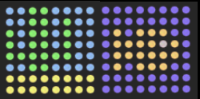

## Reageer op de luchtvochtigheid

Je kunt je luchtvochtigheidsmeting combineren met een afbeelding om ook de luchtvochtigheid op een grafische manier aan te geven. Je kunt bijvoorbeeld een oceaan weergeven voor lage luchtvochtigheid en een woestijn voor hoge luchtvochtigheid:



--- task ---

Maak onder aan het programma meer kleurvariabelen voor alle kleuren die je in je afbeeldingen wilt gebruiken. Mogelijk heb je sommige ervan al in een vorige stap gedefinieerd.

```python
o=(255,130,0)
b=(0,0,255)
c=(0,150,255)
e=(80,80,80)
g=(0,255,0)
y=(255,255,0)
```

--- /task ---

--- task ---

Teken net als eerder je afbeeldingen door eerst een lijst voor elk van deze te maken en vervolgens de lijstitems in te stellen op de kleuren die je wilt dat je pixels zijn.

```python
nat = [
  b, b, b, b, b, b, b, b,
  b, b, b, b, b, b, b, b,
  b, o, b, o, o, o, b, b,
  b, o, o, o, o, e, o, b,
  b, o, o, o, o, o, o, b,
  b, o, b, o, o, o, b, b,
  b, b, b, b, b, b, b, b,
  b, b, b, b, b, b, b, b
]


droog = [
  c, c, g, g, c, c, c, c,
  c, c, g, g, c, g, c, c,
  g, c, g, g, c, g, c, c,
  g, c, g, g, c, g, c, c,
  g, g, g, g, g, g, c, c,
  c, c, g, g, c, c, c, c,
  y, y, y, y, y, y, y, y,
  y, y, y, y, y, y, y, y
]
```

--- /task ---

--- task ---

Voeg wat code toe om de luchtvochtigheid te krijgen:

```python
vochtigheid = sense.get_humidity()
```

--- /task ---

--- task ---

Bepaal nu welke afbeelding moet worden weergegeven. Voor dit voorbeeld zullen we de `wet` afbeelding weergeven als de luchtvochtigheidswaarde 40 % of meer is, en de `dry` afbeelding als de luchtvochtigheid lager is dan 40 %.

```python
vochtigheid = sense.get_humidity()
if vochtigheid >= 40:
    sense.set_pixels(nat)
else:
    sense.set_pixels(droog)
```

--- /task ---

--- task ---

Gebruik de schuifregelaar voor luchtvochtigheid om een luchtvochtigheid op de emulator in te stellen. Voer je programma uit en controleer of de afbeelding die je voor die luchtvochtigheid hebt geselecteerd correct wordt weergegeven.

--- /task ---

--- task ---

Wijzig je code zodat je programma de luchtvochtigheid op je eigen gekozen manier aan de astronauten weergeeft.

--- /task ---

--- task --- Test je code met een paar verschillende vochtigheidsinstellingen (met behulp van de schuifregelaar) om er zeker van te zijn dat deze altijd correct werkt. Als je het bovenstaande voorbeeld hebt gevolgd, wordt er dan een afbeelding weergegeven wanneer de luchtvochtigheid is ingesteld op een waarde van minder dan 40% en ook wanneer deze is ingesteld op meer dan 40%?

--- /task ---
