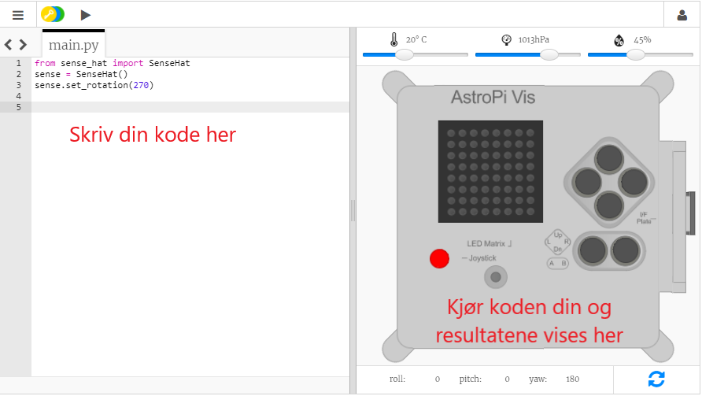

## Hva er en Astro Pi?

An Astro Pi is a Raspberry Pi computer encased by a housing specially designed for conditions in space.

Astro Pi computers come with a set of sensors and gadgets that can be used to run great scientific experiments. This set of sensors is called a ‘Sense HAT’ (that stands for ‘Hardware Attached on Top’). The Sense HAT gives Astro Pi the ability to ‘sense’ and make many kinds of measurements, from temperature to movement, and to output information using an 8 x 8 LED matrix display. The Astro Pis also have a joystick and buttons, just like a video game console!

{:width="400px"}

Here is an original Mark I Astro Pi unit on the International Space Station, running some code written by young people. Your code will eventually be run on a new version of Astro Pi computers!

<iframe width="560" height="315" src="https://www.youtube.com/embed/4ykbAJeGPMM" frameborder="0" allow="accelerometer; autoplay; encrypted-media; gyroscope; picture-in-picture" allowfullscreen></iframe>>

For this mission, you will be using the Sense HAT emulator which simulates all of the functions of the Astro Pi in your web browser.
<mark>change screenshot of emulator</mark> 
