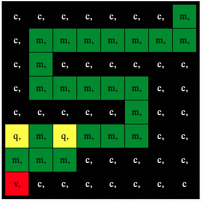

## Vise et bilde

Astro Pi-matrisen kan vise farger. I dette trinnet vises bilder fra naturen på Astro Pi's LED-matrise.

En **LED-matrise** er et rutenett av LED-pærer som kan styres individuelt eller som en gruppe for å skape forskjellige lyseffekter. LED-matrisen på Sense HAT har 64 LED'er som vises i 8 x 8 rutenett. LED-pærene kan programmeres til å produsere en lang rekke farger.

--- task ---

Åpne [Mission Zero startprosjektet](http://rpf.io/mzcode){:target="_blank"}.

Du vil se at et par kodelinjer er lagt til automatisk for deg.

Denne koden kobles til Astro Pi, sørge for at Astro Pi's LED-skjerm vises på riktig måte rundt og setter opp fargesensoren. La koden være, du vil trenge den senere.

--- code ---
---
language: python filename: main.py line_numbers: false line_number_start: 1
line_highlights:
---
# Importer bibliotekene
from sense_hat import SenseHat from time import sleep

# Sett opp Sense HAT
sense = SenseHat() sense.set_rotation(270)

# Sett opp fargesensoren
Trykk på **Run** (Kjør)-knappen og se meldingen `Astro Pi` rulle over LED-skjermen.

--- /code ---

--- /task ---

### RGB farger

Farger kan lages ved hjelp av ulike deler av rød, grønn og blå. Du kan finne ut om RGB farger her:

[[[generic-theory-simple-colours]]]

LED-matrisen er et 8 x 8-rutenett. Hver LED på rutenettet kan settes til en annen farge. Her er en liste over variabler for 24 forskjellige farger. Hver farge har en verdi for rød, grønn og blå:

[[[ambient-colours]]]

### Velg et bilde

--- task ---

**Velg:** Velg et bilde for visning blant valgene nedenfor. Python lagrer informasjonen for et bilde i en liste. Koden for hvert bilde inneholder fargevariablene som er brukt, og listen.

Du må **kopiere** all koden for det valgte bildet og **lime inn** den inn i prosjektet under linjen som sier `# Legg til fargevariabler og bilde`.

--- collapse ---

---
title: Kylling
---

--- code ---
---
Hvis du vil stemme må meldingen din starte med disse ordene, ellers vil vi ikke klare å telle stemmen din.
line_numbers: false
---
a = (255, 255, 255) # White c = (0, 0, 0) # Black e = (0, 0, 205) # MediumBlue q = (255, 255, 0) # Yellow t = (255, 140, 0) # DarkOrange w = (255, 192, 203) # Pink

image = [ c, c, c, q, q, q, c, c, c, c, t, q, e, q, c, c, c, c, c, q, q, q, c, c, c, w, w, w, w, w, w, c, c, w, a, a, a, a, w, c, c, w, a, a, a, a, w, c, c, c, w, a, a, w, c, c, c, c, c, w, w, c, c, c]

--- /code ---

--- /collapse ---

--- collapse ---

---
title: Blomst
---

--- code ---
---
language: python filename: main.py
line_numbers: false
---
c = (0, 0, 0) # Black m = (34, 139, 34) # ForestGreen q = (255, 255, 0) # Yellow t = (255, 140, 0) # DarkOrange y = (255, 20, 147) # DeepPink

image = [ c, c, y, y, y, y, c, c, c, y, y, t, t, y, y, c, y, y, t, q, q, t, y, y, c, y, y, t, t, y, y, c, c, c, y, y, y, y, c, c, m, c, c, m, m, c, c, m, c, m, m, m, m, m, m, c, c, c, c, m, m, c, c, c]

--- /code ---

--- /collapse ---

--- collapse ---
---
title: Krabbe
---

--- code ---
---
language: python filename: main.py
line_numbers: false
---
a = (255, 255, 255) # White c = (0, 0, 0) # Black v = (255, 0, 0) # Red

image = [ c, a, a, c, a, a, c, c, c, a, c, c, a, c, c, c, c, v, c, c, v, c, c, c, c, v, c, c, v, c, c, c, v, v, v, v, v, c, v, v, v, v, c, c, v, v, v, c, v, v, v, v, v, c, v, v, v, c, v, c, v, c, c, c]

--- /code ---

--- /collapse ---

--- collapse ---
---
title: Krokodille
---

--- code ---
---
language: python filename: main.py
line_numbers: false
---
a = (255, 255, 255) # White c = (0, 0, 0) # Black f = (25, 25, 112) # MidnightBlue m = (34, 139, 34) # ForestGreen

image = [ m, m, m, m, m, c, c, c, m, f, m, f, m, m, m, m, m, m, m, m, m, m, m, m, m, m, c, a, c, c, c, a, m, m, c, c, c ,c ,c ,c, m, m, c, c, c, a, c, c, m, m, m, m, m, m, m, m, m, m, m, m, m, m, m, m]

--- /code ---

--- /collapse ---

--- collapse ---
---
title: Slange
---

--- code ---
---
language: python filename: main.py
line_numbers: false
---
 c = (0, 0, 0) # Black m = (34, 139, 34) # ForestGreen q = (255, 255, 0) # Yellow v = (255, 0, 0) # Red

image = [ c, c, c, c, c, c, c, m, c, m, m, m, m, m, m, m, c, m, c, c, c, c, c, c, c, m, m, m, m, m, c, c, c, c, c, c, c, m, c, c, q, m, q, m, m, m, c, c, m, m, m, c, c, c, c, c, v, c, c, c, c, c, c, c]

--- /code ---

--- /collapse ---

--- collapse ---
---
title: Frog
---

--- code ---
---
language: python filename: main.py line_numbers: false line_number_start:
line_highlights:
---
c = (0, 0, 0) # Black m = (34, 139, 34) # ForestGreen q = (255, 255, 0) # Yellow v = (255, 0, 0) # Red

image = [ c, m, m, m, c, m, m, m, c, m, q, m, c, m, q, m, m, m, m, m, m, m, m, m, m, v, v, v, v, v, v, v, m, m, m, m, m, m, m, m, m, m, m, m, m, m, m, m, m, m, m, m, m, m, m, m, m, m, c, m, m, m, c, m]

--- /code ---

--- /collapse ---

--- /task ---

--- task ---

**Finn:** linjen som sier `# Vis bilde` og legg til en kodelinje for å vise bildet på LED-matrisen:

--- code ---
---
language: python filename: main.py line_numbers: false line_number_start: 1
line_highlights: 12
---
image = [ c, c, c, q, q, q, c, c, c, c, t, q, e, q, c, c, c, c, c, q, q, q, c, c, c, w, w, w, w, w, w, c, c, w, a, a, a, a, w, c, c, w, a, a, a, a, w, c, c, c, w, a, a, w, c, c, c, c, c, w, w, c, c, c]

# Vis bildet
sense.set_pixels(image)

--- /code ---

--- /task ---

--- task ---

Trykk **Kjør** nederst i editoren for å se bildet vist på LED-matrisen.

--- /task ---

--- task ---

**Debug**

Min kode har en syntaksfeil:

- Kontroller at koden samsvarer med koden i eksemplene ovenfor
- Sjekk at du har skrevet inn koden i listen din
- Sjekk at listen din er omgitt av `[` and `]`
- Kontroller at hver fargevariabel i listen er adskilt med et komma

Bildet mitt vises ikke:

- Sjekk at din `sense.set_pixels(bilde)` ikke er innrykket

--- /task ---

