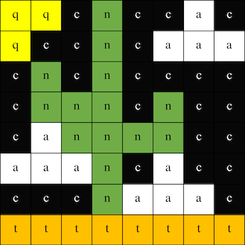
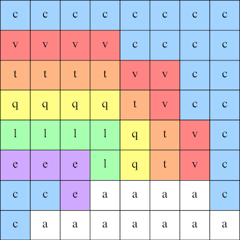

## Vise et bilde

Astro Pi-matrisen kan vise farger. I dette trinnet vises bilder fra naturen på Astro Pi's LED-matrise.

<p style="border-left: solid; border-width:10px; border-color: #0faeb0; background-color: aliceblue; padding: 10px;">
En <span style="color: #0faeb0">**LED-matrise**</span> er et rutenett av LED-pærer som kan styres individuelt eller som en gruppe for å skape forskjellige lyseffekter. LED-matrisen på Sense HAT har 64 LED'er som vises i 8 x 8 rutenett. LED-pærene kan programmeres til å produsere en lang rekke farger.
</p>


--- task ---

Åpne [Mission Zero startprosjektet](https://missions.astro-pi.org/nb/mz/code_submissions/new){:target="_blank"}.

Du vil se at et par kodelinjer er lagt til automatisk for deg.

Denne koden kobles til Astro Pi, sørge for at Astro Pi's LED-skjerm vises på riktig måte rundt og setter opp fargesensoren. La koden være, du vil trenge den senere.

--- code ---
---
language: python filename: main.py line_numbers: false line_number_start: 1
line_highlights:
---
# Importer bibliotekene
from sense_hat import SenseHat from time import sleep

# Sett opp Sense HAT
sense = SenseHat() sense.set_rotation(270)

# Sett opp fargesensoren
sense.color.gain = 60 # Set the sensitivity of the sensor sense.color.integration_cycles = 64 # The interval at which the reading will be taken

--- /code ---


--- /task ---

### RGB farger

Farger kan lages ved hjelp av ulike deler av rød, grønn og blå. Du kan finne ut om RGB farger her:

[[[generic-theory-simple-colours]]]

LED-matrisen er et 8 x 8-rutenett. Hver LED på rutenettet kan settes til en annen farge. Her er en liste over variabler for 24 forskjellige farger. Hver farge har en verdi for rød, grønn og blå:

[[[ambient-colours]]]

### Velg et bilde

--- task ---

**Velg:** Velg et bilde for visning blant valgene nedenfor. Python lagrer informasjonen for et bilde i en liste. Koden for hvert bilde inneholder fargevariablene som er brukt, og listen.

Du må **kopiere** all koden for det valgte bildet og **lime inn** den inn i prosjektet under linjen som sier `# Legg til fargevariabler og bilde`.

--- collapse ---

---
title: Fox
---


Created by team i_pupi, Italy

```python
c = (0, 0, 0) # Black
a = (255, 255, 255) # white
t = (255, 140, 0) # dark orange

image = [
t, a, t, c, c, t, a, t,
t, a, t, c, c, t, a, t,
t, t, t, t, t, t, t, t,
t, a, c, t, t, c, a, t,
t, t, t, t, t, t, t, t,
a, a, a, c, c, a, a, a,
c, a, a, a, a, a, a, c,
c, c, a, a, a, a, c, c]
```

--- /collapse ---


--- collapse ---

---
title: Elephant
---


Created by team ILiFanT, Finland

```python
c = (0, 0, 0) # Black
b = (105, 105, 105) # dark grey
a = (255, 255, 255) # white

image = [
    c, c, c, c, c, c, c, c,
    c, b, b, b, c, c, c, c,
    c, b, c, b, c, c, b, b,
    c, b, c, c, c, b, b, b,
    c, b, b, c, c, b, c, b,
    c, b, b, b, b, b, b, b,
    c, c, b, b, a, b, b, b,
    c, c, c, c, a, b, b, b]
```

--- /collapse ---

--- collapse ---
---
title: Cactus
---



Created by team 6TETHASI, The Netherlands

```python
a = (255, 255, 255) # White
c = (0, 0, 0) # Black
n = (154, 205, 50) # YellowGreen
q = (255, 255, 0) # Yellow
t = (255, 140, 0) # DarkOrange

image = [   
  q, q, c, n, c, c, a, c,
  q, c, c, n, c, a, a, a,
  c, n, c, n, c, c, c, c,
  c, n, n, n, c, n, c, c,
  c, a, n, n, n, n, c, c,
  a, a, a, n, c, a, a, a,
  c, c, c, n, a, a, a, c,
  t, t, t, t, t, t, t, t]

```

--- /collapse ---


--- collapse ---
---
line_numbers: false
---


```python

a = (255, 255, 255) # White
c = (0, 0, 0) # Black
f = (25, 25, 112) # MidnightBlue
m = (34, 139, 34) # ForestGreen

image = [
  m, m, m, m, m, c, c, c,
  m, f, m, f, m, m, m, m,
  m, m, m, m, m, m, m, m,
  m, m, c, a, c, c, c, a,
  m, m, c, c, c ,c ,c ,c,
  m, m, c, c, c, a, c, c,
  m, m, m, m, m, m, m, m,
  m, m, m, m, m, m, m, m]

```

--- /collapse ---

--- collapse ---
---
title: Rainbow
---



Created by team camrus_6, United Kingdom

```python

c = (100, 149, 237) # CornflowerBlue
a = (255, 255, 255) # White
v = (255, 0, 0) # Red
t = (255, 140, 0) # DarkOrange
q = (255, 255, 0) # Yellow
l = (0, 255, 127) # SpringGreen
e = (0, 0, 205) # MediumBlue

rainbow = [
  c, c, c, c, c, c, c, c, 
  v, v, v, v, c, c, c, c,
  t, t, t, t, v, v, c, c,
  q, q, q, q, t, v, c, c,
  l, l, l, l, q, t, v, c,
  e, e, e, l, q, t, v, c,
  c, c, e, a, a, a, a, c,
  c, a, a, a, a, a, a, a
]

```

--- /collapse ---

--- collapse ---
---
title: Dragon
---


Created by team hwplucyr, United Kingdom

```python

b = (105, 105, 105) # DimGray
c = (0, 0, 0) # Black
d = (100, 149, 237) # CornflowerBlue
v = (255, 0, 0) # Red
z = (153, 50, 204) # DarkOrchid

image = [
    c, c, v, c, v, c, c, c,
    c, z, z, z, z, v, c, c,
    z, b, z, b, z, c, c, c,
    z, z, z, z, z, v, c, c,
    c, c, d, d, d, c, c, z,
    c, z, d, z, z, z, z, c,
    c, c, d, d, z, c, c, c,
    c, c, z, c, z, c, c, c]

```

--- /collapse ---

--- /task ---

--- task ---

**Finn:** linjen som sier `# Vis bilde` og legg til en kodelinje for å vise bildet på LED-matrisen:

```python
a = (255, 255, 255) # White
c = (0, 0, 0) # Black
f = (25, 25, 112) # MidnightBlue
m = (34, 139, 34) # ForestGreen

image = [
  m, m, m, m, m, c, c, c,
  m, f, m, f, m, m, m, m,
  m, m, m, m, m, m, m, m,
  m, m, c, a, c, c, c, a,
  m, m, c, c, c ,c ,c ,c,
  m, m, c, c, c, a, c, c,
  m, m, m, m, m, m, m, m,
  m, m, m, m, m, m, m, m]

# Display the image 
sense.set_pixels(image)

```

--- /task ---

--- task ---

a = (255, 255, 255) # Hvit c = (0, 0, 0) # Svart f = (25, 25, 112) # Midnatt blå m = (34, 139, 34) # Skoggrønn

--- /task ---

--- task ---

**Debug**

Min kode har en syntaksfeil:

- Kontroller at koden samsvarer med koden i eksemplene ovenfor
- Sjekk at du har skrevet inn koden i listen din
- Sjekk at listen din er omgitt av `[` and `]`
- Kontroller at hver fargevariabel i listen er adskilt med et komma

Bildet mitt vises ikke:

- Sjekk at din `sense.set_pixels(bilde)` ikke er innrykket

--- /task ---


--- task ---

**Save your progress**

Now that you have displayed an image, you can save your program on the Mission Starter project by entering your team name, team members' names, and the classroom code given to you. You can reload your program on any device with an internet connection by entering your team name and classroom code.


--- /task --- 
