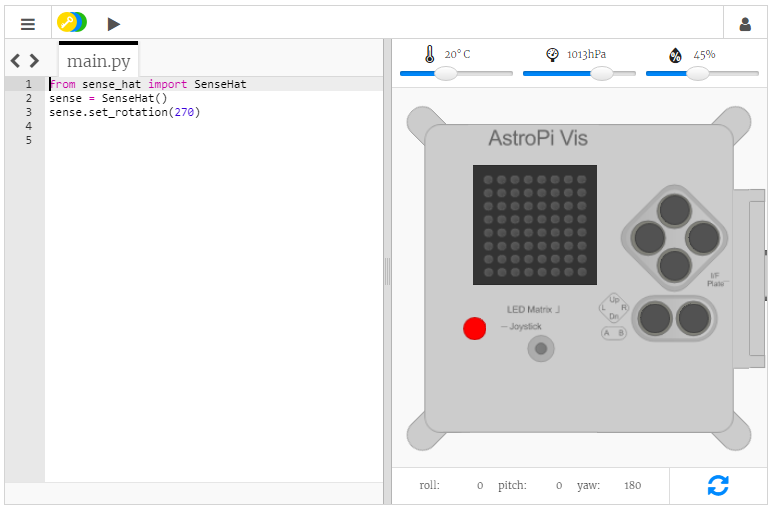
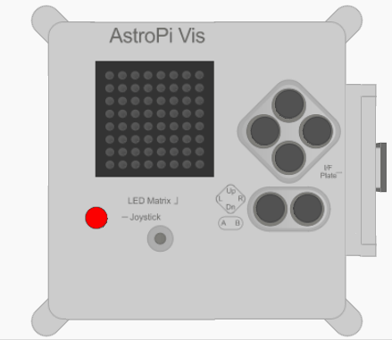

## Vise en melding

--- task ---

Åpne [Sense HAT-emulatoren](https://trinket.io/mission-zero){:target="_blank"} for Mission Zero-prosjektet.

Du vil se at tre kodelinjer er lagt til automatisk for deg:

```python
from sense_hat import SenseHat
sense = SenseHat()
sense.set_rotation(270)
```



Denne koden kobler til Astro Pi og sørger for at Astro Pi's LED-skjerm vises den riktige veien. La koden være der, du vil trenge den senere.

--- /task ---

--- task ---

Kanskje du vil legge til en hyggelig hilsen til astronautene på ISS som jobber i nærheten av Astro Pi? La oss rulle en melding over skjermen.

Legg til denne linjen under den andre koden:

```python
sense.show_message("Astro Pi")
```

--- /task ---

--- task ---

Trykk på **Run** (Kjør)-knappen og se meldingen `Astro Pi` rulle over LED-skjermen.


--- /task ---



For å vise en annen melding, kan du skrive hva som helst mellom anførselstegnene (`""`).

--- collapse ---
---
title: Hvilke tegn kan brukes?
---

Sense HAT kan bare vise tegnsettet Latin 1, noe som betyr at bare følgende tegn vil være tilgjengelig. Andre tegn vises som `?`.

    +-*/!"#$><0123456789.=)(
    
    ABCDEFGHIJKLMNOPQRSTUVWXYZ
    
    abcdefghijklmnopqrstuvwxyz
    
    ?,;:|@%[&_']\~
    

--- /collapse ---

--- task ---

Du kan også endre hastigheten på meldingen som ruller over skjermen. Legg til en `scroll_speed` til kodelinjen du allerede har, slik:

```python
sense.show_message("Astro Pi", scroll_speed=0.05)
```

Standardhastigheten til meldingen er `0.1`. Med lavere tall ruller meldingen raskere, og høyere tall gjør at meldingen går langsommere.

--- /task ---