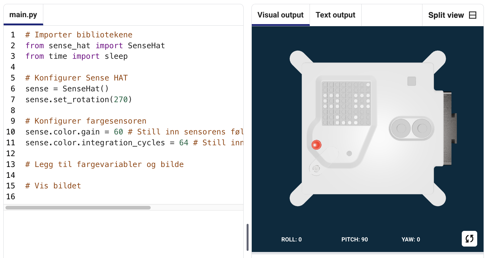
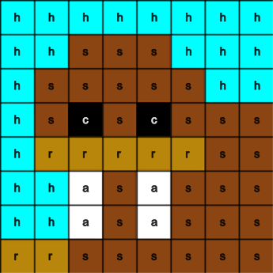
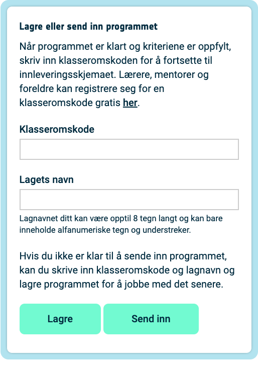

## Vise et bilde

Astro Pi-matrisen kan vise farger. I dette trinnet vises bilder fra naturen på Astro Pi's LED-matrise.

<p style="border-left: solid; border-width:10px; border-color: #0faeb0; background-color: aliceblue; padding: 10px;">
En <span style="color: #0faeb0">**LED-matrise**</span> er et rutenett av LED-pærer som kan styres individuelt eller som en gruppe for å skape forskjellige lyseffekter. LED-matrisen på Sense HAT har 64 LED'er som vises i 8 x 8 rutenett. LED-pærene kan programmeres til å produsere en lang rekke farger.
</p>


--- task ---

Åpne [Mission Zero startprosjektet](https://missions.astro-pi.org/mz/code_submissions/){:target="_blank"}.

Du vil se at et par kodelinjer er lagt til automatisk for deg.

Denne koden kobles til Astro Pi, sørge for at Astro Pi's LED-skjerm vises på riktig måte rundt og setter opp fargesensoren. La koden være, du vil trenge den senere.

--- code ---
---
language: python
filename: main.py
line_numbers: false
line_number_start: 1
line_highlights:
---
# Importer bibliotekene
from sense_hat import SenseHat 
from time import sleep

# Sett opp Sense HAT
sense = SenseHat() 
sense.set_rotation(270)

# Sett opp fargesensoren
sense.color.gain = 60 # Angi følsomheten til sensoren
sense.color.integration_cycles = 64 # Intervallet som avlesningens skal utføres i

--- /code ---



--- /task ---

### RGB farger

Farger kan lages ved hjelp av ulike deler av rød, grønn og blå. Du kan finne ut om RGB farger her:

[[[generic-theory-simple-colours]]]

LED-matrisen er et 8 x 8-rutenett. Hver LED på rutenettet kan settes til en annen farge. Her er en liste over variabler for 24 forskjellige farger. Hver farge har en verdi for rød, grønn og blå:

[[[ambient-colours]]]

### Velg et bilde

--- task ---

**Velg:** Velg et bilde for visning blant valgene nedenfor. Python lagrer informasjonen for et bilde i en liste. Koden for hvert bilde inneholder fargevariablene som er brukt, og listen.

Du må **kopiere** all koden for det valgte bildet og **lime inn** den inn i prosjektet under linjen som sier `# Legg til fargevariabler og bilde`.

--- collapse ---

---
title: Fisk
---


Laget av Team Chalka fra Polen

```python
z = (153, 50, 204) # Mørk orkidé
q = (255, 255, 0) # Gul
d = (51, 153, 255) # Blå
c = (0, 0, 0) # Svart

bilde = [
d, d, z, d, d, d, d, d,
d, d, d, z, z, d, d, d,
z, d, q, q, q, q, d, d,
z, z, q, q, q, c, q, d,
z, z, z, q, q, q, q, d,
z, z, q, q, q, q, q, d,
z, d, q, z, z, q, d, d,
d, d, d, z, d, d, d, d]

```

--- /collapse ---


--- collapse ---

---
title: Hvalross
---



Laget av Team Walrus fra Finland

```python
h = (0, 255, 255) # Cyan
c = (0, 0, 0) # Svart
s = (139, 69, 19) # Lærbrun
a = (255, 255, 255) # Hvit
r = (184, 134, 11) # Mørk gullris

bilde = [
h, h, h, h, h, h, h, h,
h, h, s, s, s, h, h, h,
h, s, s, s, s, s, h, h,
h, s, c, s, c, s, s, s,
h, r, r, r, r, r, s, s,
h, h, a, s, a, s, s, s,
h, h, a, s, a, s, s, s,
r, r, s, s, s, s, s, s]

```

--- /collapse ---

--- collapse ---
---
title: Paxi
---


Laget av team tony_pi fra Italia

```python
v = (255, 0, 0) # Rød
m = (34, 139, 34) # Skogsgrønn
c = (0, 0, 0) # Svart
e = (100, 149, 237) # Kornblomstblå
l = (0, 255, 0) # Grønn

bilde = [
    c, v, m, c, c, m, v, c,
    c, c, v, v, v, v, c, c,
    c, v, c, e, l, e, v, c,
    c, v, c, l, l, l, v, c,
    c, v, c, l, c, l, v, c,
    c, c, v, v, v, v, c, c,
    c, c, l, c, c, l, c, c,
    c, m, m, c, c, m, m, c]

```

--- /collapse ---


--- collapse ---
---
title: Hund
---


Laget av Team ptpr_07 fra Spania

```python

c = (0, 0, 0) # Svart
r = (184, 134, 11) # Mørk gullris
s = (139, 69, 19) # Lærbrun
y = (255, 20, 147) # Dyprosa

bilde = [
    c, r, r, c, c, r, r, c,
    c, r, s, s, s, s, r, c,
    c, r, c, s, s, c, r, c,
    c, s, s, s, s, s, s, c,
    c, s, s, s, s, s, s, c,
    c, s, s, c, c, s, s, c,
    c, c, s, y, y, s, c, c,
    c, c, c, y, y, c, c, c]


```

--- /collapse ---

--- collapse ---
---
title: Kameleon
---


Laget av Team The_ETs fra Storbritannia

```python

c = (0, 0, 0) # Svart
s = (139, 69, 19) # Lærbrun
a = (255, 255, 255) # Hvit
v = (255, 0, 0) # Rød
t = (255, 140, 0) # Mørk oransje
q = (255, 255, 0) # Gul
m = (34, 139, 34) # Skogsgrønn
h = (0, 255, 255) # Cyan
z = (153, 50, 204) # Mørk orkidé
y = (255, 20, 147) # Dyprosa

bilde = [
    a, a, v, v, t, a, a, a,
    a, v, v, t, t, q, a, a,
    v, c, t, t, q, q, m, a,
    v, t, t, q, q, m, m, h,
    s, s, q, s, s, m, s, h,
    a, a, a, a, a, a, a, z,
    a, a, a, a, y, a, a, z,
    a, a, a, a, a, y, z, a]

```

--- /collapse ---

--- collapse ---
---
title: Drage
---


Laget av Team Val fra Hellas

```python

c = (0, 0, 0) # Svart
m = (34, 139, 34) # Skogsgrønn
v = (255, 0, 0) # Rød
q = (255, 255, 0) # Gul
e = (0, 0, 205) # Mellomblå
h = (0, 255, 255) # Cyan

bilde = [
    h, h, h, h, h, h, h, h, 
    h, h, h, e, e, v, v, h, 
    h, h, h, e, e, v, v, h, 
    h, h, h, q, q, m, m, h, 
    h, h, h, q, q, m, m, h,
    h, h, c, h, h, h, h, h, 
    h, c, h, h, h, h, h, h, 
    c, h, h, h, h, h, h, h]

```

--- /collapse ---

--- collapse ---
---
title: Høne
---


Laget av Team Slepicky fra Tsjekkia

```python

v = (255, 0, 0) # Rød
c = (0, 0, 0) # Svart
b = (105, 105, 105) # Blekgrå
q = (255, 255, 0) # Gul
r = (184, 134, 11) # Mørk gullris

bilde =  [
    c, c, v, v, v, c, c, c,
    c, v, b, b, r, c, c, r,
    c, b, c, b, b, c, r, b,
    q, r, b, b, b, b, b, r,
    c, v, b, b, b, b, r, b,
    c, v, b, r, r, r, b, r,
    c, c, c, r, b, q, r, c,
    c, c, c, c, q, q, c, c]

```

--- /collapse ---

--- /task ---

--- task ---

**Finn:** linjen med teksten `# Vis bildet`, og legg til en kodelinje for å vise bildet på LED-matrisen:

--- code ---
---
language: python
filename: main.py
line_numbers: false
line_number_start: 1
line_highlights: 18, 19
---
z = (153, 50, 204) # Mørk orkidé
q = (255, 255, 0) # Gul
d = (51, 153, 255) # Blå
c = (0, 0, 0) # Svart

bilde = [
d, d, z, d, d, d, d, d,
d, d, d, z, z, d, d, d,
z, d, q, q, q, q, d, d,
z, z, q, q, q, c, q, d,
z, z, z, q, q, q, q, d,
z, z, q, q, q, q, q, d,
z, d, q, z, z, q, d, d,
d, d, d, z, d, d, d, d]

# Vis bildet 
sense.set_pixels(bilde)

--- /code ---

--- /task ---

--- task ---

Trykk **Kjør** nederst i editoren for å se bildet vist på LED-matrisen.

--- /task ---

--- task ---

**Debug**

Min kode har en syntaksfeil:

- Kontroller at koden samsvarer med koden i eksemplene ovenfor
- Sjekk at du har skrevet inn koden i listen din
- Sjekk at listen din er omgitt av `[` and `]`
- Kontroller at hver fargevariabel i listen er adskilt med et komma

Bildet mitt vises ikke:

- Sjekk at din `sense.set_pixels(bilde)` ikke er innrykket

--- /task ---


--- task ---

**Lagre fremgangen din**

Nå som du har vist et bilde, kan du lagre programmet ditt på Mission Starter-prosjektet ved å skrive inn lagnavnet ditt, lagmedlemmenes navn og klasseromskoden du har fått. Du kan laste inn programmet på nytt på en hvilken som helst enhet med internettforbindelse ved å skrive inn lagnavnet og klasseromskoden.



--- /task --- 
