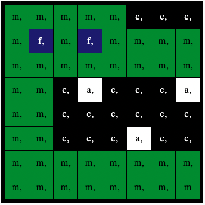

## Sanse en farge

I dette trinnet vil du sette opp fargens lysstyrke og bruke den til å forstå mengden av rød, grønn, og blå når sensoren. Denne fargen vil bli brukt til å farge i det valgte bildet. En astronaut som går opp til sensoren i en blå skjorte vil se et annet bilde enn en astronaut i en rød skjorte.

Uansett hvilket bilde du velger, bruker bakgrunnen `c`-variabelen som er satt til svart.

--- task ---

Bruk fargesensoren til å farge bakgrunnen din.

Legg til kode før bildelisten din for å få fargen fra sensoren og endre `c` bakgrunnsfarge-variabelen for å bruke fargen med Sense HAT-fargesensoren i stedet for svart.

**Tips:** Du trenger ikke skrive inn kommentarer som begynner med '#' (de er der for å forklare koden).

--- code ---
---
language: python filename: main.py line_numbers: false line_number_start: 1
line_highlights: 9, 10
---

# Legg til fargevariabler og bilde

a = (255, 255, 255) # White c = (0, 0, 0) # Black f = (25, 25, 112) # MidnightBlue m = (34, 139, 34) # ForestGreen

rgb = sense.color # get the colour from the sensor c = (rgb.red, rgb.green, rgb.blue) # use the sensed colour

image = [ m, m, m, m, m, c, c, c, m, f, m, f, m, m, m, m, m, m, m, m, m, m, m, m, m, m, c, a, c, c, c, a, m, m, c, c, c ,c ,c ,c, m, m, c, c, c, a, c, c, m, m, m, m, m, m, m, m, m, m, m, m, m, m, m, m]

--- /code ---

--- /task ---

--- task ---

**Test:** Flytt fargegjenryteren til en farge du velger, og deretter **kjør** koden din. Bakgrunnsfargen din endres. Gjenta denne testen igjen med en ny farge.

**Tips:** Du må klikke 'Run (Kjør)' hver gang du endrer fargen.

--- /task ---

## Gjenta programmet ditt

Astro Pi-Mission Zero-programmet tillates å løpe i opptil 30 sekunder. Du vil bruke denne tiden til å sjekke fargesensoren flere ganger og oppdatere bildet.

Koden din vil bruke en `for` løkke for å kjøre 28 ganger. **Hver** gang det vil:
+ fornemme den nyeste fargen
+ oppdatere bakgrunnsfargen på bildet
+ pause i ett sekund

--- task ---

**Finn** din `rgb = sense.color` kodelinje.

**Legg til** kode over for å sette opp `for` loop for `28` repetisjoner.

--- code ---
---
language: python filename: main.py line_numbers: false line_number_start: 1
line_highlights: 2
---

for i in range(28): rgb = sense.color # get the colour from the sensor c = (rgb.red, rgb.green, rgb.blue)

image = [ m, m, m, m, m, c, c, c, m, f, m, f, m, m, m, m, m, m, m, m, m, m, m, m, m, m, c, a, c, c, c, a, m, m, c, c, c ,c ,c ,c, m, m, c, c, c, a, c, c, m, m, m, m, m, m, m, m, m, m, m, m, m, m, m, m]

--- /code ---

--- /task ---

--- task ---

Nå må du rykke inn all koden under `for` løkken slik at den sitter **inni** `for` løkke.

**Tip:** Til innrykk flere linjer, uthev linjene du ønsker å rykke inn, og trykk deretter <kbd>fane</kbd> på tastaturet (vanligvis over <kbd>Caps Lock</kbd> -tasten på tastaturet).

--- code ---
---
language: python filename: main.py line_numbers: false line_number_start: 1
line_highlights: 3, 4, 5, 6, 7, 8, 9, 10, 11, 12, 13, 14, 15, 16, 17, 18
---

for i in range(28): rgb = sense.color # get the colour from the sensor c = (rgb.red, rgb.green, rgb.blue)

  image = [ m, m, m, m, m, c, c, c, m, f, m, f, m, m, m, m, m, m, m, m, m, m, m, m, m, m, c, a, c, c, c, a, m, m, c, c, c ,c ,c ,c, m, m, c, c, c, a, c, c, m, m, m, m, m, m, m, m, m, m, m, m, m, m, m, m]

  # Display the image

  sense.set_pixels(image)

--- /code ---

--- /task ---

--- task ---

I bunnen av koden legger du til en `sleep` på et sekund i løkken:

--- code ---
---
language: python filename: main.py line_numbers: false line_number_start: 1
line_highlights: 5
---

  # Display the image

  sense.set_pixels(image) sleep(1)

--- /code ---

**Tip:** Kontroller at denne kodelinjen er innrykket i din `for` løkke.

--- /task ---

--- task ---

**Test:** Kjør koden og endre fargevelgeren flere ganger når prosjektet kjører. Sjekk at bildeoppdateringer dine for å bruke sensoret farge på neste kjøring.

Bildet slutter å oppdatere når løkka er ferdig slik at programmet ikke kjører på mer enn 30 sekunder.

--- /task ---

--- task ---

**Debug**

Min kode har en syntaksfeil eller kjører ikke som forventet:

- Kontroller at koden samsvarer med koden i eksemplene ovenfor
- Sjekk at du har skrevet inn koden i `for` gjennomløp
- Sjekk at listen din er omgitt av `[` and `]`
- Kontroller at hver fargevariabel i listen er adskilt med et komma

Min kode kjører lenger enn 30 sekunder:

- Redusere antall ganger din for-løkke, fra 28 til 25 eller til 20.
- Reduser lengden på søvnen fra 1 sekund til 0,5 sekunder.

--- /task ---

--- task ---

Legg til `sense.clear()` ved slutten av koden for å fjerne bildet på slutten av løkken. Dette vil hjelpe deg å se når din animasjon er ferdig kjørt.

**Tip:** Kontroller at du **ikke** rykk `sense.clear()` linje med kode da du ønsker at dette kun skal kjøres på slutten av din animasjon.

--- code ---
---
language: python filename: main.py line_numbers: false line_number_start: 1
line_highlights: 7
---

  # Display the image

  sense.set_pixels(image) sleep(1)

sense.clear()

--- /code ---

--- /task ---

--- task ---

**Test:** Kjør koden din igjen. Når prosjektet ditt er ferdig med å kjøre LED-matrisen, vil alle lysene som er svarte (av).

--- /task ---

--- task ---

**Debug**

LED-matrisen blir sort hvert sekund:

- Sjekk at du ikke har skrevet inn `sense.clear()` koden i `for` løkke

--- /task ---

--- task ---

Legg til kode for å fjerne LED matrisen til en farge du velger. Opprett en variabel kalt `x` for å lagre den nye fargen.

Du kan blande din egen farge eller bruke verdiene fra fargelisten over farger for å lage din nye `x` farge.

\[[[generic-theory-simple-colours]]\] \[[[ambient-colours\]]]

--- code ---
---
language: python filename: main.py line_numbers: false line_number_start: 1
line_highlights: 7, 8
---

  # Display the image

  sense.set_pixels(image) sleep(1)

x = (178, 34, 34)  # choose your own red, green, blue values between 0 - 255 sense.clear(x)

--- /code ---

--- /task ---

--- task ---

**Test:** Kjør koden din igjen. Når prosjektet ditt er ferdig med å kjøre LED-matrisen vil det fjerne til den valgte fargen. Du kan endre fargen så mange ganger du vil.

--- /task ---

--- task ---

**Lagre fremgangen din**

Du kan lagre programmet ditt på Mission Starter-prosjektet ved å skrive inn lagnavnet ditt, lagmedlemmenes navn og klasseromskoden du har fått. Du kan laste inn programmet på nytt på en hvilken som helst enhet med internettforbindelse ved å skrive inn lagnavnet og klasseromskoden.

--- /task ---

--- task ---

--- collapse ---

---
title: Fullstendig kodeeksempel
---

--- code ---
---
language: python filename: main.py
line_numbers: false
---
# Import the libraries
from sense_hat import SenseHat from time import sleep

# Set up the Sense HAT
sense = SenseHat() sense.set_rotation(270)

# Set up the colour sensor
sense.color.gain = 60 # Set the sensitivity of the sensor sense.color.integration_cycles = 64 # The interval at which the reading will be taken

# Add colour variables and image

a = (255, 255, 255) # White c = (0, 0, 0) # Black f = (25, 25, 112) # MidnightBlue m = (34, 139, 34) # ForestGreen

for i in range(28): rgb = sense.color # get the colour from the sensor c = (rgb.red, rgb.green, rgb.blue)

  image = [ m, m, m, m, m, c, c, c, m, f, m, f, m, m, m, m, m, m, m, m, m, m, m, m, m, m, c, a, c, c, c, a, m, m, c, c, c ,c ,c ,c, m, m, c, c, c, a, c, c, m, m, m, m, m, m, m, m, m, m, m, m, m, m, m, m]

  # Display the image

  sense.set_pixels(image) sleep(1)

x = (178, 34, 34)  # choose your own red, green, blue values between 0 - 255 sense.clear(x)

--- /code ---

--- /collapse ---

--- /task ---
