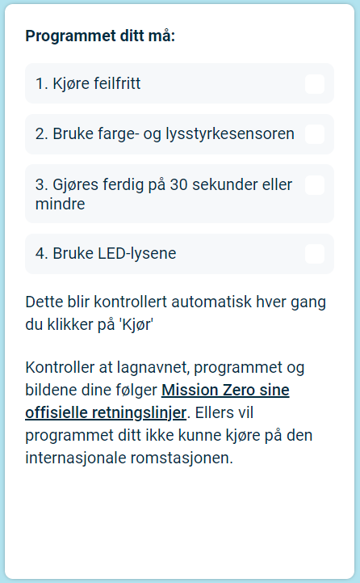

## Send inn bidraget ditt

Du kan nå skrive inn [Astro Pi Mission Zero](https://astro-pi.org/mission-zero){:target="_blank"} utfordringen ved å bruke koden du har skrevet.

Det er noen regler for at koden må følge, slik at du kan sende den til å bli kjørt på den internasjonale romstasjonen. Dersom koden din følger dem, reglene nederst på **Sense HAT-emulatoren** vil lyse opp i grønt når du kjører programmet.

**Tips:** Test koden din med noen forskjellige fargeinnstillinger (ved bruk av velgeren) for å forsikre deg om at den alltid kjører riktig.

Sørg for at oppføringen din følger de [offisielle retningslinjene](https://astro-pi.org/mission-zero/guidelines){:target="_blank"} for Mission Zero. Hvis den ikke følger retningslinjene, vil ikke programmet ditt kunne kjøre på den internasjonale romstasjonen.

Vennligst ikke inkluder noen av de følgende i gruppens navn eller kode:

+ Alt som kan tolkes som ulovlig, politisk, eller sårbar natur
+ Flagg, som de kan betraktes som politisk følsomme
+ Alt som refererer til ubehagelig eller skader på en annen person
+ Personopplysninger som telefonnummer, sosiale medier og e-postadresser
+ Obscene bilder
+ Spesielle tegn eller emojier
+ Dårlig språk eller banneord

--- task ---

Skriv inn klasseromskoden og teamnavnet ditt i boksen nederst – veilederen din vil fortelle deg hva din koden er.

**Merknader om veiledere** kan bli funnet i [Introduksjon](https://projects.raspberrypi.org/en/projects/astro-pi-mission-zero/0) trinn.

--- /task ---

--- task ---

Trykk på **Legg til lag** for å skrive inn koden. Vær oppmerksom på at et program ikke kan endres etter innlevering.

Din mentor vil få en e-post for å bekrefte oppføringen din.

--- /task ---

--- task ---

Hvis du vil, du kan dele lenken med koden på sosiale medier for å fortelle folk at koden du skrev vil bli kjørt i verdensrommet!

--- /task ---
