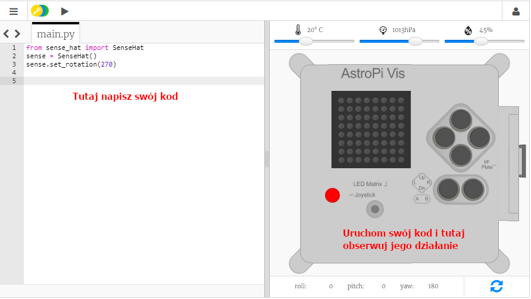

## Czym jest Astro Pi?

Astro Pi to komputer Raspberry Pi z obudową zaprojektowaną specjalnie do pracy w warunkach kosmicznych. Ma on również dodatkową płytkę-nakładkę o nazwie Sense HAT, stworzoną specjalnie dla misji Astro Pi. The Sense HAT has a joystick; an LED display; and sensors for recording the lighting conditions, temperature, humidity, pressure, colour, and orientation.

Oto oryginalne Astro Pi Mark I na Międzynarodowej Stacji Kosmicznej(ISS), z uruchomionym kodem napisanym przez uczniów. Twój kod zostanie ostatecznie uruchomiony na nowej wersji komputerów Astro Pi!

<iframe width="560" height="315" src="https://www.youtube.com/embed/4ykbAJeGPMM" frameborder="0" allow="accelerometer; autoplay; encrypted-media; gyroscope; picture-in-picture" allowfullscreen></iframe>>

W tej misji będziesz używać emulatora Sense HAT. Emulator to oprogramowanie symulujące wszystkie funkcje Astro Pi w przeglądarce internetowej.
<mark>change screenshot of emulator</mark> 

Istnieje kilka różnic między prawdziwym a emulowanym Sense HAT:
- Na emulatorze można samodzielnie ustawić kolor światła, temperaturę, ciśnienie i wilgotność za pomocą suwaków, natomiast prawdziwy Sense HAT w Astro Pi wykorzystuje czujniki do mierzenia tych parametrów w swoim otoczeniu.

- Za pomocą myszy można kliknąć i przeciągnąć emulowany HAT Sense, aby go przesunąć i obrócić, symulując zmiany w jego orientacji; prawdziwy Astro Pi (i jego Sense HAT) może poruszać się w świecie rzeczywistym, a czujniki orientacyjne Sense HAT wykrywają, kiedy i jak się porusza.
