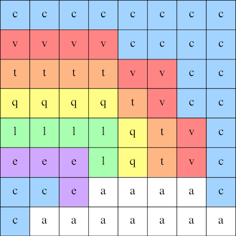

## Wyświetl obrazek

Diody LED Astro Pi mogą świecić się na kolorowo. W tym kroku będziesz wyświetlać obrazy z natury na matrycy LED Astro Pi.

<p style="border-left: solid; border-width:10px; border-color: #0faeb0; background-color: aliceblue; padding: 10px;">
<span style="color: #0faeb0">**Matryca LED**</span> to siatka diod LED, które mogą być kontrolowane pojedynczo lub jako grupa, aby tworzyć różne efekty wyświetlania. Matryca LED na Sense HAT ma 64 diody LED wyświetlane w siatce 8 x 8. Diody LED mogą być zaprogramowane w celu uzyskania szerokiej gamy kolorów.
</p>


--- task ---

Otwórz [Projekt startowy Misji Zero](http://rpf.io/mzcode){:target="_blank"}.

Zobaczysz, że kilka linijek kodu zostało dla Ciebie dodanych automatycznie.

Kod ten łączy się z Astro Pi, zapewnia odpowiedni sposób pracy wyświetlacza LED Astro Pi i przygotowuje czujnik koloru. Pozostaw ten kod, ponieważ będziesz go potrzebować.

--- code ---
---
language: python filename: main.py line_numbers: false line_number_start: 1
title: Jakich znaków można użyć?
---
# Wczytaj biblioteki
Wyświetl wiadomość i wybierz nazwę dla nowych komputerów Astro Pi

# Przygotuj Sense HAT
from sense_hat import SenseHat sense = SenseHat() sense.set_rotation(270)

# Przygotuj czujnik kolorów
sense.color.gain = 60 # Set the sensitivity of the sensor sense.color.integration_cycles = 64 # The interval at which the reading will be taken

--- /code ---


--- /task ---

### Kolory RGB

Kolory można tworzyć przy użyciu różnych proporcji czerwieni, zieleni i niebieskiego. Dowiedz się więcej o kolorach RGB tutaj:

[[[generic-theory-simple-colours]]]

Matryca LED to siatka 8 x 8. Każda dioda świecąca na siatce może być ustawiona na inny kolor. Oto lista zmiennych dla 24 różnych kolorów. Każdy kolor ma wartość dla czerwonego, zielonego i niebieskiego:

[[[ambient-colours]]]

### Wybierz obraz

--- task ---

**Wybór:** Wybierz obraz do wyświetlenia spośród poniższych opcji. Python przechowuje informacje o obrazie na liście. Kod każdego obrazu zawiera użyte zmienne kolorów i listę.

Będziesz musiał **skopiować** cały kod wybranego obrazu, a następnie **wkleić** go do swojego projektu poniżej linii, która mówi `# Dodaj zmienne kolorów i obraz`.

--- collapse ---

---
title: Wąż
---


Created by team i_pupi, Italy

```python
a = (255, 255, 255) # Biały
c = (0, 0, 0) # Czarny
v = (255, 0, 0) # Czerwony
```

--- /collapse ---


--- collapse ---

---
title: Kurczak
---


Created by team ILiFanT, Finland

```python
obrazek = [
  c, c, c, q, q, q, c, c,
  c, c, t, q, e, q, c, c,
  c, c, c, q, q, q, c, c,
  c, w, w, w, w, w, w, c,
  c, w, a, a, a, a, w, c,
  c, w, a, a, a, a, w, c,
  c, c, w, a, a, w, c, c,
  c, c, c, w, w, c, c, c]
```

--- /collapse ---

--- collapse ---
---
title: Kwiat
---


Created by team 6TETHASI, The Netherlands

```python
a = (255, 255, 255) # Biały
c = (0, 0, 0) # Czarny
e = (0, 0, 205) # ŚCzerwonyni niebieski
q = (255, 255, 0) # Żółty
t = (255, 140, 0) # Ciemny pomarańczowy
w = (255, 192, 203) # Różowy

```

--- /collapse ---


--- collapse ---
---
title: Krokodyl
---


```python

a = (255, 255, 255) # Biały
c = (0, 0, 0) # Czarny
f = (25, 25, 112) # Nocny niebieski
m = (34, 139, 34) # Leśny zielony

```

--- /collapse ---

--- collapse ---
---
title: Krab
---



Created by team camrus_6, United Kingdom

```python

c = (0, 0, 0) # Czarny
m = (34, 139, 34) # Leśny zielony
q = (255, 255, 0) # Żółty
t = (255, 140, 0) # Ciemny pomarańczowy
y = (255, 20, 147) # Głęboki różowy

```

--- /collapse ---

--- collapse ---
---
title: Żaba
---


Created by team hwplucyr, United Kingdom

```python

b = (105, 105, 105) # DimGray
c = (0, 0, 0) # Black
d = (100, 149, 237) # CornflowerBlue
v = (255, 0, 0) # Red
z = (153, 50, 204) # DarkOrchid

image = [
    c, c, v, c, v, c, c, c,
    c, z, z, z, z, v, c, c,
    z, b, z, b, z, c, c, c,
    z, z, z, z, z, v, c, c,
    c, c, d, d, d, c, c, z,
    c, z, d, z, z, z, z, c,
    c, c, d, d, z, c, c, c,
    c, c, z, c, z, c, c, c]

```

--- /collapse ---

--- /task ---

--- task ---

**Znajdź:** linię, która mówi `# Wyświetl obrazek` i dodaj linię kodu, aby wyświetlić obraz na matrycy LED:

```python
c = (0, 0, 0) # Czarny
 m = (34, 139, 34) # Leśny zielony
 q = (255, 255, 0) # Żółty
 v = (255, 0, 0) # Czerwony

```

--- /task ---

--- task ---

Naciśnij **Uruchom** na dole edytora, aby zobaczyć obraz wyświetlany na matrycy LED.

--- /task ---

--- task ---

**Debugowanie (usuwanie błędów)**

Mój kod zawiera błąd składni:

- Sprawdź, czy Twój kod pasuje do kodu w powyższych przykładach
- Sprawdź, czy masz wcięcia w kodzie na swojej liście
- Sprawdź, czy Twoja lista jest otoczona przez `[` i `]`
- Sprawdź, czy każda zmienna koloru na liście jest oddzielona przecinkiem

Mój obraz się nie pojawia:

- Sprawdź, czy Twój `sense.set_pixels(image)` nie ma wciącia

--- /task ---


--- task ---

**Save your progress**

Now that you have displayed an image, you can save your program on the Mission Starter project by entering your team name, team members' names, and the classroom code given to you. You can reload your program on any device with an internet connection by entering your team name and classroom code.


--- /task --- 
