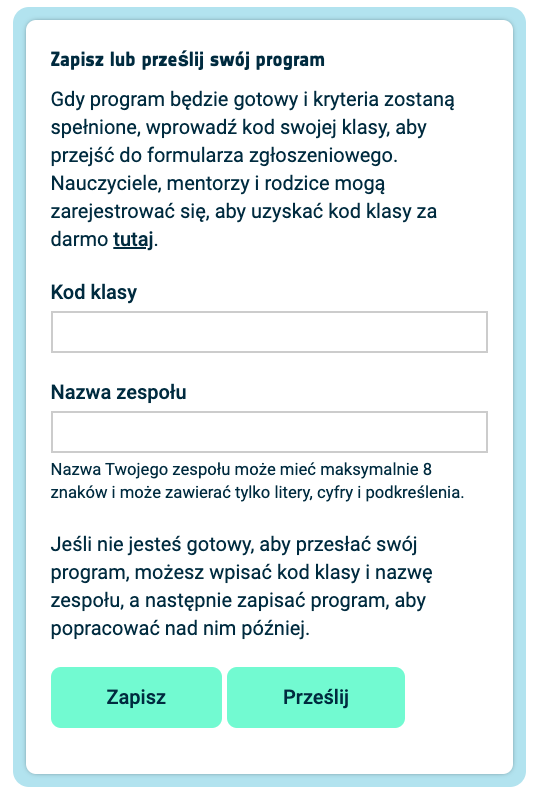

## Wyświetl obrazek

Diody LED Astro Pi mogą świecić się na kolorowo. W tym kroku będziesz wyświetlać obrazy z natury na matrycy LED Astro Pi.

<p style="border-left: solid; border-width:10px; border-color: #0faeb0; background-color: aliceblue; padding: 10px;">
<span style="color: #0faeb0">**Matryca LED**</span> to siatka diod LED, które mogą być kontrolowane pojedynczo lub jako grupa, aby tworzyć różne efekty wyświetlania. Matryca LED na Sense HAT ma 64 diody LED wyświetlane w siatce 8 x 8. Diody LED mogą być zaprogramowane w celu uzyskania szerokiej gamy kolorów.
</p>


--- task ---

Otwórz [Projekt startowy Mission Zero](https://missions.astro-pi.org/pl/mz/code_submissions/){:target="_blank"}.

Zobaczysz, że kilka linijek kodu zostało dla Ciebie dodanych automatycznie.

Kod ten łączy się z Astro Pi, zapewnia odpowiedni sposób pracy wyświetlacza LED Astro Pi i przygotowuje czujnik koloru. Pozostaw ten kod, ponieważ będziesz go potrzebować.

--- code ---
---
language: python
filename: main.py
line_numbers: false
line_number_start: 1
line_highlights: 
---
# Wczytaj biblioteki
from sense_hat import SenseHat
from time import sleep

# Przygotuj Sense HAT
sense = SenseHat()
sense.set_rotation(270)

# Przygotuj czujnik kolorów
sense.color.gain = 60 # Ustaw czułość czujnika
sense.color.integration_cycles = 64 # Okres czasu, w którym będzie dokonywany odczyt

--- /code ---


--- /task ---

### Kolory RGB

Kolory można tworzyć przy użyciu różnych proporcji czerwieni, zieleni i niebieskiego. Dowiedz się więcej o kolorach RGB tutaj:

[[[generic-theory-simple-colours]]]

Matryca LED to siatka 8 x 8. Każda dioda świecąca na siatce może być ustawiona na inny kolor. Oto lista zmiennych dla 24 różnych kolorów. Każdy kolor ma wartość dla czerwonego, zielonego i niebieskiego:

[[[ambient-colours]]]

### Wybierz obraz

--- task ---

**Wybór:** Wybierz obraz do wyświetlenia spośród poniższych opcji. Python przechowuje informacje o obrazie na liście. Kod każdego obrazu zawiera użyte zmienne kolorów i listę.

Będziesz musiał **skopiować** cały kod wybranego obrazu, a następnie **wkleić** go do swojego projektu poniżej linii, która mówi `# Dodaj zmienne kolorów i obraz`.

--- collapse ---

---
title: Ryba
---


Stworzone przez zespół chalka, Polska

```python
z = (153, 50, 204) # CiemnaOrchidea
q = (255, 255, 0) # Żółty
d = (51, 153, 255) # Niebieski
c = (0, 0, 0) # Czarny

obrazek = [
d, d, z, d, d, d, d, d,
d, d, d, z, z, d, d, d,
z, d, q, q, q, q, d, d,
z, z, q, q, q, c, q, d,
z, z, z, q, q, q, q, d,
z, z, q, q, q, q, q, d,
z, d, q, z, z, q, d, d,
d, d, d, z, d, d, d, d]

```

--- /collapse ---


--- collapse ---

---
title: Mors
---


Stworzone przez zespół Walrus, Finlandia

```python
h = (0, 255, 255) # Cyjan
c = (0, 0, 0) # Czarny
s = (139, 69, 19) # Kasztanowy brąz
a = (255, 255, 255) # Biały
r = (184, 134, 11) # Ciemna nawłoć

obrazek = [
h, h, h, h, h, h, h, h,
h, h, s, s, s, h, h, h,
h, s, s, s, s, s, h, h,
h, s, c, s, c, s, s, s,
h, r, r, r, r, r, s, s,
h, h, a, s, a, s, s, s,
h, h, a, s, a, s, s, s,
r, r, s, s, s, s, s, s]

```

--- /collapse ---

--- collapse ---
---
title: Paxi
---


Stworzone przez zespół tony_pi, Włochy

```python
v = (255, 0, 0) # Czerwony
m = (34, 139, 34) # Leśny zielony
c = (0, 0, 0) # Czarny 
e = (100, 149, 237) # Chabrowy
l = (0, 255, 0) # Zielony

obrazek = [
    c, v, m, c, c, m, v, c,
    c, c, v, v, v, v, c, c,
    c, v, c, e, l, e, v, c,
    c, v, c, l, l, l, v, c,
    c, v, c, l, c, l, v, c,
    c, c, v, v, v, v, c, c,
    c, c, l, c, c, l, c, c,
    c, m, m, c, c, m, m, c]

```

--- /collapse ---


--- collapse ---
---
title: Pies
---


Stworzone przez zespół ptpr_07, Hiszpania

```python

c = (0, 0, 0) # Czarny
r = (184, 134, 11) # Ciemna nawłoć
s = (139, 69, 19) # Kasztanowy brąz
y = (255, 20, 147) # Ciemny róż

obrazek = [
    c, r, r, c, c, r, r, c,
    c, r, s, s, s, s, r, c,
    c, r, c, s, s, c, r, c,
    c, s, s, s, s, s, s, c,
    c, s, s, s, s, s, s, c,
    c, s, s, c, c, s, s, c,
    c, c, s, y, y, s, c, c,
    c, c, c, y, y, c, c, c]


```

--- /collapse ---

--- collapse ---
---
title: Kameleon
---


Stworzone przez zespół The_ETs, Wielka Brytania

```python

c = (0, 0, 0) # Czarny
s = (139, 69, 19) # Kasztanowy brąz
a = (255, 255, 255) # Biały
v = (255, 0, 0) # Czerwony
t = (255, 140, 0) # Ciemny pomarańczowy
q = (255, 255, 0) # Żółty
m = (34, 139, 34) # Leśny zielony
h = (0, 255, 255) # Cyjan
z = (153, 50, 204) # Ciemna orchidea
y = (255, 20, 147) # Ciemny róż

obrazek = [
    a, a, v, v, t, a, a, a,
    a, v, v, t, t, q, a, a,
    v, c, t, t, q, q, m, a,
    v, t, t, q, q, m, m, h,
    s, s, q, s, s, m, s, h,
    a, a, a, a, a, a, a, z,
    a, a, a, a, y, a, a, z,
    a, a, a, a, a, y, z, a]

```

--- /collapse ---

--- collapse ---
---
title: Latawiec
---


Stworzone przez zespół Val, Grecja

```python

c = (0, 0, 0) # Czarny
m = (34, 139, 34) # Leśny zielony
v = (255, 0, 0) # Czerwony
q = (255, 255, 0) # Żółty
e = (0, 0, 205) # Średni niebieski
h = (0, 255, 255) # Cyjan

obrazek = [
    h, h, h, h, h, h, h, h, 
    h, h, h, e, e, v, v, h, 
    h, h, h, e, e, v, v, h, 
    h, h, h, q, q, m, m, h, 
    h, h, h, q, q, m, m, h,
    h, h, c, h, h, h, h, h, 
    h, c, h, h, h, h, h, h, 
    c, h, h, h, h, h, h, h]

```

--- /collapse ---

--- collapse ---
---
title: Kurczak
---


Stworzone przez zespół Slepicky, Czechy

```python

v = (255, 0, 0) # Czerwony
c = (0, 0, 0) # Czarny
b = (105, 105, 105) # Ciemnoszary
q = (255, 255, 0) # Żółty
r = (184, 134, 11) # Ciemna nawłoć

obrazek =  [
    c, c, v, v, v, c, c, c,
    c, v, b, b, r, c, c, r,
    c, b, c, b, b, c, r, b,
    q, r, b, b, b, b, b, r,
    c, v, b, b, b, b, r, b,
    c, v, b, r, r, r, b, r,
    c, c, c, r, b, q, r, c,
    c, c, c, c, q, q, c, c]

```

--- /collapse ---

--- /task ---

--- task ---

**Znajdź:** linię, która mówi `# Wyświetl obraz` i dodaj linię kodu, aby wyświetlić obraz na matrycy LED:

--- code ---
---
language: python
filename: main.py
line_numbers: false
line_number_start: 1
line_highlights: 18, 19
---
z = (153, 50, 204) # Ciemna orchidea
q = (255, 255, 0) # Żółty
d = (51, 153, 255) # Niebieski
c = (0, 0, 0) # Czarny

obrazek = [
d, d, z, d, d, d, d, d,
d, d, d, z, z, d, d, d,
z, d, q, q, q, q, d, d,
z, z, q, q, q, c, q, d,
z, z, z, q, q, q, q, d,
z, z, q, q, q, q, q, d,
z, d, q, z, z, q, d, d,
d, d, d, z, d, d, d, d]

# Wyświetl obraz 
sense.set_pixels(obrazek)

--- /code ---

--- /task ---

--- task ---

Naciśnij **Uruchom** na dole edytora, aby zobaczyć obraz wyświetlany na matrycy LED.

--- /task ---

--- task ---

**Debugowanie (usuwanie błędów)**

Mój kod zawiera błąd składni:

- Sprawdź, czy Twój kod pasuje do kodu w powyższych przykładach
- Sprawdź, czy masz wcięcia w kodzie na swojej liście
- Sprawdź, czy Twoja lista jest otoczona przez `[` i `]`
- Sprawdź, czy każda zmienna koloru na liście jest oddzielona przecinkiem

Mój obraz się nie pojawia:

- Sprawdź, czy Twój `sense.set_pixels(obrazek)` nie ma wciącia

--- /task ---

--- task ---

**Zapisz swoje postępy**

Teraz, gdy wyświetliłeś obraz, możesz zapisać swój program w projekcie Mission Starter, wpisując nazwę swojego zespołu, imiona członków zespołu i otrzymany kod klasy. Możesz ponownie załadować swój program na dowolnym urządzeniu z dostępem do Internetu, wpisując nazwę swojego zespołu i kod klasy.



--- /task --- 
