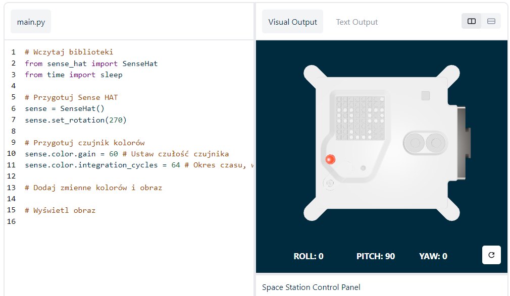

## Wyświetl obrazek

Diody LED Astro Pi mogą świecić się na kolorowo. W tym kroku będziesz wyświetlać obrazy z natury na matrycy LED Astro Pi.

<p style="border-left: solid; border-width:10px; border-color: #0faeb0; background-color: aliceblue; padding: 10px;">
<span style="color: #0faeb0">**Matryca LED**</span> to siatka diod LED, które mogą być kontrolowane pojedynczo lub jako grupa, aby tworzyć różne efekty wyświetlania. Matryca LED na Sense HAT ma 64 diody LED wyświetlane w siatce 8 x 8. Diody LED mogą być zaprogramowane w celu uzyskania szerokiej gamy kolorów.
</p>


--- task ---

Otwórz [Projekt startowy Mission Zero](https://missions.astro-pi.org/pl/mz/code_submissions/){:target="_blank"}.

Zobaczysz, że kilka linijek kodu zostało dla Ciebie dodanych automatycznie.

Kod ten łączy się z Astro Pi, zapewnia odpowiedni sposób pracy wyświetlacza LED Astro Pi i przygotowuje czujnik koloru. Pozostaw ten kod, ponieważ będziesz go potrzebować.

--- code ---
---
language: python filename: main.py line_numbers: false line_number_start: 1
line_highlights:
---
# Wczytaj biblioteki
from sense_hat import SenseHat from time import sleep

# Przygotuj Sense HAT
sense = SenseHat() sense.set_rotation(270)

# Przygotuj czujnik kolorów
sense.color.gain = 60 # Set the sensitivity of the sensor sense.color.integration_cycles = 64 # The interval at which the reading will be taken

--- /code ---



--- /task ---

### Kolory RGB

Kolory można tworzyć przy użyciu różnych proporcji czerwieni, zieleni i niebieskiego. Dowiedz się więcej o kolorach RGB tutaj:

[[[generic-theory-simple-colours]]]

Matryca LED to siatka 8 x 8. Każda dioda świecąca na siatce może być ustawiona na inny kolor. Oto lista zmiennych dla 24 różnych kolorów. Każdy kolor ma wartość dla czerwonego, zielonego i niebieskiego:

[[[ambient-colours]]]

### Wybierz obraz

--- task ---

**Wybór:** Wybierz obraz do wyświetlenia spośród poniższych opcji. Python przechowuje informacje o obrazie na liście. Kod każdego obrazu zawiera użyte zmienne kolorów i listę.

Będziesz musiał **skopiować** cały kod wybranego obrazu, a następnie **wkleić** go do swojego projektu poniżej linii, która mówi `# Dodaj zmienne kolorów i obraz`.

--- collapse ---

---
title: Fish
---


Created by team chalka, Poland

```python
z = (204, 0, 204) # magenta
q = (255, 255, 0) # yellow
d = (51, 153, 255) # blue
c = (0, 0, 0) # black

image = [
d, d, z, d, d, d, d, d,
d, d, d, z, z, d, d, d,
z, d, q, q, q, q, d, d,
z, z, q, q, q, c, q, d,
z, z, z, q, q, q, q, d,
z, z, q, q, q, q, q, d,
z, d, q, z, z, q, d, d,
d, d, d, z, d, d, d, d]

```

--- /collapse ---


--- collapse ---

---
title: Walrus
---


Created by team Walrus, Finland

```python
h = (0, 255, 255)
c = (0, 0, 0)
s = (139, 69, 19)
a = (255, 255, 255)
r = (184, 134, 11)   

image = [
h, h, h, h, h, h, h, h,
h, h, s, s, s, h, h, h,
h, s, s, s, s, s, h, h,
h, s, c, s, c, s, s, s,
h, r, r, r, r, r, s, s,
h, h, a, s, a, s, s, s,
h, h, a, s, a, s, s, s,
r, r, s, s, s, s, s, s]

```

--- /collapse ---

--- collapse ---
---
title: Paxi
---


Created by team tony_pi, Italy

```python
v = (255, 0, 0) # Red
j = (34, 139, 34) # ForestGreen
c = (0, 0, 0) # Black 
e = (100, 149, 237) # CornflowerBlue
l = (0, 255, 0) # Green

image = [
    c, v, j, c, c, j, v, c,
    c, c, v, v, v, v, c, c,
    c, v, c, e, l, e, v, c,
    c, v, c, l, l, l, v, c,
    c, v, c, l, c, l, v, c,
    c, c, v, v, v, v, c, c,
    c, c, l, c, c, l, c, c,
    c, j, j, c, c, j, j, c]

```

--- /collapse ---


--- collapse ---
---
title: Dog
---


Created by team ptpr_07, Spain
```python

c = (0, 0, 0) # Black
r = (86, 71, 0) # Light Brown
s = (123, 61, 0) # Orange Brown
y = (155, 0, 134) # Deep Pink

image = [
    c, r, r, c, c, r, r, c,
    c, r, s, s, s, s, r, c,
    c, r, c, s, s, c, r, c,
    c, s, s, s, s, s, s, c,
    c, s, s, s, s, s, s, c,
    c, s, s, c, c, s, s, c,
    c, c, s, y, y, s, c, c,
    c, c, c, y, y, c, c, c]


```

--- /collapse ---

--- collapse ---
---
title: Chameleon
---


Created by team The_ETs, United Kingdom

```python

c = (0, 0, 0) # Black
s = (95, 65, 0) # Brown
a = (255, 255, 255) # white
v = (255, 0, 0) # Red
t = (255, 153, 28) # Orange
q = (255, 255, 0) # Yellow
m = (0, 255, 0) # Green
h = (0, 255, 255) # Cyan
z = (128, 0, 255) # Purple
y = (191, 0, 255) # Magenta

image = [
    a, a, v, v, t, a, a, a,
    a, v, v, t, t, q, a, a,
    v, c, t, t, q, q, m, a,
    v, t, t, q, q, m, m, h,
    s, s, q, s, s, m, s, h,
    a, a, a, a, a, a, a, z,
    a, a, a, a, y, a, a, z,
    a, a, a, a, a, y, z, a]

```

--- /collapse ---

--- collapse ---
---
title: Kite
---


Created by team Val, Greece

```python

c = (0, 0, 0) # Black
m = (0, 255, 0) # Green
v = (255, 0, 0) # Red
q = (255, 255, 0) # Yellow
e = (0, 0, 255) # Blue
h = (0, 255, 255) # Cyan

image = [
    h, h, h, h, h, h, h, h, 
    h, h, h, e, e, v, v, h, 
    h, h, h, e, e, v, v, h, 
    h, h, h, q, q, m, m, h, 
    h, h, h, q, q, m, m, h,
    h, h, c, h, h, h, h, h, 
    h, c, h, h, h, h, h, h, 
    c, h, h, h, h, h, h, h]

```

--- /collapse ---

--- collapse ---
---
title: Chicken
---


Created by team Slepicky, Czech Republic

```python

w = (255, 255, 255) #  White                                                                
v = (255, 0, 0) # Red
c = (0, 0, 0) # Black
b = (105, 105, 105) # Light Grey
q = (255, 255, 0) # Yellow
k = (79, 79, 79) # Dark Grey


image =  [
    a, a, v, v, v, a, a, a,
    a, v, b, b, k, a, a, k,
    a, b, c, b, b, a, k, b,
    q, k, b, b, b, b, b, k,
    a, v, b, b, b, b, k, b,
    a, v, b, k, k, k, b, k,
    a, a, a, k, b, q, k, a,
    a, a, a, a, q, q, a, a]

```

--- /collapse ---

--- /task ---

--- task ---

**Znajdź:** linię, która mówi `# Wyświetl obrazek` i dodaj linię kodu, aby wyświetlić obraz na matrycy LED:

--- code ---
---
language: python filename: main.py line_numbers: false line_number_start: 1
line_highlights: 18, 19
---
z = (204, 0, 204) # magenta q = (255, 255, 0) # yellow d = (51, 153, 255) # blue c = (0, 0, 0) # black

image = [ d, d, z, d, d, d, d, d, d, d, d, z, z, d, d, d, z, d, q, q, q, q, d, d, z, z, q, q, q, c, q, d, z, z, z, q, q, q, q, d, z, z, q, q, q, q, q, d, z, d, q, z, z, q, d, d, d, d, d, z, d, d, d, d]

# Display the image
sense.set_pixels(image)

--- /code ---

--- /task ---

--- task ---

Naciśnij **Uruchom** na dole edytora, aby zobaczyć obraz wyświetlany na matrycy LED.

--- /task ---

--- task ---

**Debugowanie (usuwanie błędów)**

Mój kod zawiera błąd składni:

- Sprawdź, czy Twój kod pasuje do kodu w powyższych przykładach
- Sprawdź, czy masz wcięcia w kodzie na swojej liście
- Sprawdź, czy Twoja lista jest otoczona przez `[` i `]`
- Sprawdź, czy każda zmienna koloru na liście jest oddzielona przecinkiem

Mój obraz się nie pojawia:

- Sprawdź, czy Twój `sense.set_pixels(obrazek)` nie ma wciącia

--- /task ---


--- task ---

**Zapisz swoje postępy**

Teraz, gdy wyświetliłeś obraz, możesz zapisać swój program w projekcie Mission Starter, wpisując nazwę swojego zespołu, imiona członków zespołu i otrzymany kod klasy. Możesz ponownie załadować swój program na dowolnym urządzeniu z dostępem do Internetu, wpisując nazwę swojego zespołu i kod klasy.


--- /task --- 
