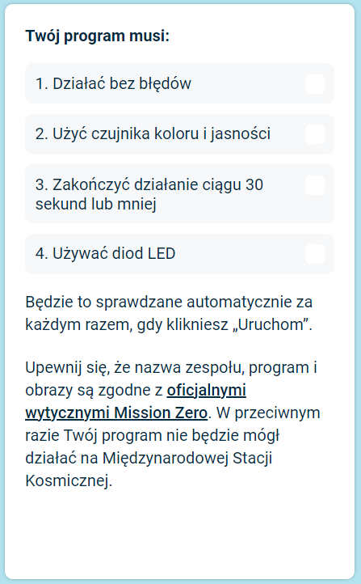

## Wyślij swoje zgłoszenie

Teraz możesz wziąć udział w wyzwaniu [Astro Pi Mission Zero](https://astro-pi.org/mission-zero){:target="_blank"}, używając kodu, który napisałeś.

Jest kilka zasad, które kod musi spełniać, aby można było go zgłosić do uruchomienia na Międzynarodowej Stacji Kosmicznej. Jeśli twój kod je spełnia, zasady u dołu **emulatora Sense HAT** zaświecą się na zielono kiedy uruchomisz swój program.

**Wskazówka:** Przetestuj swój kod z kilkoma różnymi ustawieniami kolorów (za pomocą selektora), aby upewnić się, że zawsze działa poprawnie.

Upewnij się, że Twoje zgłoszenie jest zgodne z [oficjalnymi wytycznymi](https://astro-pi.org/mission-zero/guidelines){:target="_blank"} dotyczącymi Misji Zero. Jeśli Twój program nie będzie przestrzegał wytycznych, nie będzie mógł działać na Międzynarodowej Stacji Kosmicznej.

Prosimy nie umieszczać niczego z poniższych w nazwie lub kodzie Twojego zespołu:

+ Wszystko, co można zinterpretować jako nielegalne, polityczne lub drażliwe
+ Flag, ponieważ można je uznać za wrażliwe politycznie
+ Wszystko, co odnosi się do nieprzyjemności lub krzywdy wyrządzanej innej osobie
+ Dane osobowe, takie jak numery telefonów, kontakty z mediów społecznościowych i adresy e-mail
+ Nieprzyzwoite obrazy
+ Znaki specjalne lub emotikony
+ Wulgarny język lub przekleństwa

--- task ---

Wpisz kod swojej klasy i nazwę zespołu w polu na dole — Twój mentor powie Ci, jaki jest Twój kod.

**Wskazówki dla mentorów** można znaleźć w kroku [Wprowadzenie](https://projects.raspberrypi.org/en/projects/astro-pi-mission-zero/0).

--- /task ---

--- task ---

Naciśnij przycisk **Dodaj swój zespół**, aby wprowadzić swój kod. Należy pamiętać, że programu nie można zmienić po przesłaniu.

Twój mentor otrzyma e-mail z potwierdzeniem Waszego zgłoszenia.

--- /task ---

--- task ---

Jeśli chcesz, możesz udostępnić link do swojego kodu w mediach społecznościowych, aby powiedzieć znajomym, że napisany przez ciebie kod zostanie uruchomiony w kosmosie!

--- /task ---
