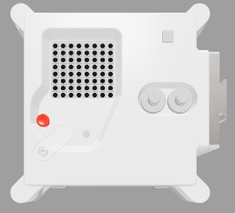

## Pomiar wilgotności

Czujnik wilgotności w Astro Pi może mierzyć wilgotność powietrza wokół niego, co jest przydatną funkcją, która pomaga zbierać dane o warunkach w przestrzeni.



Astro Pi mierzy wilgotność w ISS, mierząc procentowe stężenie wody w powietrzu.

Częścią waszej misji jest pomoc w codziennym życiu załogi na pokładzie ISS, aby mogli wiedzieć, że wilgotność na pokładzie stacji kosmicznej mieści się w normalnym zakresie, co ich uspokoi.

[[[generic-theory-what-is-humidity]]]

--- task ---

Dodaj ten kod, aby odczytać wilgotność:

```python
wilgotnosc= sense.get_humidity()
```

Ta linia zmierzy aktualną wilgotność i zapisze zmierzoną wartość w zmiennej `wilgotnosc`.

--- /task ---

--- task ---

Wilgotność jest zapisywana bardzo precyzyjnie, tj. zapisana wartość będzie miała dużą liczbę miejsc po przecinku. Można zaokrąglić wartość do dowolnej liczby miejsc po przecinku. W tym przykładzie zaokrągliliśmy do jednego miejsca po przecinku, ale aby uzyskać inny poziom dokładności, należy zmienić cyfrę `1` na pożądaną liczbę miejsc po przecinku.

```python
wilgotnosc= round(sense.get_humidity(), 1)
```

--- /task ---

--- task ---

Aby wyświetlić aktualną wilgotność jako komunikat przewijający się na wyświetlaczu, dodaj tą linijkę kodu:

```python
sense.show_message(str(wilgotnosc))
```

Część `str()` przekształca wilgotność z liczby na tekst, tak aby Astro Pi mogło ją wyświetlić.

--- /task ---

--- task ---

Możesz również wyświetlić wilgotność jako część innej wiadomości, dołączając do części swojej wiadomości używając `+`.

```python
sense.show_message( "Jest " + str(wilgotnosc) + " %" )
```

--- /task ---

Prawdziwy Astro Pi mierzy temperaturę w swoim otoczeniu, ale możesz przesunąć suwak wilgotności na emulatorze Sense HAT, aby symulować zmiany wilgotności i przetestować kod.


**Uwaga:** Być może zastanawiasz się, dlaczego suwak wilgotności wyświetla wilgotność jako liczbę całkowitą, ale pomiar podawany jest w postaci liczby dziesiętnej. Emulator symuluje niewielką niedokładność rzeczywistego czujnika, więc uzyskany pomiar wilgotności może być nieznacznie większy lub mniejszy niż wartość ustawiona za pomocą suwaka.
