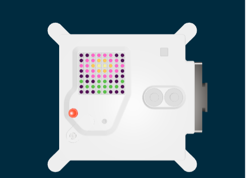

## Mostrar uma imagem

A matriz de LED do Astro Pi pode mostrar cores. Neste passo, tu irás mostrar imagens da natureza na matriz LED do Astro Pi.

Uma **matriz LED** é uma grelha de LEDs que podem ser controlados individualmente ou como um grupo para criar diferentes efeitos de iluminação. A matriz LED do Sense HAT possui 64 LEDs dispostos numa grelha de 8 x 8. Os LEDs podem ser programados para produzir uma ampla gama de cores.

--- task ---

Abre o [projeto inicial Missão Zero](http://rpf.io/mzcode){:target="_blank"}.

Irás ver que algumas linhas de código foram adicionadas para ti automaticamente.

Este código liga-se ao Astro Pi e garante que o ecrã LED do Astro Pi seja visto na orientação correta e configura o sensor de cor. Deixa o código lá, porque irás precisar.

--- code ---
---
language: python
filename: main.py
line_numbers: false
line_number_start: 1
line_highlights: 
---
# Importar as bibliotecas
from sense_hat import SenseHat
from time import sleep

# Configurar o Sense HAT
sense = SenseHat()
sense.set_rotation(270)

# Configurar o sensor de cor
sense.color.gain = 60 # Definir a sensibilidade do sensor
sense.color.integration_cycles = 64 # O intervalo em que a leitura será feita

--- /code ---

--- /task ---

### Cores RGB

As cores podem ser criadas usando diferentes proporções de vermelho, verde e azul. Podes descobrir mais sobre as cores RGB aqui:

[[[generic-theory-simple-colours]]]

A matriz de LED é uma grelha de 8 x 8. Cada LED na grelha pode ser definido para uma cor diferente. Aqui está uma lista de variáveis para 24 cores diferentes. Cada cor tem um valor para vermelho, verde e azul:

[[[ambient-colours]]]

### Escolhe uma imagem

--- task ---

**Escolhe:** Escolhe uma imagem para mostrar das as opções em baixo. O Python armazena as informações de uma imagem numa lista. O código para cada imagem inclui as variáveis de cor usadas e a lista.

Tu irás precisar de **copiar** todo o código da imagem escolhida e **colá-lo** no teu projeto abaixo da linha que diz `# Adicionar variáveis de cor e imagem`.

--- collapse ---

---
title: Galinha
---

--- code ---
---
language: python
filename: main.py
line_numbers: false
---
a = (255, 255, 255) # Branco
c = (0, 0, 0) # Preto
e = (0, 0, 205) # Azul Médio
q = (255, 255, 0) # Amarelo
t = (255, 140, 0) # Laranja escuro
w = (255, 192, 203) # Cor de rosa

imagem = [
  c, c, c, q, q, q, c, c,
  c, c, t, q, e, q, c, c,
  c, c, c, q, q, q, c, c,
  c, w, w, w, w, w, w, c,
  c, w, a, a, a, a, w, c,
  c, w, a, a, a, a, w, c,
  c, c, w, a, a, w, c, c,
  c, c, c, w, w, c, c, c]

--- /code ---

--- /collapse ---

--- collapse ---

---
title: Flor
---

--- code ---
---
language: python
filename: main.py
line_numbers: false
---
c = (0, 0, 0) # Preto
m = (34, 139, 34) # Verde floresta
q = (255, 255, 0) # Amarelo
t = (255, 140, 0) # Laranja escuro
y = (255, 20, 147) # Rosa escuro

imagem = [
  c, c, y, y, y, y, c, c,
  c, y, y, t, t, y, y, c,
  y, y, t, q, q, t, y, y,
  c, y, y, t, t, y, y, c,
  c, c, y, y, y, y, c, c,
  m, c, c, m, m, c, c, m,
  c, m, m, m, m, m, m, c,
  c, c, c, m, m, c, c, c]

--- /code ---

--- /collapse ---

--- collapse ---
---
title: Caranguejo
---

--- code ---
---
language: python
filename: main.py
line_numbers: false
---
a = (255, 255, 255) # Branco
c = (0, 0, 0) # Preto
v = (255, 0, 0) # Vermelho

imagem = [
  c, a, a, c, a, a, c, c,
  c, a, c, c, a, c, c, c,
  c, v, c, c, v, c, c, c,
  c, v, c, c, v, c, c, c,
  v, v, v, v, v, c, v, v,
  v, v, c, c, v, v, v, c,
  v, v, v, v, v, c, v, v,
  v, c, v, c, v, c, c, c]
 

--- /code ---

--- /collapse ---

--- collapse ---
---
title: Crocodilo
---

--- code ---
---
language: python
filename: main.py
line_numbers: false
---
a = (255, 255, 255) # Branco
c = (0, 0, 0) # Preto
f = (25, 25, 112) # Azul da meia noite
m = (34, 139, 34) # Verde floresta

imagem = [
  m, m, m, m, m, c, c, c,
  m, f, m, f, m, m, m, m,
  m, m, m, m, m, m, m, m,
  m, m, c, a, c, c, c, a,
  m, m, c, c, c ,c ,c ,c,
  m, m, c, c, c, a, c, c,
  m, m, m, m, m, m, m, m,
  m, m, m, m, m, m, m, m]

--- /code ---

--- /collapse ---

--- collapse ---
---
title: Serpente
---

--- code ---
---
language: python
filename: main.py
line_numbers: false
---
 c = (0, 0, 0) # Preto
 m = (34, 139, 34) # Verde floresta
 q = (255, 255, 0) # Amarelo
 v = (255, 0, 0) # Vermelho

imagem = [
  c, c, c, c, c, c, c, m,
  c, m, m, m, m, m, m, m,
  c, m, c, c, c, c, c, c,
  c, m, m, m, m, m, c, c,
  c, c, c, c, c, m, c, c,
  q, m, q, m, m, m, c, c,
  m, m, m, c, c, c, c, c,
  v, c, c, c, c, c, c, c]
  

--- /code ---

--- /collapse ---

--- collapse ---
---
title: Sapo
---

--- code ---
---
language: python
filename: main.py
line_numbers: false
line_number_start: 
line_highlights: 
---
c = (0, 0, 0) # Preto
m = (34, 139, 34) # Verde floresta
q = (255, 255, 0) # Amarelo
v = (255, 0, 0) # Vermelho

imagem = [
  c, m, m, m, c, m, m, m,
  c, m, q, m, c, m, q, m,
  m, m, m, m, m, m, m, m,
  m, v, v, v, v, v, v, v,
  m, m, m, m, m, m, m, m,
  m, m, m, m, m, m, m, m,
  m, m, m, m, m, m, m, m,
  m, m, c, m, m, m, c, m]

--- /code ---

--- /collapse ---

--- /task ---

--- task ---

**Encontra:** a linha que diz `# Mostrar a imagem` e adiciona uma linha de código para mostrar a tua imagem na matriz de LEDs:

--- code ---
---
language: python
filename: main.py
line_numbers: false
line_number_start: 1
line_highlights: 12
---
imagem = [
  c, c, c, q, q, q, c, c,
  c, c, t, q, e, q, c, c,
  c, c, c, q, q, q, c, c,
  c, w, w, w, w, w, w, c,
  c, w, a, a, a, a, w, c,
  c, w, a, a, a, a, w, c,
  c, c, w, a, a, w, c, c,
  c, c, c, w, w, c, c, c]

# Mostrar a imagem 
sense.set_pixels(imagem)

--- /task ---

--- task ---

Pressiona **Executar** no fundo do editor para ver a tua imagem mostrada na matriz de LEDs.

--- /task ---

--- task ---

**Depurar**

O meu código tem um erro de sintaxe:

- Verifica que o teu código corresponde ao código nos exemplos acima
- Verifica se indentaste o código na tua lista
- Verifica se a tua lista está entre `[` e `]`
- Verifica se cada variável de cor na lista é separada por uma vírgula

A minha imagem não aparece:

- Verifica se o teu `sense.set_pixels(imagem)` não está indentado

--- /task ---

