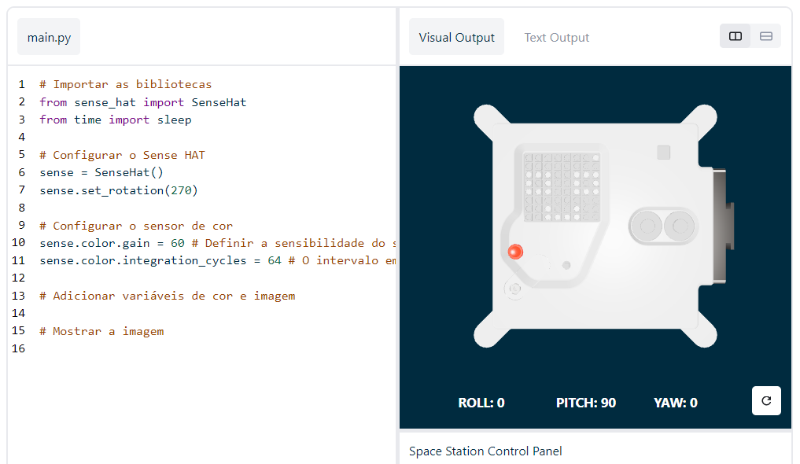

## Exibir uma mensagem

--- task ---

Abre o emulador [Sense HAT](https://trinket.io/mission-zero){:target="_blank"} para o projeto Mission Zero.

Irás ver três linhas de código que foram adicionadas automaticamente para ti:

```python
from sense_hat import SenseHat
sense = SenseHat()
sense.set_rotation(270)
```



Este código conecta-se ao Astro Pi e garante que o ecrã LED do Astro Pi seja visto da maneira correta. Deixa o código aí, porque irás precisar dele.

--- /task ---

--- task ---

Queres deixar uma saudação agradável para os astronautas da Estação Espacial Internacional que estão a trabalhar perto do Astro Pi? Vamos passar uma mensagem no ecrã.

Adiciona este texto por baixo do outro código:

```python
sense.show_message("Astro Pi")
```

--- /task ---

--- task ---

Para executar, pressiona o botão **Run** e vê a mensagem `Astro Pi` passar no ecrã LED.


--- /task ---


Para exibir uma mensagem diferente, podes escrever o que quiseres entre as aspas (`""`).

--- collapse ---

---
title: Que carateres podem ser usados?
---

O Sense HAT só pode exibir o conjunto de carateres Latin 1, o que significa que apenas os seguintes carateres estarão disponíveis. Outros carateres serão exibidos como `?` .

```
+-*/!"#$><0123456789.=)( ABCDEFGHIJKLMNOPQRSTUVWXYZ

abcdefghijklmnopqrstuvwxyz

?,;:|@%[&_']\~
```

--- /collapse ---

--- task ---

Também podes alterar a velocidade da mensagem que vês no ecrã. Adiciona um `scroll_speed` para a linha de código que já tens, assim:

```python
sense.show_message("Astro Pi", scroll_speed=0.05)
```

A velocidade padrão da mensagem é `0.1`. Diminuir o número faz com que a mensagem passe mais rapidamente, e aumentar o número faz com que a mensagem passe mais devagar.

--- /task ---

### Choose a name for the new Astro Pi computers

--- task --- We will name the Astro Pi computers after two inspirational European scientists. There are hundreds of men and women that have contributed to science and technology, and participants can suggest their own names, or pick from our list of suggestions:


[Ada Lovelace](https://en.wikipedia.org/wiki/Ada_Lovelace){:target="_blank"}: [Alan Turing](https://en.wikipedia.org/wiki/Alan_Turing) [Caroline Herschel](https://en.wikipedia.org/wiki/Caroline_Herschel) [Edsgar Dijkstra](https://en.wikipedia.org/wiki/Edsger_W._Dijkstra) [Hedy Lamarr](https://en.wikipedia.org/wiki/Hedy_Lamarr) [Hypatia](https://en.wikipedia.org/wiki/Hypatia) [John Edmonstone](https://en.wikipedia.org/wiki/John_Edmonstone) [Marie Curie](https://en.wikipedia.org/wiki/Marie_Curie) [Nikola Tesla](https://en.wikipedia.org/wiki/Nikola_Tesla) [Tycho Brahe](https://en.wikipedia.org/wiki/Tycho_Brahe)

To vote, start your message with the words "My name should be". For example, you want to vote for Ada Lovelace, your code would look like this:

```python
sense.show_message("My name should be Ada Lovelace")
```
--- /task ---


