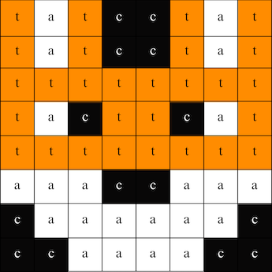
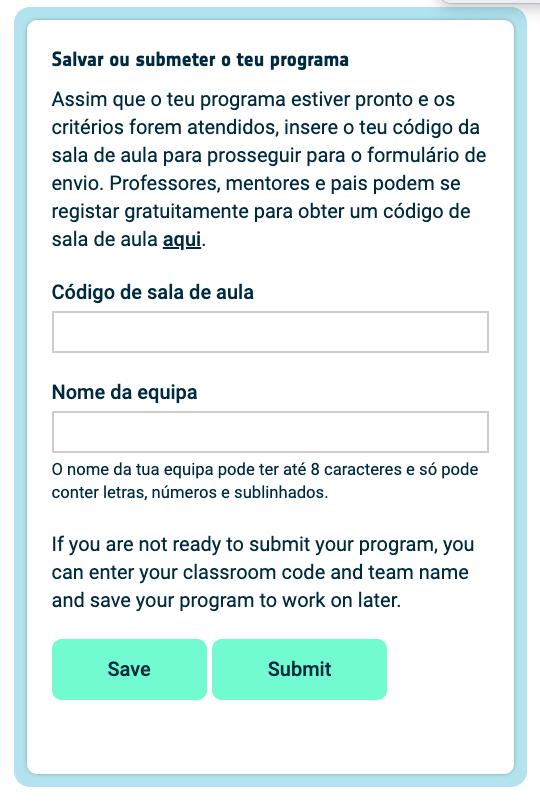

## Mostrar uma imagem

A matriz de LED do Astro Pi pode mostrar cores. Neste passo, irás mostrar imagens da natureza na matriz LED do Astro Pi.

<p style="border-left: solid; border-width:10px; border-color: #0faeb0; background-color: aliceblue; padding: 10px;">
Uma <span style="color: #0faeb0">**matriz LED**</span> é uma grelha de LEDs que podem ser controlados individualmente ou como um grupo para criar diferentes efeitos de iluminação. A matriz LED do Sense HAT possui 64 LEDs dispostos numa grelha de 8 x 8. Os LEDs podem ser programados para produzir uma ampla gama de cores.
</p>


--- task ---

Abre o [projeto inicial Mission Zero](https://missions.astro-pi.org/pt/mz/code_submissions/){:target="_blank"}.

Irás ver que algumas linhas de código foram adicionadas para ti automaticamente.

Este código liga-se ao Astro Pi e garante que o ecrã LED do Astro Pi seja visto na orientação correta e configura o sensor de cor. Deixa o código lá, porque irás precisar.

--- code ---
---
language: python
filename: main.py
line_numbers: false
line_number_start: 1
line_highlights: 
---
# Importar as bibliotecas
from sense_hat import SenseHat
from time import sleep

# Configurar o Sense HAT
sense = SenseHat()
sense.set_rotation(270)

# Configurar o sensor de cor
sense.color.gain = 60 # Definir a sensibilidade do sensor
sense.color.integration_cycles = 64 # O intervalo em que a leitura será feita

--- /code ---


--- /task ---

### Cores RGB

As cores podem ser criadas usando diferentes proporções de vermelho, verde e azul. Podes descobrir mais sobre as cores RGB aqui:

[[[generic-theory-simple-colours]]]

A matriz de LED é uma grelha de 8 x 8. Cada LED na grelha pode ser definido para uma cor diferente. Aqui está uma lista de variáveis para 24 cores diferentes. Cada cor tem um valor para vermelho, verde e azul:

[[[ambient-colours]]]

### Escolhe uma imagem

--- task ---

**Escolhe:** Das opções abaixo, escolhe uma imagem para exibir. O Python armazena as informações de uma imagem numa lista. O código para cada imagem inclui as variáveis de cor usadas e a lista.

Tu irás precisar de **copiar** todo o código da imagem escolhida e **colá-lo** no teu projeto abaixo da linha que diz `# Adicionar variáveis de cor e imagem`.

--- collapse ---

---
title: Raposa
---



Criado pela equipa i_pupi, Itália

```python
c = (0, 0, 0) # Preto
a = (255, 255, 255) # Branco
t = (255, 140, 0) # Laranja escuro

imagem = [
t, a, t, c, c, t, a, t,
t, a, t, c, c, t, a, t,
t, t, t, t, t, t, t, t,
t, a, c, t, t, c, a, t,
t, t, t, t, t, t, t, t,
a, a, a, c, c, a, a, a,
c, a, a, a, a, a, a, c,
c, c, a, a, a, a, c, c]
```

--- /collapse ---

--- collapse ---

---
title: Elefante
---


Criado pela equipa ILiFanT, Finlândia

```python
c = (0, 0, 0) # Preto
b = (105, 105, 105) # Cinzento escuro
a = (255, 255, 255) # Branco

imagem = [
    c, c, c, c, c, c, c, c,
    c, b, b, b, c, c, c, c,
    c, b, c, b, c, c, b, b,
    c, b, c, c, c, b, b, b,
    c, b, b, c, c, b, c, b,
    c, b, b, b, b, b, b, b,
    c, c, b, b, a, b, b, b,
    c, c, c, c, a, b, b, b]
```

--- /collapse ---

--- collapse ---
---
title: Cato
---


Criado pela equipa 6TETHASI, Países Baixos

```python
a = (255, 255, 255) # Branco
c = (0, 0, 0) # Preto
n = (154, 205, 50) # Amarelo esverdeado
q = (255, 255, 0) # Amarelo
t = (255, 140, 0) # Laranja escuro

imagem = [   
  q, q, c, n, c, c, a, c,
  q, c, c, n, c, a, a, a,
  c, n, c, n, c, c, c, c,
  c, n, n, n, c, n, c, c,
  c, a, n, n, n, n, c, c,
  a, a, a, n, c, a, a, a,
  c, c, c, n, a, a, a, c,
  t, t, t, t, t, t, t, t]

```

--- /collapse ---


--- collapse ---
---
title: Crocodilo
---


```python

a = (255, 255, 255) # Branco
c = (0, 0, 0) # Preto
f = (25, 25, 112) # Azul noturno
m = (34, 139, 34) # Verde floresta

imagem = [
  m, m, m, m, m, c, c, c,
  m, f, m, f, m, m, m, m,
  m, m, m, m, m, m, m, m,
  m, m, c, a, c, c, c, a,
  m, m, c, c, c ,c ,c ,c,
  m, m, c, c, c, a, c, c,
  m, m, m, m, m, m, m, m,
  m, m, m, m, m, m, m, m]

```


--- /collapse ---

--- collapse ---
---
title: Arco-Íris
---


Criado pela equipa camrus_6, Reino Unido

```python

c = (100, 149, 237) # Azul centáurea
a = (255, 255, 255) # Branco
v = (255, 0, 0) # Vermelho
t = (255, 140, 0) # Laranja escuro
q = (255, 255, 0) # Amarelo
l = (0, 255, 127) # Verde primavera
e = (0, 0, 205) # Azul médio

arco-iris = [
  c, c, c, c, c, c, c, c, 
  v, v, v, v, c, c, c, c,
  t, t, t, t, v, v, c, c,
  q, q, q, q, t, v, c, c,
  l, l, l, l, q, t, v, c,
  e, e, e, l, q, t, v, c,
  c, c, e, a, a, a, a, c,
  c, a, a, a, a, a, a, a
]

```

--- /collapse ---

--- collapse ---
---
title: Dragão
---


Criado pela equipa hwplucyr, Reino Unido

```python

b = (105, 105, 105) # Cinzento fosco
c = (0, 0, 0) # Preto
d = (100, 149, 237) # Azul centáurea
v = (255, 0, 0) # Vermelho
z = (153, 50, 204) # Orquídea negra

imagem = [
    c, c, v, c, v, c, c, c,
    c, z, z, z, z, v, c, c,
    z, b, z, b, z, c, c, c,
    z, z, z, z, z, v, c, c,
    c, c, d, d, d, c, c, z,
    c, z, d, z, z, z, z, c,
    c, c, d, d, z, c, c, c,
    c, c, z, c, z, c, c, c]

```

--- /collapse ---

--- /task ---

--- task ---

**Encontra:** a linha que diz `# Mostrar a imagem` e adiciona uma linha de código para mostrar a tua imagem na matriz de LEDs:

```python
a = (255, 255, 255) # Branco
c = (0, 0, 0) # Preto
f = (25, 25, 112) # Azul noturno
m = (34, 139, 34) # Verde floresta

imagem = [
  m, m, m, m, m, c, c, c,
  m, f, m, f, m, m, m, m,
  m, m, m, m, m, m, m, m,
  m, m, c, a, c, c, c, a,
  m, m, c, c, c ,c ,c ,c,
  m, m, c, c, c, a, c, c,
  m, m, m, m, m, m, m, m,
  m, m, m, m, m, m, m, m]

# Mostrar a imagem 
sense.set_pixels(imagem)

```

--- /task ---

--- task ---

Pressiona **Run (Executar)** no fundo do editor, para veres a tua imagem exibida na matriz de LEDs.

--- /task ---

--- task ---

**Depurar**

O meu código tem um erro de sintaxe:

- Verifica se o teu código corresponde ao respetivo código nos exemplos acima
- Verifica se indentaste o código na tua lista
- Verifica se a tua lista está entre `[` e `]`
- Verifica se cada variável de cor na lista é separada por uma vírgula

A minha imagem não aparece:

- Verifica se o teu `sense.set_pixels(imagem)` não está indentado

--- /task ---


--- task ---

**Guarda o teu progresso**

Agora que exibiste uma imagem, podes guardar o teu programa no projeto Inicio de Missão ao inserir o teu nome de equipa, os nomes dos elementos da equipa e o código de sala de aula que te foi dado. Podes recarregar o teu programa em qualquer dispositivo com conexão à Internet ao inserir o nome da tua equipa e o código de sala de aula.



--- /task --- 
